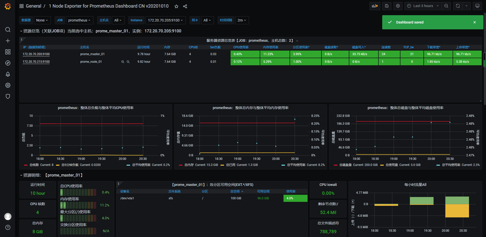

> 本机curl访问数据
```shell script

[root@prome_master_01 tgzs]# curl  -s  localhost:9100/metrics |grep node_  |head -20
# HELP node_arp_entries ARP entries by device
# TYPE node_arp_entries gauge
node_arp_entries{device="eth0"} 3
# HELP node_boot_time_seconds Node boot time, in unixtime.
# TYPE node_boot_time_seconds gauge
node_boot_time_seconds 1.616987084e+09
# HELP node_context_switches_total Total number of context switches.
# TYPE node_context_switches_total counter
node_context_switches_total 2.105979e+06
# HELP node_cooling_device_cur_state Current throttle state of the cooling device
# TYPE node_cooling_device_cur_state gauge
node_cooling_device_cur_state{name="0",type="Processor"} 0
node_cooling_device_cur_state{name="1",type="Processor"} 0
node_cooling_device_cur_state{name="2",type="Processor"} 0
node_cooling_device_cur_state{name="3",type="Processor"} 0
# HELP node_cooling_device_max_state Maximum throttle state of the cooling device
# TYPE node_cooling_device_max_state gauge
node_cooling_device_max_state{name="0",type="Processor"} 0
node_cooling_device_max_state{name="1",type="Processor"} 0
node_cooling_device_max_state{name="2",type="Processor"} 0

```

> 项目地址
- [node_exporter](https://github.com/prometheus/node_exporter)


> 查看启动日志
```shell script
Mar 29 15:38:51 prome_master_01 node_exporter: level=info ts=2021-03-29T07:38:51.315Z caller=node_exporter.go:178 msg="Starting node_exporter" version="(version=1.1.2, branch=HEAD, revision=b597c1244d7bef49e6f3359c87a56dd7707f6719)"
Mar 29 15:38:51 prome_master_01 node_exporter: level=info ts=2021-03-29T07:38:51.315Z caller=node_exporter.go:179 msg="Build context" build_context="(go=go1.15.8, user=root@f07de8ca602a, date=20210305-09:29:10)"
Mar 29 15:38:51 prome_master_01 node_exporter: level=warn ts=2021-03-29T07:38:51.315Z caller=node_exporter.go:181 msg="Node Exporter is running as root user. This exporter is designed to run as unpriviledged user, root is not required."
Mar 29 15:38:51 prome_master_01 node_exporter: level=info ts=2021-03-29T07:38:51.316Z caller=filesystem_common.go:74 collector=filesystem msg="Parsed flag --collector.filesystem.ignored-mount-points" flag=^/(dev|proc|sys|var/lib/docker/.+)($|/)
Mar 29 15:38:51 prome_master_01 node_exporter: level=info ts=2021-03-29T07:38:51.316Z caller=filesystem_common.go:76 collector=filesystem msg="Parsed flag --collector.filesystem.ignored-fs-types" flag=^(autofs|binfmt_misc|bpf|cgroup2?|configfs|debugfs|devpts|devtmpfs|fusectl|hugetlbfs|iso9660|mqueue|nsfs|overlay|proc|procfs|pstore|rpc_pipefs|securityfs|selinuxfs|squashfs|sysfs|tracefs)$
Mar 29 15:38:51 prome_master_01 node_exporter: level=info ts=2021-03-29T07:38:51.316Z caller=node_exporter.go:106 msg="Enabled collectors"
Mar 29 15:38:51 prome_master_01 node_exporter: level=info ts=2021-03-29T07:38:51.316Z caller=node_exporter.go:113 collector=arp
Mar 29 15:38:51 prome_master_01 node_exporter: level=info ts=2021-03-29T07:38:51.316Z caller=node_exporter.go:113 collector=bcache
Mar 29 15:38:51 prome_master_01 node_exporter: level=info ts=2021-03-29T07:38:51.316Z caller=node_exporter.go:113 collector=bonding
Mar 29 15:38:51 prome_master_01 node_exporter: level=info ts=2021-03-29T07:38:51.316Z caller=node_exporter.go:113 collector=btrfs
Mar 29 15:38:51 prome_master_01 node_exporter: level=info ts=2021-03-29T07:38:51.316Z caller=node_exporter.go:113 collector=conntrack
Mar 29 15:38:51 prome_master_01 node_exporter: level=info ts=2021-03-29T07:38:51.316Z caller=node_exporter.go:113 collector=cpu
Mar 29 15:38:51 prome_master_01 node_exporter: level=info ts=2021-03-29T07:38:51.316Z caller=node_exporter.go:113 collector=cpufreq
Mar 29 15:38:51 prome_master_01 node_exporter: level=info ts=2021-03-29T07:38:51.316Z caller=node_exporter.go:113 collector=diskstats
Mar 29 15:38:51 prome_master_01 node_exporter: level=info ts=2021-03-29T07:38:51.316Z caller=node_exporter.go:113 collector=edac
Mar 29 15:38:51 prome_master_01 node_exporter: level=info ts=2021-03-29T07:38:51.316Z caller=node_exporter.go:113 collector=entropy
Mar 29 15:38:51 prome_master_01 node_exporter: level=info ts=2021-03-29T07:38:51.316Z caller=node_exporter.go:113 collector=fibrechannel
Mar 29 15:38:51 prome_master_01 node_exporter: level=info ts=2021-03-29T07:38:51.316Z caller=node_exporter.go:113 collector=filefd
Mar 29 15:38:51 prome_master_01 node_exporter: level=info ts=2021-03-29T07:38:51.316Z caller=node_exporter.go:113 collector=filesystem
Mar 29 15:38:51 prome_master_01 node_exporter: level=info ts=2021-03-29T07:38:51.316Z caller=node_exporter.go:113 collector=hwmon
Mar 29 15:38:51 prome_master_01 node_exporter: level=info ts=2021-03-29T07:38:51.316Z caller=node_exporter.go:113 collector=infiniband
Mar 29 15:38:51 prome_master_01 node_exporter: level=info ts=2021-03-29T07:38:51.316Z caller=node_exporter.go:113 collector=ipvs
```


> 默认开启的采集项目介绍 

- 黑名单: 关闭某一项默认开启的采集项
```shell script
--no-collector.<name> flag

# help
[root@prome-master01 node_exporter]# pwd
/opt/app/node_exporter
[root@prome-master01 node_exporter]# ./node_exporter -h

# 未开启前
[root@prome_master_01 node_exporter]# curl  -s  localhost:9100/metrics |grep node_cpu
# HELP node_cpu_guest_seconds_total Seconds the CPUs spent in guests (VMs) for each mode.
# TYPE node_cpu_guest_seconds_total counter
node_cpu_guest_seconds_total{cpu="0",mode="nice"} 0
node_cpu_guest_seconds_total{cpu="0",mode="user"} 0
node_cpu_guest_seconds_total{cpu="1",mode="nice"} 0
node_cpu_guest_seconds_total{cpu="1",mode="user"} 0
node_cpu_guest_seconds_total{cpu="2",mode="nice"} 0
node_cpu_guest_seconds_total{cpu="2",mode="user"} 0
node_cpu_guest_seconds_total{cpu="3",mode="nice"} 0
node_cpu_guest_seconds_total{cpu="3",mode="user"} 0
# HELP node_cpu_seconds_total Seconds the CPUs spent in each mode.
# TYPE node_cpu_seconds_total counter
node_cpu_seconds_total{cpu="0",mode="idle"} 17691.27
node_cpu_seconds_total{cpu="0",mode="iowait"} 8.9
node_cpu_seconds_total{cpu="0",mode="irq"} 0
node_cpu_seconds_total{cpu="0",mode="nice"} 0.32
node_cpu_seconds_total{cpu="0",mode="softirq"} 0.28
node_cpu_seconds_total{cpu="0",mode="steal"} 2.7

# 关闭cpu采集
systemctl stop node_exporter 
 ./node_exporter --no-collector.cpu

systemctl start node_exporter 
curl  -s  localhost:9100/metrics |grep node_cpu
```

- 白名单：关闭默认采集项而只开启某些采集 
```shell script
 --collector.disable-defaults --collector.<name> .

# 只开启mem采集
 ./node_exporter --collector.disable-defaults --collector.meminfo

# 只开启mem 和cpu 采集
./node_exporter --collector.disable-defaults --collector.meminfo --collector.cpu
```


> 默认关闭的
> 关闭原因
- 太重：High cardinality
- 太慢：Prolonged runtime that exceeds the Prometheus scrape_interval or scrape_timeout
- 太多资源开销： Significant resource demands on the host


> 禁用golang sdk 指标
- 使用 ` --web.disable-exporter-metrics `
- `promhttp_` 代表访问`/metrics` 的http情况
```shell script
./node_exporter --web.disable-exporter-metrics

[root@prome_master_01 tgzs]# curl  -s  localhost:9100/metrics |grep promhttp_
# HELP promhttp_metric_handler_errors_total Total number of internal errors encountered by the promhttp metric handler.
# TYPE promhttp_metric_handler_errors_total counter
promhttp_metric_handler_errors_total{cause="encoding"} 0
promhttp_metric_handler_errors_total{cause="gathering"} 0
# HELP promhttp_metric_handler_requests_in_flight Current number of scrapes being served.
# TYPE promhttp_metric_handler_requests_in_flight gauge
promhttp_metric_handler_requests_in_flight 1
# HELP promhttp_metric_handler_requests_total Total number of scrapes by HTTP status code.
# TYPE promhttp_metric_handler_requests_total counter
promhttp_metric_handler_requests_total{code="200"} 8
promhttp_metric_handler_requests_total{code="500"} 0
promhttp_metric_handler_requests_total{code="503"} 0

```

- `go_`代表 goruntime 信息等
```shell script
curl  -s  localhost:9100/metrics |grep go_

# HELP go_goroutines Number of goroutines that currently exist.
# TYPE go_goroutines gauge
go_goroutines 7
# HELP go_info Information about the Go environment.
# TYPE go_info gauge
go_info{version="go1.15.8"} 1
# HELP go_memstats_alloc_bytes Number of bytes allocated and still in use.
# TYPE go_memstats_alloc_bytes gauge
go_memstats_alloc_bytes 2.781752e+06

```

- `process_`代表 进程信息等
```shell script
curl  -s  localhost:9100/metrics |grep process

# HELP process_cpu_seconds_total Total user and system CPU time spent in seconds.
# TYPE process_cpu_seconds_total counter
process_cpu_seconds_total 0.54
# HELP process_max_fds Maximum number of open file descriptors.
# TYPE process_max_fds gauge
process_max_fds 1024
# HELP process_open_fds Number of open file descriptors.
# TYPE process_open_fds gauge
process_open_fds 9
# HELP process_resident_memory_bytes Resident memory size in bytes.
# TYPE process_resident_memory_bytes gauge
process_resident_memory_bytes 1.5720448e+07

```

> 节点上自打点数据上报
- `--collector.textfile.directory=""` 配置本地采集目录
- 在采集目录里创建`.prom`文件，[格式说明](https://prometheus.io/docs/instrumenting/exposition_formats/)
```shell script
# 创建目录
mkdir ./text_file_dir
# 准备 prom文件
cat <<EOF > ./text_file_dir/test.prom
# HELP nyy_test_metric just test
# TYPE nyy_test_metric gauge
nyy_test_metric{method="post",code="200"} 1027
EOF

# 启动服务
./node_exporter --collector.textfile.directory=./text_file_dir

# curl查看数据
[root@prome_master_01 tgzs]# curl  -s  localhost:9100/metrics |grep nyy
# HELP nyy_test_metric just test
# TYPE nyy_test_metric gauge
nyy_test_metric{code="200",method="post"} 1027


```

> http传入参数，按采集器过滤指标
- 原理： 通过http请求参数过滤采集器

```go
func (h *handler) ServeHTTP(w http.ResponseWriter, r *http.Request) {
	filters := r.URL.Query()["collect[]"]
	level.Debug(h.logger).Log("msg", "collect query:", "filters", filters)

	if len(filters) == 0 {
		// No filters, use the prepared unfiltered handler.
		h.unfilteredHandler.ServeHTTP(w, r)
		return
	}
	// To serve filtered metrics, we create a filtering handler on the fly.
	filteredHandler, err := h.innerHandler(filters...)
	if err != nil {
		level.Warn(h.logger).Log("msg", "Couldn't create filtered metrics handler:", "err", err)
		w.WriteHeader(http.StatusBadRequest)
		w.Write([]byte(fmt.Sprintf("Couldn't create filtered metrics handler: %s", err)))
		return
	}
	filteredHandler.ServeHTTP(w, r)
}
```

- http访问
```shell script
# 只看cpu采集器的指标

http://192.168.116.130:9100/metrics?collect[]=cpu

# 只看cpu和mem采集器的指标
http://192.168.116.130:9100/metrics?collect[]=cpu&collect[]=meminfo
```

- prometheus配置
```yaml
  params:
    collect[]:
      - cpu
      - meminfo
```

- 和prometheus `relabel_config`的区别 ： `按采集器过滤 VS 按metric_name 或label过滤`

> 导入dashboard商城中的node_exporter模板
- 地址 https://grafana.com/grafana/dashboards

- 两种导入模式
    - xxxxxxxxxx     - 172.20.70.205:9090    - 172.20.70.215:9090yaml
    - json文件导入
- https://grafana.com/grafana/dashboards/8919

