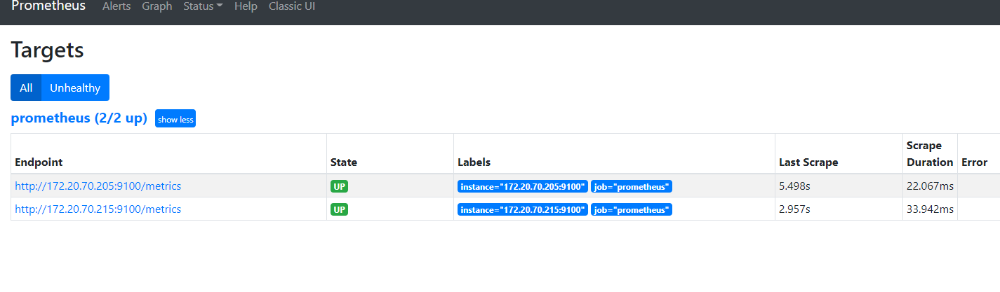
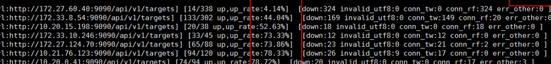

> 使用ansible部署prometheus
```shell script

ansible-playbook -i host_file  service_deploy.yaml  -e "tgz=prometheus-2.25.2.linux-amd64.tar.gz" -e "app=prometheus"

# check
ansible -i host_file all -m shell -a "ps -ef |grep prometheus | grep -v grep "
/opt/app/prometheus/prometheus --config.file=/opt/app/prometheus/prometheus.yml --storage.tsdb.path=/opt/app/prometheus/data --web.enable-lifecycle

# 热加载
curl -vv -X POST localhost:9090/-/reload
```

> 查看页面 
```shell script
http://master01.prome.me:9090/
http://192.168.116.130:9090/

```

> 查看启动
>
> - 一个二进制  + 配置文件

```
systemctl status prometheus
vim /etc/systemd/system/prometheus.service

/opt/app/prometheus/prometheus
/opt/app/prometheus/prometheus.yml
tail -f /opt/logs/prometheus.log 
```


> prometheus配置文件 解析 

```yaml
vim /opt/app/prometheus/prometheus.yml

# 全局配置段
global:
  # 采集间隔 
  scrape_interval:     15s # Set the scrape interval to every 15 seconds. Default is every 1 minute.
  # 计算报警和预聚合间隔
  evaluation_interval: 15s # Evaluate rules every 15 seconds. The default is every 1 minute.
  # 采集超时时间
  scrape_timeout: 10s 
  # 查询日志，包含各阶段耗时统计
  query_log_file: /opt/logs/prometheus_query_log
  # 全局标签组
  # 通过本实例采集的数据都会叠加下面的标签
  external_labels:
    account: 'huawei-main'
    region: 'beijng-01'


# Alertmanager信息段
alerting:
  alertmanagers:
  - scheme: http
    static_configs:
    - targets:
      - "localhost:9093"

# 告警、预聚合配置文件段
rule_files:
    - /etc/prometheus/rules/record.yml
    - /etc/prometheus/rules/alert.yml

# 采集配置段
scrape_configs:
  # The job name is added as a label `job=<job_name>` to any timeseries scraped from this config.
  - job_name: 'prometheus'

    # metrics_path defaults to '/metrics'
    # scheme defaults to 'http'.

    static_configs:
    - targets: ['localhost:9090']

# 远程查询段
remote_read:
  # prometheus 
  - url: http://prometheus/v1/read
    read_recent: true

  # m3db 
  - url: "http://m3coordinator-read:7201/api/v1/prom/remote/read"
    read_recent: true

# 远程写入段
remote_write:
  - url: "http://m3coordinator-write:7201/api/v1/prom/remote/write"
    queue_config:
      capacity: 10000
      max_samples_per_send: 60000
    write_relabel_configs:
      - source_labels: [__name__]
        separator: ;
        # 标签key前缀匹配到的drop
        regex: '(kubelet_|apiserver_|container_fs_).*'
        replacement: $1
        action: drop
```

- 所以prometheus实例可以用来做下列用途

|  对应的配置段   | 用途|
|  ----  | ----  | 
| 采集配置段	| 做采集器，数据保存在本地|
| 采集配置段 + 远程写入段| 做采集器+传输器，数据保存在本地+远端存储|
| 远程查询段| 做查询器，查询远端存储数据|
| 采集配置段 + 远程查询段| 做采集器+查询器，查询本地数据+远端存储数据 |
| 采集配置段 + Alertmanager信息段 + 告警配置文件段 | 做采集器+告警触发器，查询本地数据生成报警发往Alertmanager |
| 远程查询段 + Alertmanager信息段 + 告警配置文件段 | 做远程告警触发器，查询远端数据生成报警发往Alertmanager |
| 远程查询段+远程写入段  + 预聚合配置文件段 | 做预聚合指标，生成的结果集指标写入远端存储 |


> 准备prometheus配置文件，配置采集两个node_exporter

```yaml
global:
  scrape_interval: 15s
  scrape_timeout: 10s
  evaluation_interval: 15s
alerting:
  alertmanagers:
  - scheme: http
    timeout: 10s
    api_version: v1
    static_configs:
    - targets: []
scrape_configs:

# 配置
- job_name: prometheus
  honor_timestamps: true
  scrape_interval: 15s
  scrape_timeout: 10s
  metrics_path: /metrics
  scheme: http
  static_configs:
  - targets:
    - 172.20.70.205:9100
    - 172.20.70.215:9100

```

```yaml
vim /opt/app/prometheus/prometheus.yml

# node_export
  - job_name: node_exporter
    honor_timestamps: true
    scrape_interval: 15s
    scrape_timeout: 10s
    metrics_path: /metrics
    scheme: http
    static_configs:
    - targets:
      - 192.168.116.130:9100
      - 192.168.116.131:9100
```


> 热更新配置文件

```shell script
# 命令行开启  --web.enable-lifecycle
curl -X POST http://localhost:9090/-/reload 

```

> 页面查看targets up情况
- 访问页面 http://master01.prome.me:9090/targets
- 记得关闭防火墙

```
[root@prome-node01 ~]# systemctl stop firewalld 
[root@prome-node01 ~]# systemctl enable firewall
```


-  

> 解说targets页面
- job 分组情况
- endpoint 实例地址
- state 采集是否成功
- label 标签组
- Last Scrape 上次采集到现在的间隔时间
- Scrape Duration 上次采集耗时
- Error 采集错误	

> 通过api获取targets 详情
- 运行`008_get_targets_from_prome.py`

```shell script

状态:正常 num:1/2 endpoint:http://172.20.70.205:9100/metrics state:up labels:{'instance': '172.20.70.205:9100', 'job': 'prometheus'} lastScrape:2021-03-29T18:20:04.304025213+08:00 lastScrapeDuration:0.011969003 lastError:
状态:正常 num:2/2 endpoint:http://172.20.70.215:9100/metrics state:up labels:{'instance': '172.20.70.215:9100', 'job': 'prometheus'} lastScrape:2021-03-29T18:20:06.845862504+08:00 lastScrapeDuration:0.012705335 lastError:

```

- 随便填几个错误的target测试一下 比如 `abc:9100`
```shell script
状态:异常 num:1/3 endpoint:http://abc:9100/metrics state:down labels:{'instance': 'abc:9100', 'job': 'prometheus'} lastScrape:2021-03-29T18:24:08.365229831+08:00 lastScrapeDuration:0.487732313 lastError:Get "http://abc:9100/metrics": dial tcp: lookup abc on 114.114.114.114:53: no such host
状态:正常 num:2/3 endpoint:http://172.20.70.205:9100/metrics state:up labels:{'instance': '172.20.70.205:9100', 'job': 'prometheus'} lastScrape:2021-03-29T18:24:19.304044469+08:00 lastScrapeDuration:0.012483866 lastError:
状态:正常 num:3/3 endpoint:http://172.20.70.215:9100/metrics state:up labels:{'instance': '172.20.70.215:9100', 'job': 'prometheus'} lastScrape:2021-03-29T18:24:21.845860017+08:00 lastScrapeDuration:0.010381262 lastError:


```
- 可以用来算target采集成功率
 

- up metrics

# 采集prometheus自身的指标

```yaml
    - 172.20.70.205:9090
    - 172.20.70.215:9090
```