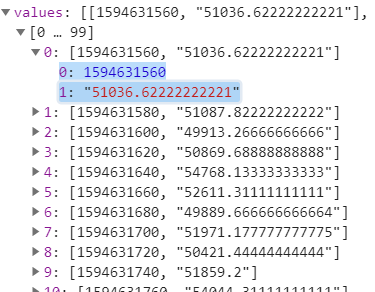
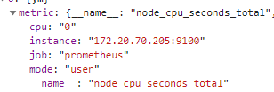
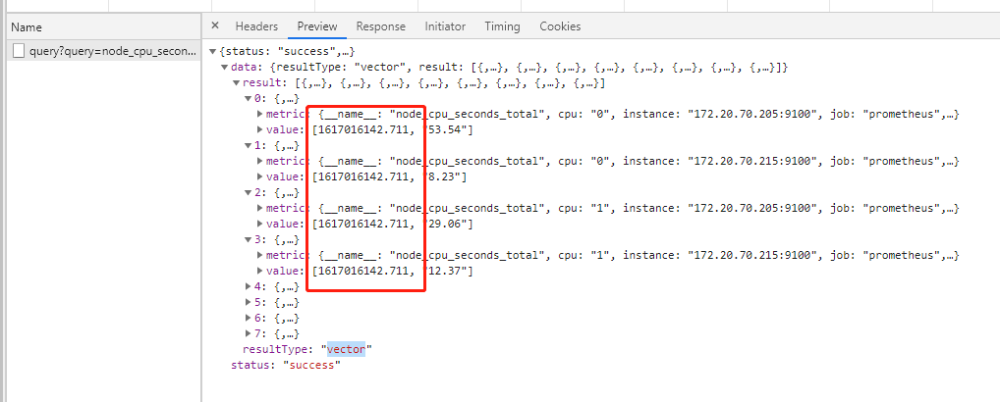
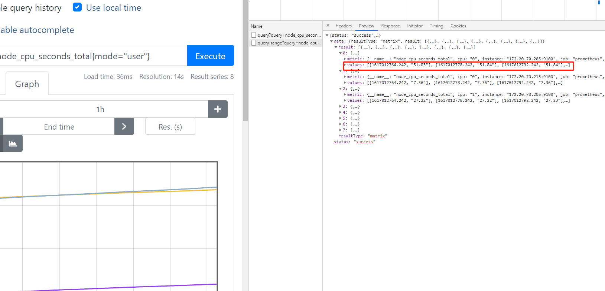

> 在prometheus graph页面上查询数据
```shell script
node_cpu_seconds_total{mode="user"}

node_cpu_seconds_total{cpu="0", instance="172.20.70.205:9100", job="prometheus", mode="user"}
53.43
node_cpu_seconds_total{cpu="0", instance="172.20.70.215:9100", job="prometheus", mode="user"}
8.17
node_cpu_seconds_total{cpu="1", instance="172.20.70.205:9100", job="prometheus", mode="user"}
28.96
node_cpu_seconds_total{cpu="1", instance="172.20.70.215:9100", job="prometheus", mode="user"}
12.32
node_cpu_seconds_total{cpu="2", instance="172.20.70.205:9100", job="prometheus", mode="user"}
31.54
node_cpu_seconds_total{cpu="2", instance="172.20.70.215:9100", job="prometheus", mode="user"}
8.32
node_cpu_seconds_total{cpu="3", instance="172.20.70.205:9100", job="prometheus", mode="user"}
53.88
node_cpu_seconds_total{cpu="3", instance="172.20.70.215:9100", job="prometheus", mode="user"}
6.38
```

# prometheus 基本概念 
> sample 数据点
```golang
type sample struct {
	t int64
	v float64
}
```
- sample代表一个数据点
- size:16byte: 包含 1个8byte int64时间戳和1个8byte float64 value 


> Label 标签

```
type Label struct {
	Name, Value string
}
```

- 一对label 比如 `cpu="0"` `mode: "user"`


> Labels 标签组
```
type Labels []Label

```
- 就是metric 一个指标的所有tag values


# prometheus四种查询类型
- [文档地址](https://prometheus.io/docs/prometheus/latest/querying/basics/)
1. 即时向量 `Instant vector` : 一组时间序列，每个时间序列包含一个样本，所有样本共享相同的时间戳 
    > 在prometheus页面上就是table查询 ，对应查询接口 /api/v1/query 
    
    
    > vector 向量 
    ```
    type Vector []Sample
    ```
    - vector 向量,是samples的别名,但是所有sample具有相同timestamp ,常用作instance_query的结果

2. 范围向量 `Range vector` : 一组时间序列，每个时间序列包含一个样本，所有样本共享相同的时间戳
    > 在prometheus页面上就是graph查询 ，对应查询接口 /api/v1/query 
    
    > Matrix 矩阵
    ```
    type Matrix []Series
    ```
    - Matrix是series的切片，一般的range_query返回的结果

    

3. 标量 `Scalar` 一个简单的数字浮点值
4. String 一个简单的字符串值；目前未使用


# 四种标签匹配模式
1. `=` 等于
    - 查询: cpu第一个核并且是用户态的数据  node_cpu_seconds_total{mode="user",cpu="0"}
2. `!=` 不等于
    - 查询: 非lo网卡的接收字节数  node_network_receive_bytes_total{device!="lo"}
3. `=~` 正则匹配
    - 查询: 挂载点以/run开头的文件系统剩余字节数  node_filesystem_avail_bytes{mountpoint=~"^/run.*"}
4. `!~` 正则非匹配
    - 查询: 块设备名字不包含vda的读字节数  node_disk_read_bytes_total{device!~".*vda.*"}

# 四种数据类型

```
# 查询四种类型
# curl -s localhost:9090/metrics |grep TYPE | awk '{print $NF}' |sort | uni
```


- `gauge` 当前值 
```shell script
node_memory_MemFree_bytes
```
- `counter`   计数器是代表一个累积指标单调递增计数器，其价值只能在重新启动增加或归零。例如，您可以使用计数器来表示已服务请求，已完成任务或错误的数量。
```shell script
http_request_total

# 配合rate使用
rate(prometheus_http_requests_total[1m])

# delta增量
delta(prometheus_http_requests_total[1m])
```
- `histogram` 直方图样本观测（通常之类的东西请求持续时间或响应大小）和计数它们配置的桶中。它还提供所有观察值的总和。
```shell script
# http所有接口 总的95分位值

#http所有接口
# curl -s localhost:9090/metrics |grep prometheus_http_request_duration_seconds |tail
prometheus_http_request_duration_seconds_bucket{handler="/metrics",le="0.4"} 669
prometheus_http_request_duration_seconds_bucket{handler="/metrics",le="1"} 669
prometheus_http_request_duration_seconds_bucket{handler="/metrics",le="3"} 669
prometheus_http_request_duration_seconds_bucket{handler="/metrics",le="8"} 669
prometheus_http_request_duration_seconds_bucket{handler="/metrics",le="20"} 669
prometheus_http_request_duration_seconds_bucket{handler="/metrics",le="60"} 669
prometheus_http_request_duration_seconds_bucket{handler="/metrics",le="120"} 669
prometheus_http_request_duration_seconds_bucket{handler="/metrics",le="+Inf"} 669
prometheus_http_request_duration_seconds_sum{handler="/metrics"} 4.131321069999996
prometheus_http_request_duration_seconds_count{handler="/metrics"} 669

# sum/count 可以算平均值
prometheus_http_request_duration_seconds_sum/ prometheus_http_request_duration_seconds_count


# 所有接口的95分位值
histogram_quantile(0.95, sum(rate(prometheus_http_request_duration_seconds_bucket[5m])) by (le,handler))

histogram_quantile(0.95, sum(rate(prometheus_http_request_duration_seconds_bucket[1m])) by (le))

# range_query某个接口的95分位值
histogram_quantile(0.95, sum(rate(prometheus_http_request_duration_seconds_bucket{handler="/api/v1/query_range"}[5m])) by (le))


```

- `summary`   摘要会采样观察值（通常是请求持续时间和响应大小之类的东西）。尽管它还提供了观测值的总数和所有观测值的总和，但它可以计算滑动时间窗口内的可配置分位数。

```shell script
# gc耗时
[root@prome-master01 ~]# curl -s localhost:9090/metrics |grep go_gc_duration_seconds |tail
# HELP go_gc_duration_seconds A summary of the pause duration of garbage collection cycles.
# TYPE go_gc_duration_seconds summary
go_gc_duration_seconds{quantile="0"} 1.8318e-05
go_gc_duration_seconds{quantile="0.25"} 6.3202e-05
go_gc_duration_seconds{quantile="0.5"} 0.00012535
go_gc_duration_seconds{quantile="0.75"} 0.00033699
go_gc_duration_seconds{quantile="1"} 0.013843411
go_gc_duration_seconds_sum 0.065801356
go_gc_duration_seconds_count 188


# HELP go_gc_duration_seconds A summary of the pause duration of garbage collection cycles.
# TYPE go_gc_duration_seconds summary
go_gc_duration_seconds{quantile="0"} 0.000135743
go_gc_duration_seconds{quantile="0.25"} 0.000872805
go_gc_duration_seconds{quantile="0.5"} 0.000965516
go_gc_duration_seconds{quantile="0.75"} 0.001055636
go_gc_duration_seconds{quantile="1"} 0.006464756

# summary 平均值
go_gc_duration_seconds_sum /go_gc_duration_seconds_count
```

# 范围向量选择器 Range Vector Selectors
- 范围矢量的工作方式与即时矢量一样，不同之处在于它们从当前即时中选择了一定范围的样本。语法上，将持续时间附加在[]向量选择器末尾的方括号（）中，以指定应为每个结果范围向量元素提取多远的时间值。
- 只能作用在`counter`上

> 时间范围 
```shell script
ms -毫秒
s -秒
m - 分钟
h - 小时
d -天-假设一天总是24小时
w -周-假设一周始终为7天
y -年-假设一年始终为365天
```
> 直接查询报错   node_network_receive_bytes_total{device!="lo"}[1m]
```shell script
Error executing query: invalid expression type "range vector" for range query, must be Scalar or instant Vector

```
> 需要叠加一个非聚合函数 如 rate irate delta idelta sum 等
- 计算网卡入流量
rate(node_network_receive_bytes_total{device!="lo"}[1m])

> 时间范围 ，不能低于采集间隔
- 采集30秒 ，查询10秒则无数据
- rate(node_network_receive_bytes_total{device!="lo"}[10s])

