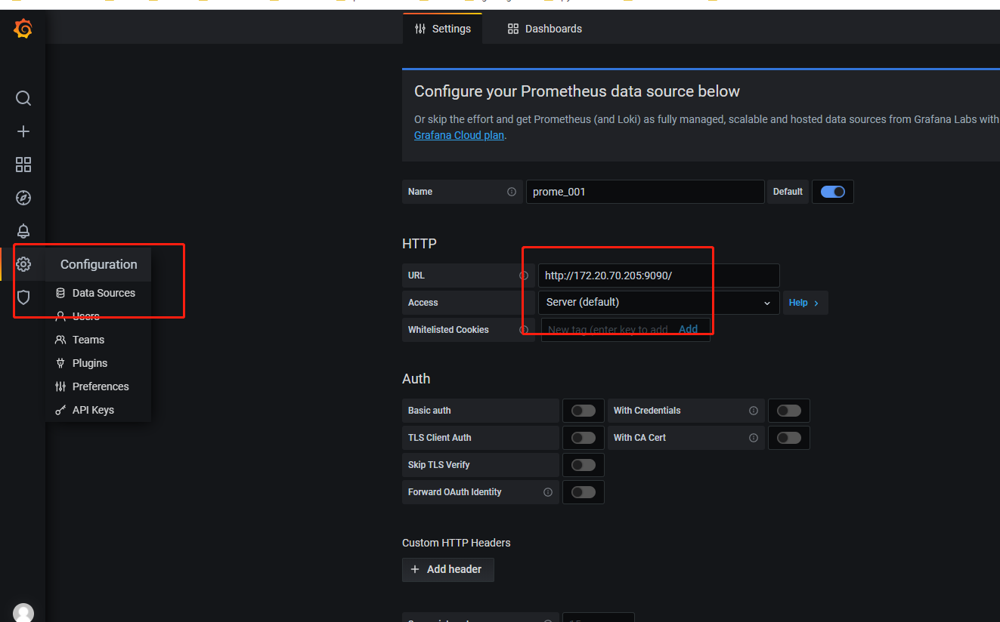
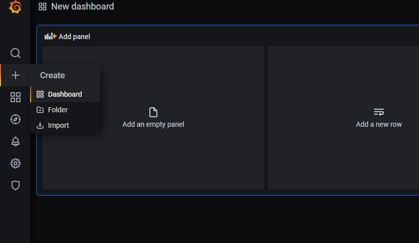
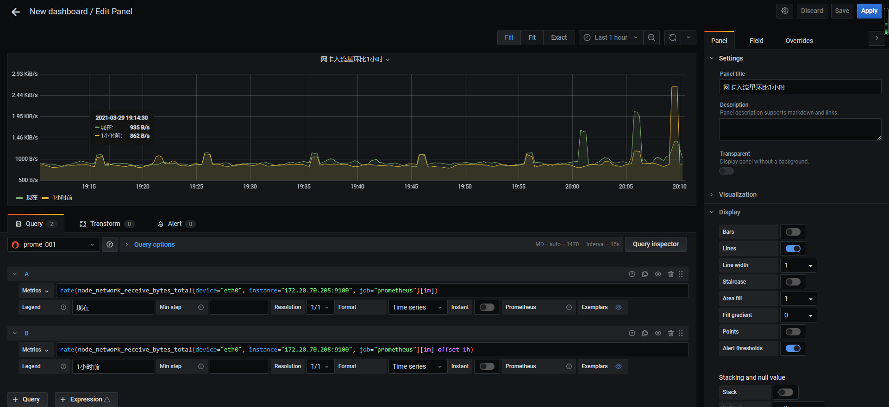
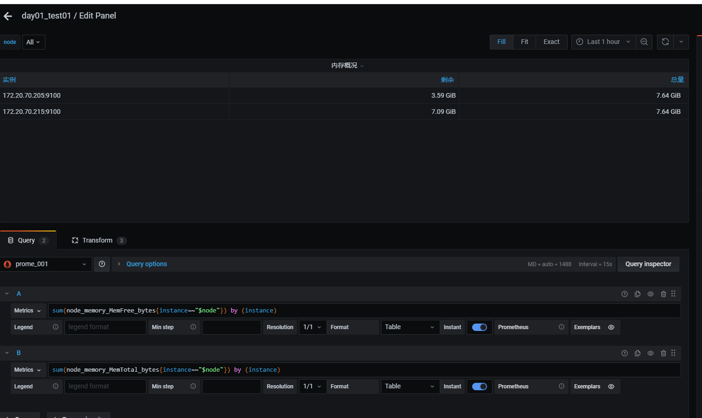
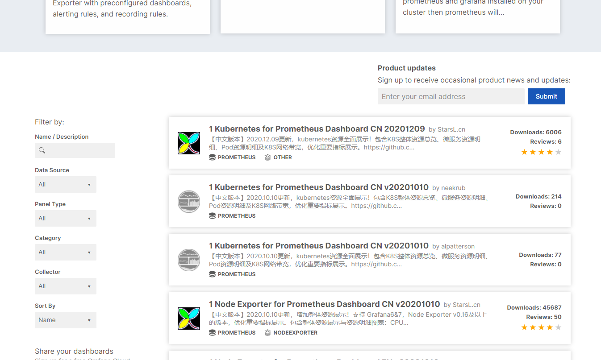
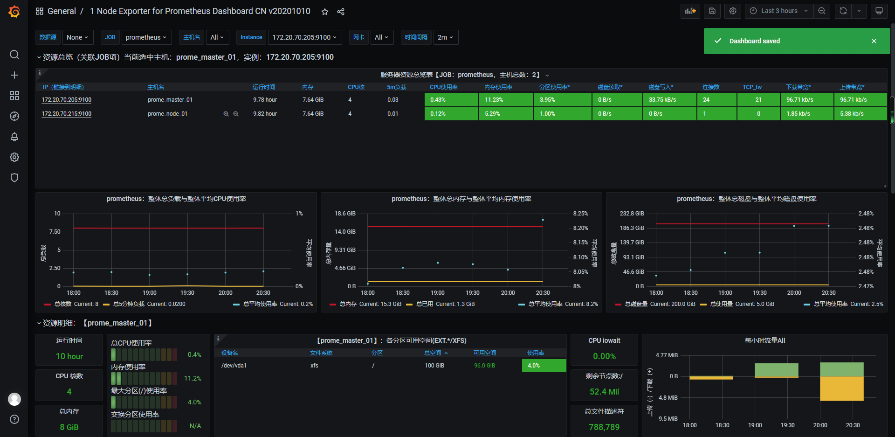

> 添加数据源
>
> - 选择pormethesu
>
> 

> 创建测试dashboard
>
> - 点击Add an empty panel
>
> 

> disk测试
>
> sql: node_disk_io_now

```
# error
yum install -y ntp

ntpdate -u time1.aliyun.com
```


> 网卡测试数据
> 

> panel中操作
- 设置单位
- panel改名
- 曲线别名
- 曲线sort
- 曲线复制
- 曲线静默
- panel复制
- 设置告警线


> 设置tables

> 使用变量查询


> 变量嵌套

> dashboard开屏时需要加载变量，这是导致他们慢的原因之一


> 导入dashboard商城中的node_exporter模板
- 地址 https://grafana.com/grafana/dashboards

- 两种导入模式
    - url导入
    - json文件导入
- https://grafana.com/grafana/dashboards/8919
- 推荐第二个模板

- https://grafana.com/grafana/dashboards/11074-node-exporter-for-prometheus-dashboard-en-v20201010/


- 

