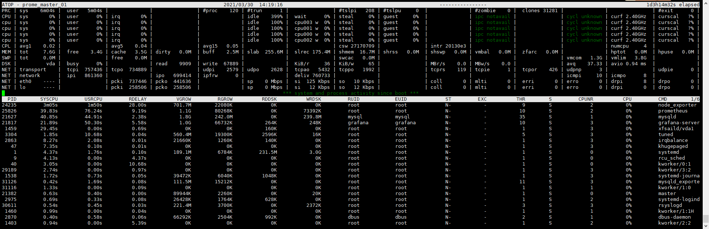
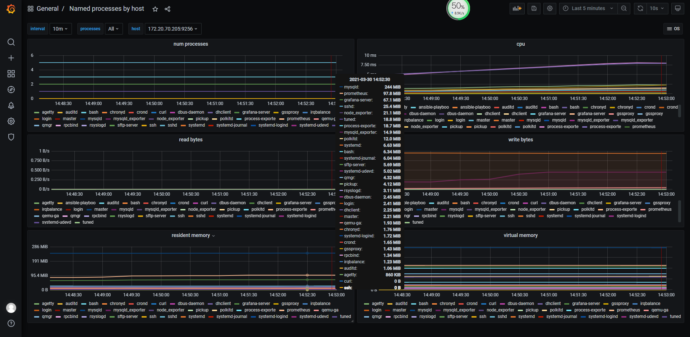

> 体验atop
```shell script
yum -y install atop

atop
c、p、m
```



> 在机器上部署 process-exporter
- 项目地址 https://github.com/ncabatoff/process-exporter


> 使用ansible部署 process-exporter
```shell script

ansible-playbook -i host_file  service_deploy.yaml  -e "tgz=process-exporter-0.7.5.linux-amd64.tar.gz" -e "app=process-exporter"

```

> 准备配置文件 process-exporter.yaml
- 指定采集进程的方式，下面的例子代表所有cmdline
```shell script
# error
Jun 14 01:29:42 prome-master01 process-exporter: 2023/06/14 01:29:42 error reading config file "/opt/app/process-exporter/process-exporter.yaml": error reading config file "/opt/app/process-exporter/process-exporter.yaml": open /opt/app/process-exporter/process-exporter.yaml: no such file or directory

# 配置文件
cat <<EOF >/opt/app/process-exporter/process-exporter.yaml
process_names:
  - name: "{{.Comm}}"
    cmdline:
    - '.+'
EOF

# 只采集mysql
cat <<EOF >/opt/app/process-exporter/process-exporter.yaml
process_names:
  - name: "{{.Comm}}"
    cmdline:
    - '.*mysql.*'
EOF


# 重启
systemctl restart process-exporter
```

> 将process-exporter采集加入的采集池中 
```shell script
# vim /opt/app/prometheus/prometheus.yml
  - job_name: process_exporter
    honor_timestamps: true
    scrape_interval: 15s
    scrape_timeout: 10s
    metrics_path: /metrics
    scheme: http
    static_configs:
    - targets:
      - 192.168.116.130:9256
      - 192.168.116.130:9256

```

> grafana 上导入process-exporter dashboard
- 地址 https://grafana.com/grafana/dashboards/4202
- 备选 https://grafana.com/grafana/dashboards/10317
    - 变量替换 
    - label_values(namedprocess_namegroup_num_procs, instance)
	- label_values(namedprocess_namegroup_cpu_seconds_total{instance=~"$host"},groupname)



> 原理

```
[root@prome-node01 ~]# cat /proc/1331/stat
1331 (master) S 1 1331 1331 0 -1 4202816 442 4950 0 5 1 13 3 18 20 0 1 0 1981 91852800 546 18446744073709551615 94059147509760 94059147665844 140734968668704 140734968667144 140687748714051 0 0 4096 91215 18446744072034544958 0 0 17 0 0 0 0 0 0 94059149764680 94059149772128 94059175206912 140734968675628 140734968675659 140734968675659 140734968676316 0
[root@prome-node01 ~]# cat /proc/1331/io

```

