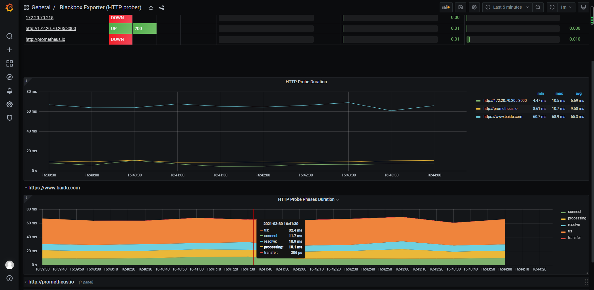

> 在机器上部署 blackbox_exporter
>
> 允许对端点进行黑盒探测 HTTP、HTTPS、DNS、TCP、ICMP 和 gRPC
- 项目地址 https://github.com/prometheus/blackbox_exporter


> 使用ansible部署 blackbox_exporter
```shell script

ansible-playbook -i host_file  service_deploy.yaml  -e "tgz=blackbox_exporter-0.18.0.linux-amd64.tar.gz" -e "app=blackbox_exporter"

```

> 页面访问blackbox 
- 地址 http://172.20.70.205:9115/

> 页面访问target http探测
```shell script
# 探测https://www.baidu.com
http://192.168.116.130:9115/probe?target=https://www.baidu.com&module=http_2xx
http://172.20.70.205:9115/probe?target=https://www.baidu.com&module=http_2xx&debug=true

```

> 结果解读
```shell script

Logs for the probe:
ts=2021-03-30T07:28:17.405299592Z caller=main.go:304 module=http_2xx target=https://www.baidu.com level=info msg="Beginning probe" probe=http timeout_seconds=119.5
ts=2021-03-30T07:28:17.40563586Z caller=http.go:342 module=http_2xx target=https://www.baidu.com level=info msg="Resolving target address" ip_protocol=ip6
ts=2021-03-30T07:28:17.414113889Z caller=http.go:342 module=http_2xx target=https://www.baidu.com level=info msg="Resolved target address" ip=110.242.68.4
ts=2021-03-30T07:28:17.414249109Z caller=client.go:252 module=http_2xx target=https://www.baidu.com level=info msg="Making HTTP request" url=https://110.242.68.4 host=www.baidu.com
ts=2021-03-30T07:28:17.459576352Z caller=main.go:119 module=http_2xx target=https://www.baidu.com level=info msg="Received HTTP response" status_code=200
ts=2021-03-30T07:28:17.459696667Z caller=main.go:119 module=http_2xx target=https://www.baidu.com level=info msg="Response timings for roundtrip" roundtrip=0 start=2021-03-30T15:28:17.414370915+08:00 dnsDone=2021-03-30T15:28:17.414370915+08:00 connectDone=2021-03-30T15:28:17.423500145+08:00 gotConn=2021-03-30T15:28:17.449441723+08:00 responseStart=2021-03-30T15:28:17.459467652+08:00 end=2021-03-30T15:28:17.459684294+08:00
ts=2021-03-30T07:28:17.459886914Z caller=main.go:304 module=http_2xx target=https://www.baidu.com level=info msg="Probe succeeded" duration_seconds=0.054504338


Metrics that would have been returned:
# HELP probe_dns_lookup_time_seconds Returns the time taken for probe dns lookup in seconds
# TYPE probe_dns_lookup_time_seconds gauge
probe_dns_lookup_time_seconds 0.008485086
# HELP probe_duration_seconds Returns how long the probe took to complete in seconds
# TYPE probe_duration_seconds gauge
probe_duration_seconds 0.054504338
# HELP probe_failed_due_to_regex Indicates if probe failed due to regex
# TYPE probe_failed_due_to_regex gauge
probe_failed_due_to_regex 0
# HELP probe_http_content_length Length of http content response
# TYPE probe_http_content_length gauge
probe_http_content_length 227
# HELP probe_http_duration_seconds Duration of http request by phase, summed over all redirects
# TYPE probe_http_duration_seconds gauge
probe_http_duration_seconds{phase="connect"} 0.009129316
probe_http_duration_seconds{phase="processing"} 0.01002596
probe_http_duration_seconds{phase="resolve"} 0.008485086
probe_http_duration_seconds{phase="tls"} 0.035070878
probe_http_duration_seconds{phase="transfer"} 0.000216612
# HELP probe_http_redirects The number of redirects
# TYPE probe_http_redirects gauge
probe_http_redirects 0
# HELP probe_http_ssl Indicates if SSL was used for the final redirect
# TYPE probe_http_ssl gauge
probe_http_ssl 1
# HELP probe_http_status_code Response HTTP status code
# TYPE probe_http_status_code gauge
probe_http_status_code 200
# HELP probe_http_uncompressed_body_length Length of uncompressed response body
# TYPE probe_http_uncompressed_body_length gauge
probe_http_uncompressed_body_length 227
# HELP probe_http_version Returns the version of HTTP of the probe response
# TYPE probe_http_version gauge
probe_http_version 1.1
# HELP probe_ip_addr_hash Specifies the hash of IP address. It's useful to detect if the IP address changes.
# TYPE probe_ip_addr_hash gauge
probe_ip_addr_hash 4.37589817e+08
# HELP probe_ip_protocol Specifies whether probe ip protocol is IP4 or IP6
# TYPE probe_ip_protocol gauge
probe_ip_protocol 4
# HELP probe_ssl_earliest_cert_expiry Returns earliest SSL cert expiry in unixtime
# TYPE probe_ssl_earliest_cert_expiry gauge
probe_ssl_earliest_cert_expiry 1.627277462e+09
# HELP probe_ssl_last_chain_expiry_timestamp_seconds Returns last SSL chain expiry in timestamp seconds
# TYPE probe_ssl_last_chain_expiry_timestamp_seconds gauge
probe_ssl_last_chain_expiry_timestamp_seconds 1.627277462e+09
# HELP probe_ssl_last_chain_info Contains SSL leaf certificate information
# TYPE probe_ssl_last_chain_info gauge
probe_ssl_last_chain_info{fingerprint_sha256="2ed189349f818f3414132ebea309e36f620d78a0507a2fa523305f275062d73c"} 1
# HELP probe_success Displays whether or not the probe was a success
# TYPE probe_success gauge
probe_success 1
# HELP probe_tls_version_info Contains the TLS version used
# TYPE probe_tls_version_info gauge
probe_tls_version_info{version="TLS 1.2"} 1


Module configuration:
prober: http
http:
    ip_protocol_fallback: true
tcp:
    ip_protocol_fallback: true
icmp:
    ip_protocol_fallback: true
dns:
    ip_protocol_fallback: true
```


> http trace中对于http各个状态的描述
- dns解析时间:              DNSDone-DNSStart
- tls握手时间:              gotConn - DNSDone
- tls connect连接时间:      connectDone - DNSDone
- 非tls connect连接时间:    gotConn - DNSDone
- processing 服务端处理时间: responseStart - gotConn
- transfer 数据传输时间:     end - responseStart

```golang
trace := &httptrace.ClientTrace{
    DNSStart:             tt.DNSStart,
    DNSDone:              tt.DNSDone,
    ConnectStart:         tt.ConnectStart,
    ConnectDone:          tt.ConnectDone,
    GotConn:              tt.GotConn,
    GotFirstResponseByte: tt.GotFirstResponseByte,
}
```


> blackbox_exporter 需要传入target 和 module 参数，采用下列方式加入的采集池中 
```yaml
  - job_name: 'blackbox-http'
    # metrics的path 注意不都是/metrics
    metrics_path: /probe
    # 传入的参数
    params:
      module: [http_2xx]  # Look for a HTTP 200 response.
      target: [prometheus.io,www.baidu.com,192.168.116.130:3000]
    static_configs:
      - targets:
        - 192.168.116.130:9115 
       
```

> 会发现如此配置之后 实例数据只有blackbox_exporter的地址 而没有target的地址

```shell script
probe_duration_seconds
probe_duration_seconds{instance="172.20.70.205:9115", job="blackbox-http"}

# 使用relabel_configs，如下
```

> 请看015 多实例采集的说明

```yml
cd /opt/app/blackbox_exporter

# 支持的模块说明
vim blackbox.yml
```


> blackbox_exporter 采集加入的采集池中 
```yaml
scrape_configs:
  - job_name: 'blackbox-http'
    # metrics的path 注意不都是/metrics
    metrics_path: /probe
    # 传入的参数
    params:
      module: [http_2xx]  # Look for a HTTP 200 response.
    static_configs:
      - targets:
        - http://prometheus.io    # Target to probe with http.
        - https://www.baidu.com   # Target to probe with https.
        - http://192.168.116.130:3000 # Target to probe with http on port 3000.
    relabel_configs:
      - source_labels: [__address__]
        target_label: __param_target
      - source_labels: [__param_target]
        target_label: instance
      - target_label: __address__
        replacement: 192.168.116.130:9115  # The blackbox exporter's real hostname:port.

  - job_name: 'blackbox-ssh'
    # metrics的path 注意不都是/metrics
    metrics_path: /probe
    # 传入的参数
    params:
      module: [ssh_banner]  # Look for a HTTP 200 response.
    static_configs:
      - targets:
        - 172.20.70.205    # Target to probe with http.
        - 172.20.70.215   # Target to probe with https.
    relabel_configs:
      - source_labels: [__address__]
        target_label: __param_target
      - source_labels: [__param_target]
        target_label: instance
      - target_label: __address__
        replacement: 172.20.70.205:9115  # The blackbox exporter's real hostname:port.
```

> grafana 上导入 blackbox_exporter dashboard
- 地址 https://grafana.com/grafana/dashboards/13659




> ssh探测 基于tcp
```yml
# ssh
[root@prome-master01 ~]# telnet prome-node01 22
Trying 192.168.116.131...
Connected to prome-node01.
Escape character is '^]'.
SSH-2.0-OpenSSH_7.4

# ping
[root@prome-master01 ~]# ping 114.114.114.114
PING 114.114.114.114 (114.114.114.114) 56(84) bytes of data.
64 bytes from 114.114.114.114: icmp_seq=1 ttl=128 time=13.2 ms
```


- 页面访问探测
```shell script
# 模块使用 ssh_banner 探测172.20.70.215:22
http://172.20.70.205:9115/probe?module=ssh_banner&target=172.20.70.215:22

# 结果解读

# HELP probe_dns_lookup_time_seconds Returns the time taken for probe dns lookup in seconds
# TYPE probe_dns_lookup_time_seconds gauge
probe_dns_lookup_time_seconds 2.5331e-05
# HELP probe_duration_seconds Returns how long the probe took to complete in seconds
# TYPE probe_duration_seconds gauge
probe_duration_seconds 0.02228226
# HELP probe_failed_due_to_regex Indicates if probe failed due to regex
# TYPE probe_failed_due_to_regex gauge
probe_failed_due_to_regex 0
# HELP probe_ip_addr_hash Specifies the hash of IP address. It's useful to detect if the IP address changes.
# TYPE probe_ip_addr_hash gauge
probe_ip_addr_hash 9.51584696e+08
# HELP probe_ip_protocol Specifies whether probe ip protocol is IP4 or IP6
# TYPE probe_ip_protocol gauge
probe_ip_protocol 4
# HELP probe_success Displays whether or not the probe was a success
# TYPE probe_success gauge
probe_success 1

# ssh_banner 模块解读
# 使用tcp进行探测，并且 期望得到 SSH-2.0-的响应
  ssh_banner:
    prober: tcp
    tcp:
      query_response:
      - expect: "^SSH-2.0-"

# 和telnet结果一致
[root@prome_master_01 blackbox_exporter]# telnet 172.20.70.215 22
Trying 172.20.70.215...
Connected to 172.20.70.215.
Escape character is '^]'.
SSH-2.0-OpenSSH_7.4

Protocol mismatch.
Connection closed by foreign host.


```
- 配置
```yaml
  - job_name: 'blackbox-ssh'
    # metrics的path 注意不都是/metrics
    metrics_path: /probe
    # 传入的参数
    params:
      module: [ssh_banner]  # Look for a HTTP 200 response.
    static_configs:
      - targets:
        - 192.168.116.130:22    # Target to probe with http.
        - 192.168.116.131:22   # Target to probe with https.
    relabel_configs:
      - source_labels: [__address__]
        target_label: __param_target
      - source_labels: [__param_target]
        target_label: instance
      - target_label: __address__
        replacement: 192.168.116.130:9115  # The blackbox exporter's real hostname:port.
        
  - job_name: 'blackbox-ping'
    # metrics的path 注意不都是/metrics
    metrics_path: /probe
    # 传入的参数
    params:
      module: [icmp]  # Look for a HTTP 200 response.
    static_configs:
      - targets:
        - 192.168.116.130    # Target to probe with http.
        - 192.168.116.131   # Target to probe with https.
        - 114.114.114.114
    relabel_configs:
      - source_labels: [__address__]
        target_label: __param_target
      - source_labels: [__param_target]
        target_label: instance
      - target_label: __address__
        replacement: 192.168.116.130:9115  # The blackbox exporter's real hostname:port.
 
```

> 进行ping探测
- 查看Prometheus的target -> 点击页面访问
```shell script
http://172.20.70.205:9115/probe?module=icmp&target=www.baidu.com
http://192.168.116.130:9115/probe?module=icmp&target=114.114.114.114&debug=true

# 结果解读
# HELP probe_dns_lookup_time_seconds Returns the time taken for probe dns lookup in seconds
# TYPE probe_dns_lookup_time_seconds gauge
probe_dns_lookup_time_seconds 0.195704171
# HELP probe_duration_seconds Returns how long the probe took to complete in seconds
# TYPE probe_duration_seconds gauge
probe_duration_seconds 0.378563375
# HELP probe_icmp_duration_seconds Duration of icmp request by phase
# TYPE probe_icmp_duration_seconds gauge
probe_icmp_duration_seconds{phase="resolve"} 0.195704171
probe_icmp_duration_seconds{phase="rtt"} 0.182456226
probe_icmp_duration_seconds{phase="setup"} 0.000145827
# HELP probe_icmp_reply_hop_limit Replied packet hop limit (TTL for ipv4)
# TYPE probe_icmp_reply_hop_limit gauge
probe_icmp_reply_hop_limit 49
# HELP probe_ip_addr_hash Specifies the hash of IP address. It's useful to detect if the IP address changes.
# TYPE probe_ip_addr_hash gauge
probe_ip_addr_hash 2.282787449e+09
# HELP probe_ip_protocol Specifies whether probe ip protocol is IP4 or IP6
# TYPE probe_ip_protocol gauge
probe_ip_protocol 4
# HELP probe_success Displays whether or not the probe was a success
# TYPE probe_success gauge
probe_success 1

```


> ssh探测过程说明


```shell script

prometheus --> blackbox_exporter 使用配置 http://192.168.0.112:9115/probe?module=ssh_banner&target=192.168.0.127%3A22  --> 192.168.0.127:22


```