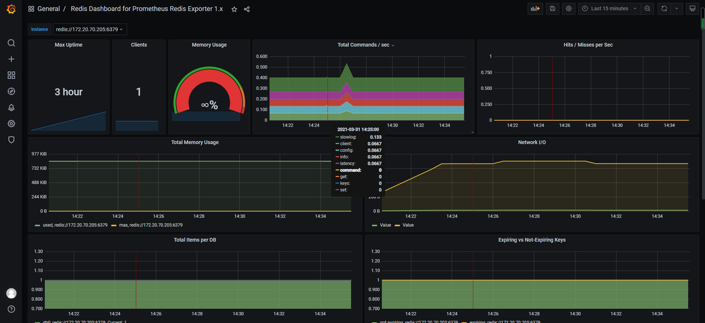

> 项目地址
- https://github.com/oliver006/redis_exporter

> 使用ansible部署 redis_exporter
```shell script

ansible-playbook -i host_file  service_deploy.yaml  -e "tgz=redis_exporter-v1.20.0.linux-amd64.tar.gz" -e "app=redis_exporter"

```

> redis_exporter 采集加入的采集池中,按照之前blackbox_exporter的模式
```yaml

scrape_configs:
  ## config for the multiple Redis targets that the exporter will scrape
  - job_name: 'redis_exporter_targets'
    static_configs:
      - targets:
        - redis://192.168.116.130:6379
        - redis://192.168.116.130:6479
    metrics_path: /scrape
    relabel_configs:
      - source_labels: [__address__]
        target_label: __param_target
      - source_labels: [__param_target]
        target_label: instance
      - target_label: __address__
        replacement: 192.168.116.130:9121

```

```
#ctrl +r  
# 搜索历史命令
```


> 复制项目grafana json导入大盘图

- 地址 https://raw.githubusercontent.com/oliver006/redis_exporter/master/contrib/grafana_prometheus_redis_dashboard.json

> 效果图

