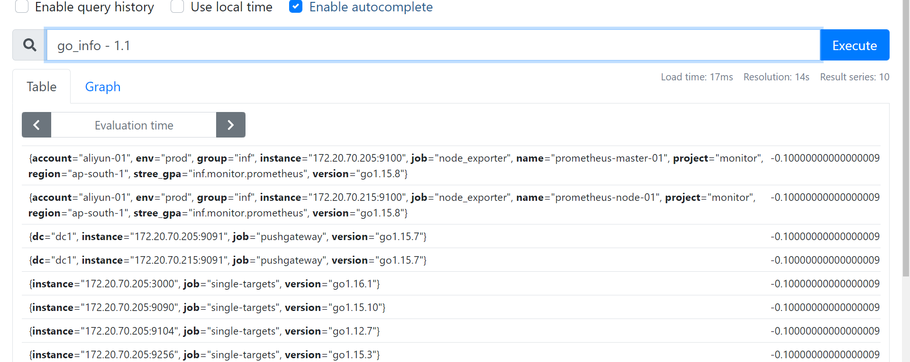

> 地址
- https://prometheus.io/docs/concepts/data_model/

> metrics_name 正则
- `[a-zA-Z_:][a-zA-Z0-9_:]*`

> metrics_name 正则
- `[a-zA-Z_:][a-zA-Z0-9_:]*`

> 标签名称 正则
- 标签名称可能包含ASCII字母，数字和下划线。它们必须匹配正则表达式`[a-zA-Z_][a-zA-Z0-9_]* `开头的标签名称__ 保留供内部使用。

> 标签值可以包含任何Unicode字符。

> 思考问啥不支持 `.` 和 `-`

- 看起来 promql 如果含有点 和 float 的运算冲突，所以metric_name不支持，但是在标签中是支持点的
- 我理解metric 需要解析成实时运算，但是标签的解析不涉及到运算，虽然 __name__ 也是作为一种特殊标签存入 倒排索引中？
- 道理跟metricname中不支持减号一个道理么
- 相关讨论
    - https://github.com/prometheus/client_golang/issues/418
    - https://github.com/prometheus/jmx_exporter/issues/256