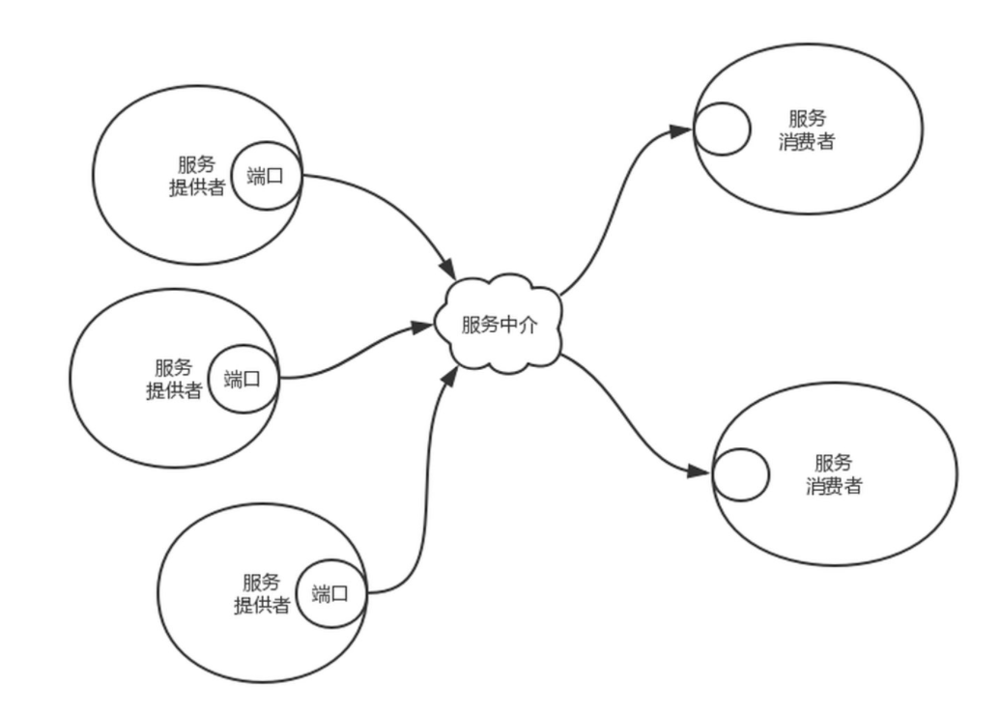
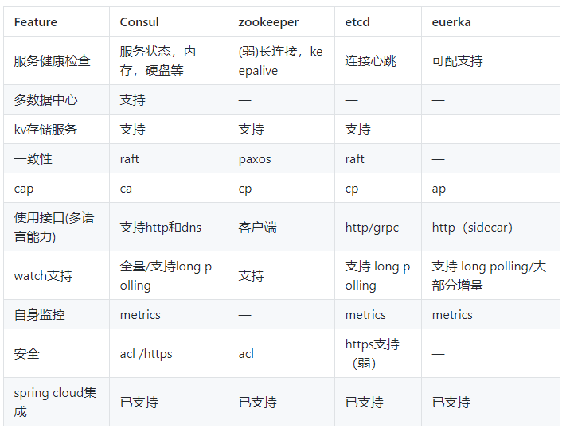
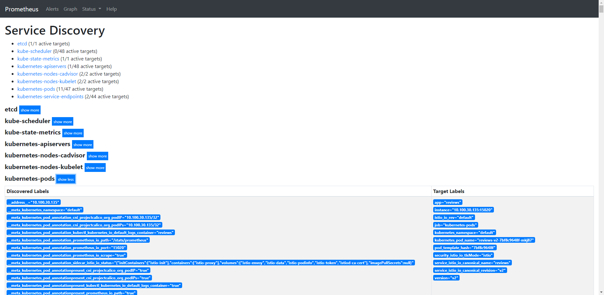

> 静态配置样例
```yaml
  - job_name: 'single-targets'
    honor_timestamps: true
    scrape_interval: 15s
    scrape_timeout: 10s
    metrics_path: /metrics
    scheme: http
    static_configs:
    - targets:
      - 172.20.70.205:9100
      - 172.20.70.215:9100
      - 172.20.70.205:3000
      - 172.20.70.205:9104
      - 172.20.70.205:9256
      - 172.20.70.215:9256

```

> 静态配置问题
- 不能很好的感知target变化
- 无法很好的添加tag
- 自动化需要结合yaml文件变更来做

# 服务发现配置
- 什么是服务发现  

> 角色分类
- 服务发现有三个角色，服务提供者、服务消费者和服务中介
- 服务中介是联系服务提供者和服务消费者的桥梁
- 服务提供者将自己提供的服务地址注册到服务中介
- 服务消费者从服务中介那里查找自己想要的服务的地址，然后享受这个服务
- 服务中介提供多个服务，每个服务对应多个服务提供者
- 服务中介就是一个字典，字典里有很多key/value键值对，key是服务名称，value是服务提供者的地址列表

> 服务注册
- 服务注册就是调用字典的Put方法塞东西，服务查找就是调用字典的Get方法拿东西

> 服务探测 
- 当服务提供者节点挂掉时，要求服务能够及时取消注册，比便及时通知消费者重新获取服务地址
- 当服务提供者新加入时，要求服务中介能及时告知服务消费者，你要不要尝试一下新的服务

## 服务发现组织对比


## 服务发现和监控系统对接
- 服务发现源作为监控采集的上级
- 监控系统watch服务变化，获得target列表并采集

> 举例 k8s服务发现node/pod/service


> prometheus支持的服务发现源


|  服务发现名   | 含义|   说明| 
|  ----  | ----  | ----  | 
| azure_sd_config	| 从微软云azure发现 vm ip|	
| consul_sd_config	| 从consul发现service|	
| digitalocean_sd_config	| 从DigitalOcean发现虚拟专用服务器（VPS）|	
| dockerswarm_sd_config	| 从docker swarm 抓取service/node/task |	
| dns_sd_config	| 从dns发现A记录等|	
| ec2_sd_config	| 从aws发现ec2记录等|	
| openstack_sd_config	| OpenStack Nova实例中检索抓取目标|	
| gce_sd_config	| GCP GCE实例|	
| hetzner_sd_config	| hetzner云实例|	
| marathon_sd_config 	| Marathon 容器编排云实例|	
| nerve_sd_config 	| AirBnB的Nerve中检索刮目标|	
| file_sd_config	| 从文件抓取目标   |	
| kubernetes_sd_config	| 从k8s发现 service/node/pod/endpoint/ingress |	

