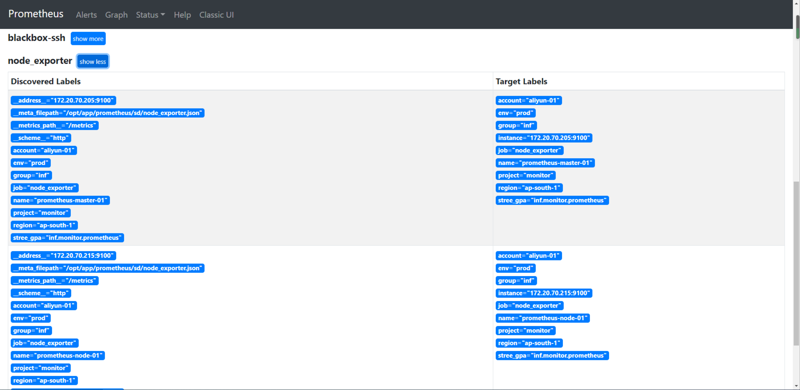

> 之前配置了很多个traget
- redis
- mysql
- grafana
- pushgateway
.....

#  基于文件的服务发现配置 
> 文档地址
-  https://prometheus.io/docs/prometheus/latest/configuration/configuration/#file_sd_config
> 特点
- 基于文件的服务发现提供了一种配置静态目标的更通用的方法
- 并充当了插入自定义服务发现机制的接口。
- 摆脱对特定服务发现源的依赖
- 只要能正确给出 json/yaml文件即可
- 和服务树的最好匹配方案

> 使用
- 20 prometheus 采集器，一个控制器 生成文件+分发文件

> 文件类型
- yaml
```shell script
YAML yaml - targets: [ - '<host>' ] labels: [ <labelname>: <labelvalue> ... ]

```
- json
```shell script
json [ { "targets": [ "<host>", ... ], "labels": { "<labelname>": "<labelvalue>", ... } }, ... ]
```
> 文件路径 支持通配符
> 文件刷新间隔 refresh_interval 
> prometheus配置样例
```yaml
  - job_name: 'ECS'
    scrape_interval: 30s
    scrape_timeout: 10s
    metrics_path: /metrics
    scheme: http
    honor_timestamps: false
    file_sd_configs:
    - files:
      - /App/prometheus/sd/file_sd_by_prome_shared.json
      refresh_interval: 5m
```

> json文件样例
```json
[
  {
    "targets": [
      "172.20.70.205:9100"
    ],
    "labels": {
      "name": "prometheus-storage-01",
      "account": "aliyun-01",
      "region": "ap-south-1",
      "env": "prod",
      "group": "inf",
      "project": "monitor",
      "stree_gpa": "inf.monitor.prometheus"
    }
  },
  {
    "targets": [
      "172.20.70.205:9091",
      "172.20.70.215:9091"
    ],
    "labels": {
      "account": "aliyun-01",
      "region": "ap-south-2",
      "env": "prod",
      "group": "inf",
      "project": "middleware",
      "stree_gpa": "inf.middleware.kafka"
    }
  }
]
```
> 下面来解读一下
- targets 是一组实例地址的列表
- labels 是这组实例的标签，应用到列表中所有实例
- 如果想每个实例不同的标签，可以将targets列表保留一个实例即可
- 标签可以自定义，下面举几个例子
    - account 代表公有云账户，多账户情况
    - region 代表区域
    - env 代表所属环境 prod代表生产，pre代表预发，test代表测试
    - group代表业务大组
    - project 代表项目
    - stree_gpa 代表服务树三级标签
- 那么prometheus在采集对应target时就会将对应标签打入其metrics中
- 为后续我们按照标签过滤提供方便

## yaml 格式
```yaml
- targets:        
  - 172.20.70.205:9100
  - 172.20.70.215:9100
  labels:
    account: "aliyun-01"     
    region: "ap-south-1"
```

## 多实例target如 redis和blackbox
- 比如http探测的targets
```json
[
  {
    "targets": [
      "172.20.70.205:9115",
      "http://prometheus.io",
      "https://www.baidu.com"
    ]
  }
]
```
> 上手实操
- 将http探测改为文件发现
- 将node_exporter改为文件发现
- prometheus 配置
```yaml

  - job_name: 'blackbox-http'
    # metrics的path 注意不都是/metrics
    metrics_path: /probe
    # 传入的参数
    params:
      module: [http_2xx]  # Look for a HTTP 200 response.
    scrape_interval: 30s
    scrape_timeout: 10s
    scheme: http
    honor_timestamps: false
    file_sd_configs:
    - files:
      - /opt/app/prometheus/sd/blackbox_http.json
      refresh_interval: 2m
    relabel_configs:
      - source_labels: [__address__]
        target_label: __param_target
      - source_labels: [__param_target]
        target_label: instance
      - target_label: __address__
        replacement: 192.168.116.130:9115


  - job_name: 'node_exporter'
    # metrics的path 注意不都是/metrics
    # 传入的参数
    scrape_interval: 30s
    scrape_timeout: 10s
    scheme: http
    honor_timestamps: false
    file_sd_configs:
    - files:
      - /opt/app/prometheus/sd/node_exporter.json
      refresh_interval: 2m

            

```
- 创建sd目录
```shell script
mkdir -pv /opt/app/prometheus/sd/
```
- 写入json文件
```shell script

cat <<EOF > /opt/app/prometheus/sd/node_exporter.json
[
  {
    "targets": [
      "192.168.116.130:9100"
    ],
    "labels": {
      "name": "prometheus-master-01",
      "account": "aliyun-01",
      "region": "ap-south-1",
      "env": "prod",
      "group": "inf",
      "project": "monitor",
      "stree_gpa": "inf.monitor.prometheus"
    }
  },
  {
    "targets": [
      "192.168.116.131:9100"
    ],
    "labels": {
      "name": "prometheus-node-01",
      "account": "aliyun-01",
      "region": "ap-south-1",
      "env": "prod",
      "group": "inf",
      "project": "monitor",
      "stree_gpa": "inf.monitor.prometheus"
    }
  }
]
EOF

cat <<EOF > /opt/app/prometheus/sd/blackbox_http.json
[
  {
    "targets": [
      "192.168.116.130:9115",
      "192.168.116.130:3000",
      "http://prometheus.io",
      "https://www.baidu.com"
    ]
  }
]
EOF

```

- reload prometheus 
- 观察target页面 http://172.20.70.205:9090/targets 和 sd结果页面  http://172.20.70.205:9090/service-discovery#blackbox-http


> 修改文件 blackbox_http.json 新增 https://github.com/ 的探测
```shell script
cat <<EOF > /opt/app/prometheus/sd/blackbox_http.json
[
  {
    "targets": [
      "172.20.70.205:9115",
      "http://prometheus.io",
      "https://www.baidu.com",
      "https://github.com/"
    ]
  }
]
EOF


curl -X POST http://localhost:9090/-/reload

```

