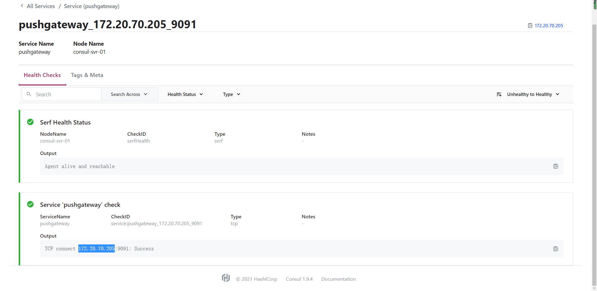

## 基于consul的服务发现

> consul 安装
```shell script

# 下载consul
wget -O /opt/tgzs/consul_1.9.4_linux_amd64.zip  https://releases.hashicorp.com/consul/1.9.4/consul_1.9.4_linux_amd64.zip 

cd /opt/tgzs/
unzip consul_1.9.4_linux_amd64.zip

/bin/cp -f consul /usr/bin/


```

> 启动单机版consul
```shell script
# 
mkdir  /opt/app/consul

# 准备配置文件
cat <<EOF > /opt/app/consul/single_server.json
{
    "datacenter": "dc1",
    "node_name": "consul-svr-01",
    "server": true,
    "bootstrap_expect": 1,
    "data_dir": "/opt/app/consul/",
    "log_level": "INFO",
    "log_file": "/opt/logs/",
    "ui": true,
    "bind_addr": "0.0.0.0",
    "client_addr": "0.0.0.0",
    "retry_interval": "10s",
    "raft_protocol": 3,
    "enable_debug": false,
    "rejoin_after_leave": true,
    "enable_syslog": false
}
EOF

# 写入service文件
cat <<EOF > /etc/systemd/system/consul.service
[Unit]
Description=consul server
Wants=network-online.target
After=network-online.target

[Service]
ExecStart=/usr/bin/consul agent  -config-file=/opt/app/consul/single_server.json
StandardOutput=syslog
StandardError=syslog
SyslogIdentifier=consul
[Install]
WantedBy=default.target
EOF

# 启动服务
systemctl daemon-reload && systemctl start consul   

systemctl status consul 


```

> 验证访问
- http://172.20.70.205:8500/

> python-consul初体验
- 项目地址  https://python-consul.readthedocs.io/en/latest/
- 安装 pip install python-consul
> set key v

> get key v

> 传入index 阻塞get—key
- 传入的index >= 当前index 会阻塞等待更新
- 发出一个block query时，服务端的处理流程为:
    - 如果wait时间没有超时
        - 如果index大于服务内部的index
            - 如果服务在此期间有变更，则重新获取服务的数据。重新判断
            - 如果服务没有变更，则等待
        - 如果index小于服务内部的index，则立即返回，并通过header设置客户端的index
    - 如果wait时间超时
        - 直接返回当前的服务数据


> 注册service


> 注销服务 

> watch 服务变化


