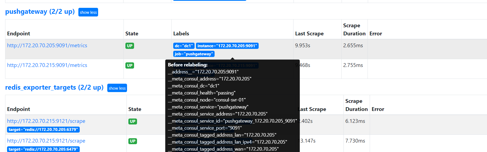

> 配置文档 https://prometheus.io/docs/prometheus/latest/configuration/configuration/#consul_sd_config

> 将pushgateway 服务改造成consul 服务发现模式

```yaml
  - job_name: 'pushgateway'
    honor_timestamps: true
    scrape_interval: 15s
    scrape_timeout: 10s
    metrics_path: /metrics
    scheme: http
    consul_sd_configs:
      - server: 172.20.70.205:8500
        services:
          - pushgateway
    relabel_configs:
      - source_labels:  ["__meta_consul_dc"]
        target_label: "dc"
```

> 页面观察服务发现结果


