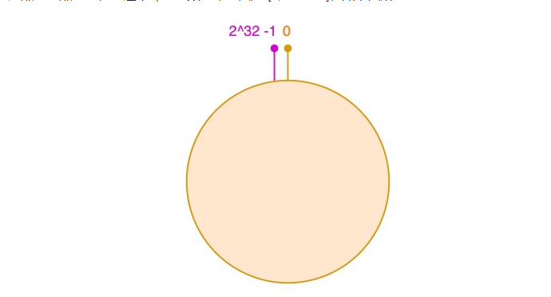
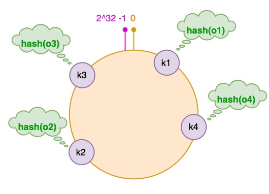
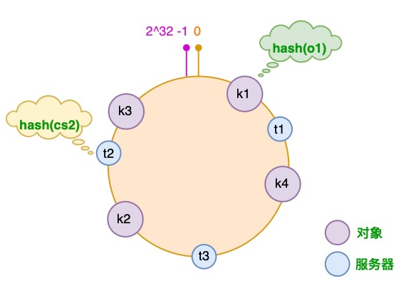
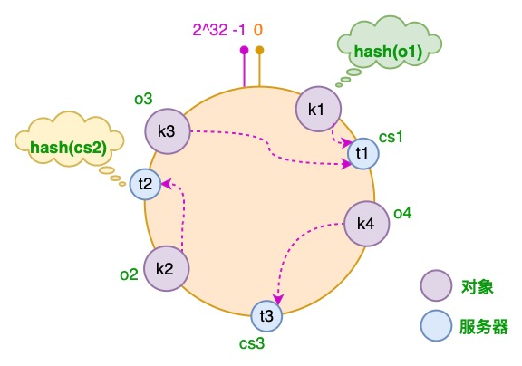
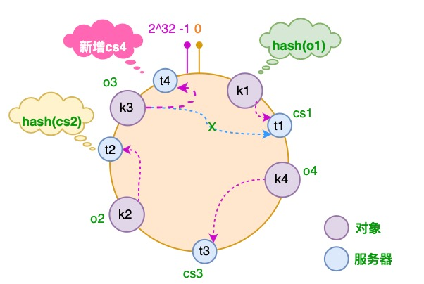
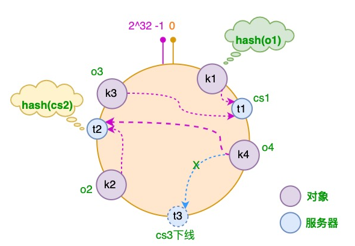
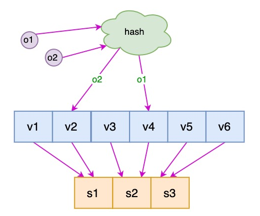
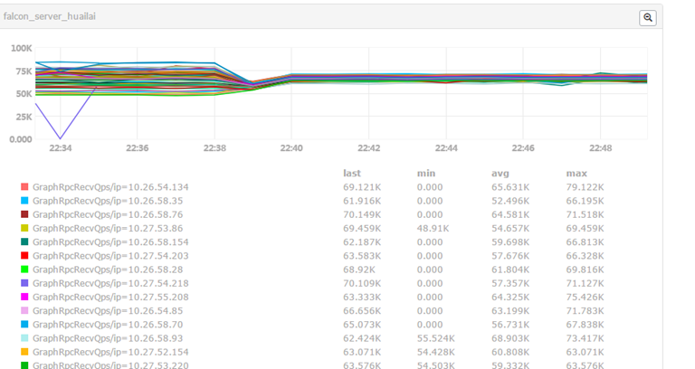
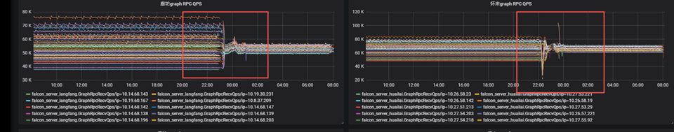

> 什么是哈希
hash（散列、杂凑）函数，是将任意长度的数据映射到有限长度的域上。直观解释起来，就是对一串数据m进行杂糅，输出另一段固定长度的数据h，作为这段数据的特征（指纹）

- 举例 md5sum
```shell script
[root@prome_master_01 prometheus]# md5sum  prometheus.yml
b03075ae85405e468a327d285bb1a84f  prometheus.yml

```

> 哈希算法在分布式系统中的问题
- 在分布式的存储系统中，要将数据存储到具体的节点上
- 如果我们采用普通的hash算法进行路由，将数据映射到具体的节点上，如key%N，key是数据的key，N是机器节点数
- 如果有一个机器加入或退出这个集群，则所有的数据映射都无效了，如果是持久化存储则要做数据迁移，如果是分布式缓存，则其他缓存就失效了。

#  一致性哈希算法
> 一致性哈希算法在 1997 年由麻省理工学院提出，是一种特殊的哈希算法，在移除或者添加一个服务器时，能够尽可能小地改变已存在的服务请求与处理请求服务器之间的映射关系。一致性哈希解决了简单哈希算法在分布式哈希表（Distributed Hash Table，DHT）中存在的动态伸缩等问题 。
> 一致性哈希算法优点
-  可扩展性。一致性哈希算法保证了增加或减少服务器时，数据存储的改变最少，相比传统哈希算法大大节省了数据移动的开销 。
- 更好地适应数据的快速增长。采用一致性哈希算法分布数据，当数据不断增长时，部分虚拟节点中可能包含很多数据、造成数据在虚拟节点上分布不均衡，此时可以将包含数据多的虚拟节点分裂，这种分裂仅仅是将原有的虚拟节点一分为二、不需要对全部的数据进行重新哈希和划分。
- 虚拟节点分裂后，如果物理服务器的负载仍然不均衡，只需在服务器之间调整部分虚拟节点的存储分布。这样可以随数据的增长而动态的扩展物理服务器的数量，且代价远比传统哈希算法重新分布所有数据要小很多。

> 一致性哈希算法与哈希算法的关系

**一致性哈希算法是在哈希算法基础上提出的，在动态变化的分布式环境中，哈希算法应该满足的几个条件：平衡性、单调性和分散性。**

- 平衡性：是指 hash 的结果应该平均分配到各个节点，这样从算法上解决了负载均衡问题。
- 单调性：是指在新增或者删减节点时，不影响系统正常运行。
- 分散性：是指数据应该分散地存放在分布式集群中的各个节点（节点自己可以有备份），不必每个节点都存储所有的数据。


# 一致性哈希算法原理
- 数据结构
> 一致性哈希算法通过一个叫作一致性哈希环的数据结构实现。这个环的起点是 0，终点是 2^32 - 1，并且起点与终点连接，故这个环的整数分布范围是 [0, 2^32-1]，如下图所示：


- 将对象放置到哈希环
> 假设我们有 "semlinker"、"kakuqo"、"lolo"、"fer" 四个对象，分别简写为 o1、o2、o3 和 o4，然后使用哈希函数计算这个对象的 hash 值，值的范围是 [0, 2^32-1]：


图中对象的映射关系如下：
```shell script
hash(o1) = k1; hash(o2) = k2;
hash(o3) = k3; hash(o4) = k4;
```

- 将服务器放置到哈希环
> 接着使用同样的哈希函数，我们将服务器也放置到哈希环上，可以选择服务器的 IP 或主机名作为键进行哈希，这样每台服务器就能确定其在哈希环上的位置。这里假设我们有 3 台缓存服务器，分别为 cs1、cs2 和 cs3：


图中服务器的映射关系如下：
```shell script
hash(cs1) = t1; hash(cs2) = t2; hash(cs3) = t3; # Cache Server
```

- 为对象选择服务器
> 将对象和服务器都放置到同一个哈希环后，在哈希环上顺时针查找距离这个对象的 hash 值最近的机器，即是这个对象所属的机器。 以 o2 对象为例，顺序针找到最近的机器是 cs2，故服务器 cs2 会缓存 o2 对象。而服务器 cs1 则缓存 o1，o3 对象，服务器 cs3 则缓存 o4 对象。


- 服务器增加的情况
> 假设由于业务需要，我们需要增加一台服务器 cs4，经过同样的 hash 运算，该服务器最终落于 t1 和 t2 服务器之间，具体如下图所示：

> 对于上述的情况，只有 t1 和 t2 服务器之间的对象需要重新分配。在以上示例中只有 o3 对象需要重新分配，即它被重新到 cs4 服务器。在前面我们已经分析过，如果使用简单的取模方法，当新添加服务器时可能会导致大部分缓存失效，而使用一致性哈希算法后，这种情况得到了较大的改善，因为只有少部分对象需要重新分配。

- 服务器减少的情况
> 假设 cs3 服务器出现故障导致服务下线，这时原本存储于 cs3 服务器的对象 o4，需要被重新分配至 cs2 服务器，其它对象仍存储在原有的机器上。


- 虚拟节点
> 到这里一致性哈希的基本原理已经介绍完了，但对于新增服务器的情况还存在一些问题。新增的服务器 cs4 只分担了 cs1 服务器的负载，服务器 cs2 和 cs3 并没有因为 cs4 服务器的加入而减少负载压力。如果 cs4 服务器的性能与原有服务器的性能一致甚至可能更高，那么这种结果并不是我们所期望的。
> 针对这个问题，我们可以通过引入虚拟节点来解决负载不均衡的问题。即将每台物理服务器虚拟为一组虚拟服务器，将虚拟服务器放置到哈希环上，如果要确定对象的服务器，需先确定对象的虚拟服务器，再由虚拟服务器确定物理服务器。


> 图中 o1 和 o2 表示对象，v1 ~ v6 表示虚拟服务器，s1 ~ s3 表示物理服务器。


# python 实现一致性哈希算法
- 实现参考 day02/011_prome_shard/consistent_hash_ring.py 文件

```python
import mmh3


class ConsistentHashRing(object):
    def __init__(self, replicas=3, nodes=None, ):
        self.replicas = replicas
        self.ring = dict()
        self._sorted_keys = []

        if nodes:
            for node in nodes:
                self.add_node(node)
        self.nodes = nodes

    def add_node(self, node):
        """
        Adds a `node` to the hash ring (including a number of replicas)
        """
        for i in range(self.replicas):
            virtual_node = f"{node}#{i}"
            key = self.gen_key(virtual_node)
            self.ring[key] = node

            # print(self.ring)
            # print(self._sorted_keys)

            self._sorted_keys.append(key)
            # print(f"{virtual_node} --> {key} --> {node}")

        self._sorted_keys.sort()
        print(self.ring)
        print(self._sorted_keys)
        # print([self.ring[key] for key in self._sorted_keys])

    def remove_node(self, node):
        """
        Removes `node` from the hash ring and its replicas
        """
        for i in range(self.replicas):
            key = self.gen_key(f"{node}#{i}")
            del self.ring[key]
            self._sorted_keys.remove(key)

    def get_node(self, string_key):
        """
        Given a string key a corresponding node in the hash ring is returned.

        If the hash ring is empty, `None` is returned.
        """
        return self.get_node_pos(string_key)[0]

    def get_node_pos(self, string_key):
        """
        Given a string key a corresponding node in the hash ring is returned
        along with it's position in the ring.

        If the hash ring is empty, (`None`, `None`) is returned.
        """
        if not self.ring:
            return None, None

        key = self.gen_key(string_key)
        nodes = self._sorted_keys
        for i in range(len(nodes)):
            node = nodes[i]
            if key < node:
                return self.ring[node], i

        # 如果key > node，那么让这些key落在第一个node上就形成了闭环
        return self.ring[nodes[0]], 0

    def gen_key(self, string_key):
        """
        Given a string key it returns a long value, this long value represents
        a place on the hash ring
        """
        return mmh3.hash(string_key, 32, signed=False)


if __name__ == '__main__':
    """
    # 第一次 
    [obj=a][target_node=1.1.1.4:9090]
    [obj=b][target_node=1.1.1.1:9090]
    [obj=c][target_node=1.1.1.1:9090]
    [obj=d][target_node=1.1.1.4:9090]
    [obj=e][target_node=1.1.1.1:9090]
    [obj=f][target_node=1.1.1.2:9090]

    # 第二次， 1节点下线
    [obj=a][target_node=1.1.1.4:9090]
    [obj=b][target_node=1.1.1.4:9090]
    [obj=c][target_node=1.1.1.4:9090]
    [obj=d][target_node=1.1.1.4:9090]
    [obj=e][target_node=1.1.1.3:9090]
    [obj=f][target_node=1.1.1.2:9090]
    
    # 第三次，1上线，4下线
    [obj=a][target_node=1.1.1.1:9090]
    [obj=b][target_node=1.1.1.1:9090]
    [obj=c][target_node=1.1.1.1:9090]
    [obj=d][target_node=1.1.1.3:9090]
    [obj=e][target_node=1.1.1.1:9090]
    [obj=f][target_node=1.1.1.2:9090]
    """
    nodes = [
        "1.1.1.1:9090",
        "1.1.1.2:9090",
        "1.1.1.3:9090",
        "1.1.1.4:9090",
    ]

    # 分片数 3
    c = ConsistentHashRing(3, nodes)
    # c = ConsistentHashRing(500, nodes)

    objs = [
        "a",
        "b",
        "c",
        "d",
        "e",
        "f",
    ]
    for i in objs:
        target_node = c.get_node(i)
        msg = "[obj={}][target_node={}]".format(
            i,
            target_node
        )
        print(msg)


```
# 一致性哈希算法不均匀 中 crc32 vs murmur3

