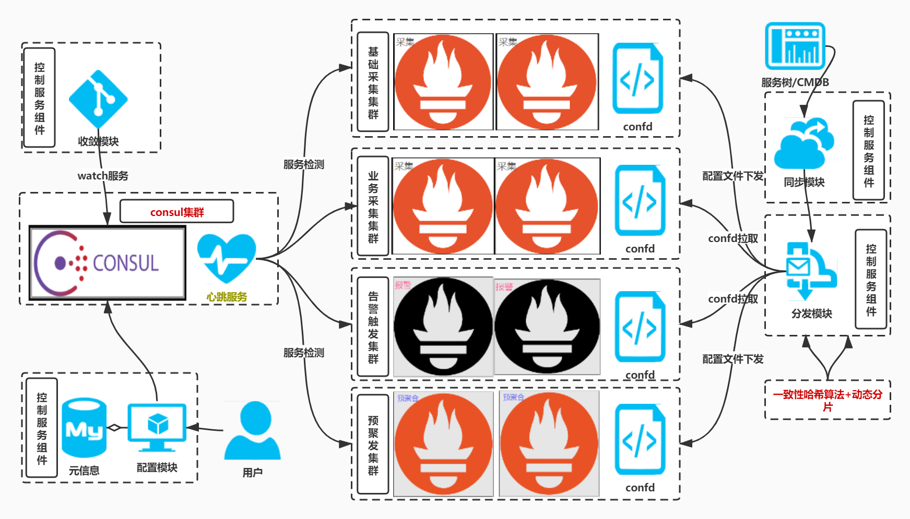
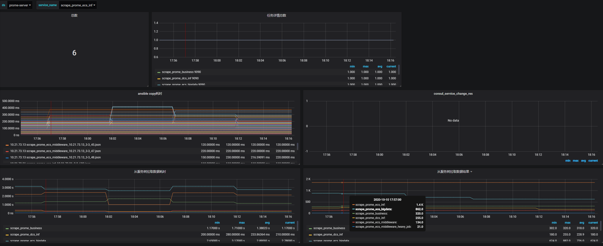
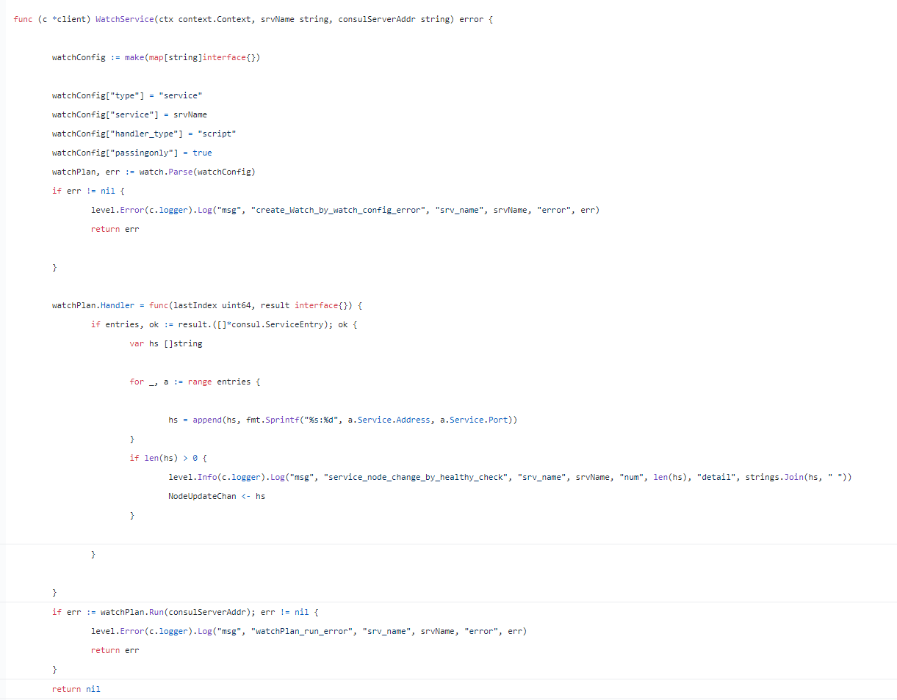

#  ·采集端动态分片方案· 架构图


# 开源项目地址: 
项目地址: [https://github.com/ning1875/prome_shard](https://github.com/ning1875/prome_shard)

# 项目说明
## prometheus采集端单点问题
### 采集类型
- 采集机器级别的指标
- 采集k8s基础监控指标
- 采集部署在lb后面的vm业务指标
- 采集部署在pod里的业务指标
- 采集各种中间件的指标 如kafka zk clickhouse等
**面对如此复杂的采集类型，一般会使用一批采集Prometheus各司其职**
### sd发现问题
面对不同的采集来源，有对应的服务发现类型，如k8s_sd，我们修改Prometheus代码适配不同的服务发现类型，
- 比如有一些指标挂在lb的后面，需要通过lb的服务发现来感知后端server的变化
- 但是问题是每个采集器都是单点的，而且修改适配不同的发现源
- 当然也可可以无脑启动多个相同的采集器采集同一组jobs，配合remote_write等补足单点问题，但带来额外的成本开销
`各自适配不同发现源缺点总结`
- prometheus版本无法统一
- 配置文件五花八门
- 需要定义各种采集源或者sd方法

# 本项目介绍
使用一组采集器注册server到consul中，通过python反射运行定时任务，通过服务树等外部接口拿到targets池，一致性哈希分发给后端，统一通过file_sd生效，consul会对各组采集器实例做探活，当节点变化(宕机或扩容)会触发targets rebalance达到HA目的

## 架构说明
- 解析配置文件
- 同步注册服务到consul中
- 开启监听watch结果变化的消费者
- 异步watch各服务
- 触发/get_service生成哈希环
- 定时获取目标列根据哈希环生成各个节点的专属文件
- 通过ansible下发 sd_result文件并reload prometheus

**现有方式**
- 配置文件定义方法名称和对应的实例列表，在get_targets中反射定义对应的方法
- sd本质说明:均能转换成file_sd，只需要给出对应的 target结构体就可以


## consul watch问题
- golang 中

在golang中可以轻松做到，代码地址 [开源项目 : dynamic-sharding： 解决pushgateway HA问题](https://zhuanlan.zhihu.com/p/165205939) 
- 本项目 python中稍微复杂，需要改为blocking query
```python
def block_get_health(self, service_name, service_hash_map, dq):
    index = None
    while True:
        try:
            index, d = self.consul.health.service(service_name, passing=True, index=index)
            if d:
                data = d
                new_nodes = []
                for x in data:
                    address = x.get("Service").get("Address")
                    if address:
                        new_nodes.append(address)

                old_nodes = service_hash_map[service_name].nodes

                if set(old_nodes) != set(new_nodes):
                    logging.info("[new_num:{} old_num:{}][new_nodes:{} old_nodes:{}]".format(
                        len(new_nodes),
                        len(old_nodes),
                        ",".join(new_nodes),
                        ",".join(old_nodes),

                    ))
                    new_ring = ConsistentHashRing(100, new_nodes)
                    service_hash_map[service_name] = new_ring
                    dq.appendleft(str(service_name))
                    # dq.put(str(service_name))
                    M_SERVICE_CHANGES.labels(service_name=service_name, old_nodes=len(old_nodes),
                                             new_nodes=len(new_nodes)).set(len(new_nodes))
        except Exception as e:
            logging.error("[watch_error,service:{},error:{}]".format(service_name, e))
            time.sleep(5)
            continue

```


## 采集器单点/固定分片问题
- 无论是单点还是固定分片，都不是ha的，只要某一个分片的采集器挂了，那么损失对应的数据
- 采用consul_watch_service方式，根据返回的健康实例生成一致性哈希环
- 将target做分片分配给健康的节点采集即可

#使用方法

### 1， 克隆代码
```c
git clone https://github.com/ning1875/prome_shard
```

### 2. 添加配置
填写config.yaml中的consul地址等
```yaml
    nodes:
      - 192.168.116.130
      - 192.168.116.131
```

### 3. 填写job 需要跟get_targets.py同步
get_targets.py 是prome_shard发现采集targets pool的方法
使用时需要实现 GetTarget的方法，方法名需要和config.yaml中相同
比如 在config.yaml中 有个job名为scrape_prome_ecs_inf
那么需要在 GetTarget中定义方法
```yaml
    @classmethod
    def scrape_prome_ecs_inf(cls):
```
    
这个方法返回值是发现到的target列表，形如
```json
[{
    "labels": {
      "group": "SGT",
      "env": "prod",
      "service": "scrape_prome",
      "region": "ap-southeast-3",
      "scrape_type": "vm"
    },
    "targets": [
      "1.1.1.1:9090"
    ]
}]
 ```


### 4. 启动consul
```yaml
[root@prome-master01 011_prome_shard]# systemctl daemon-reload && systemctl start consul 
[root@prome-master01 011_prome_shard]# systemctl status consul 
```


### 5. 启动代码
prome_shard根据返回的targets池做一致性哈希分配给配置中定义好的nodes
```yaml
[root@prome-master01 011_prome_shard]# python prome_shard.py
```

### 6. 查看targets
```yaml
# master01，查看
[root@prome-master01 sd]# pwd
/opt/app/prometheus/sd
[root@prome-master01 sd]# ll
total 20
-rw-r--r-- 1 root root   155 Jul  2 00:29 blackbox_http.json
-rw-r--r-- 1 root root 10855 Jul  3 22:32 file_sd_by_prome_shared.json
-rw-r--r-- 1 root root   595 Jul  2 00:29 node_exporter.json
  
[root@prome-master01 sd]# cat file_sd_by_prome_shared.json |python -m json.tool |grep 9090 |wc -l
56

# node1，先创建sd目录
[root@prome-node01 sd]# pwd
/opt/app/prometheus/sd

[root@prome-node01 sd]# cat file_sd_by_prome_shared.json |python -m json.tool | grep 9090 |wc -l
44

# consul，已经注册上了
http://192.168.116.130:8500/ui/dc1/nodes/consul-svr-01/service-instances


# 查看ansible分发的文件
[root@prome-master01 011_prome_shard]# pwd
/opt/tgzs/011_prome_shard
[root@prome-master01 011_prome_shard]# ll
-rw-r--r-- 1 root root 11920 Jul  3 22:45 scrape_prome_node_exporter_192.168.116.130_1-2_56.json
-rw-r--r-- 1 root root  9360 Jul  3 22:45 scrape_prome_node_exporter_192.168.116.131_2-2_44.json

[root@prome-master01 011_prome_shard]# cat scrape_prome_node_exporter_192.168.116.131_2-2_48.json 
[{"targets": ["192.168.0.1:9090"], "labels": {"name": "prome-node-1", "account": "aliyun-01", "region": "ap-south-1", "env": "prod", "group": "inf", "project": "monitor", "stree_gpa": "inf.monitor.prometheus"}}, 
 {"targets": ["192.168.0.2:9090"], "labels": {"name": "prome-node-2", "account": "aliyun-01", "region": "ap-south-1", "env": "prod", "group": "inf", "project": "monitor", "stree_gpa": "inf.monitor.prometheus"}},
 {"targets": ["192.168.0.3:9090"], "labels": {"name": "prome-node-3", "account": "aliyun-01", "region": "ap-south-1", "env": "prod", "group": "inf", "project": "monitor", "stree_gpa": "inf.monitor.prometheus"}}, 
 {"targets": ["192.168.0.6:9090"], "labels": {"name": "prome-node-6", "account": "aliyun-01", "region": "ap-south-1", "env": "prod", "group": "inf", "project": "monitor", "stree_gpa": "inf.monitor.prometheus"}},

```

### 7. 配置Prometheus.yml
```yaml
  - job_name: 'shard_job'
    # metrics的path 注意不都是/metrics
    # 传入的参数
    scrape_interval: 30s
    scrape_timeout: 10s
    scheme: http
    honor_timestamps: false
    file_sd_configs:
    - files:
      - /opt/app/prometheus/sd/file_sd_by_prome_shared.json
      refresh_interval: 2m
```


### 8. 查看target，模拟断开
```yaml
# 自动reload
[root@prome-node01 sd]# tail -f /opt/logs/prometheus.log
 
# 56台
 http://192.168.116.130:9090/targets
# 44台
  http://192.168.116.131:9090/targets


# 模拟：2->1  真实环境 10-9

# node2 停止Prometheus
[root@prome-node01 sd]# ss -nltp |grep 9090
LISTEN     0      128       [::]:9090                  [::]:*                   users:(("prometheus",pid=1064,fd=8))
[root@prome-node01 sd]# 
[root@prome-node01 sd]# systemctl stop prometheus


# 查看 sharding 日志
2023-07-03 22:56:45 WARNING consul_work.py [func:watch_service] [line:60]:[节点变化，需要收敛][service:scrape_prome_node_exporter]
2023-07-03 22:56:45 INFO consul_work.py [func:watch_service] [line:74]:[new_num:1 old_num:2][new_nodes:192.168.116.130 old_nodes:192.168.116.130,192.168.116.131]
2023-07-03 22:56:45 INFO prome_shard.py [func:consumer] [line:219]:[接收到任务][msg:scrape_prome_node_exporter]

# 再次查看targets
http://192.168.116.130:9090/targets

[root@prome-master01 sd]# cat file_sd_by_prome_shared.json |python -m json.tool |grep 9090 |wc -l
100


# 再次启动node2，查看targets
2023-07-03 22:59:20 WARNING consul_work.py [func:watch_service] [line:60]:[节点变化，需要收敛][service:scrape_prome_node_exporter]
2023-07-03 22:59:20 INFO consul_work.py [func:watch_service] [line:74]:[new_num:2 old_num:1][new_nodes:192.168.116.130,192.168.116.131 old_nodes:192.168.116.130]
2023-07-03 22:59:20 INFO prome_shard.py [func:consumer] [line:219]:[接收到任务][msg:scrape_prome_node_exporter]

[root@prome-master01 sd]# cat file_sd_by_prome_shared.json |python -m json.tool |grep 9090 |wc -l
51
```

### 9.讲解
```yaml
remote_write 对接其他tsdb远端存储
m3db vm

merge
multi_remote_read

# 查看进程
[root@prome-master01 sd]# ps -ef |grep prome_shard |grep -v grep
root      11033   1371  0 22:41 pts/0    00:00:01 python3 prome_shard.py
root      11037  11033  0 22:41 pts/0    00:00:02 python3 prome_shard.py
root      11044  11033  0 22:42 pts/0    00:00:02 python3 prome_shard.py
root      11045  11033  0 22:42 pts/0    00:00:00 python3 prome_shard.py
root      30273  11033 21 23:01 pts/0    00:00:01 python3 prome_shard.py
root      30450  30273  9 23:01 pts/0    00:00:00 python3 prome_shard.py

# prometheus.yml中的json文件，可以随意替换为相关的
      - /opt/app/prometheus/sd/file_sd_by_prome_shared.json
      - /opt/app/prometheus/sd/alert_rule.json

select * from alert_rule;
```