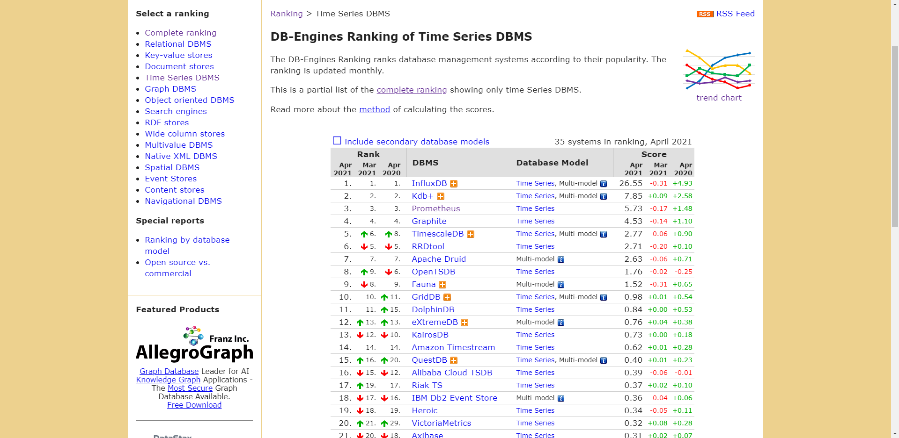
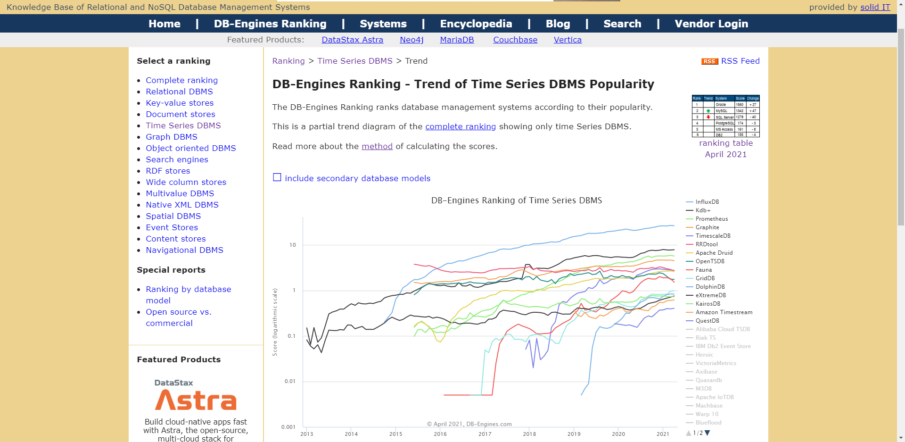
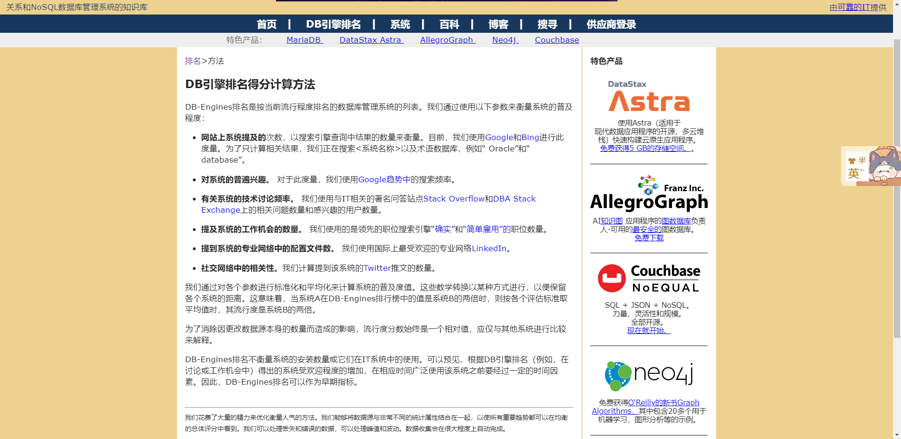
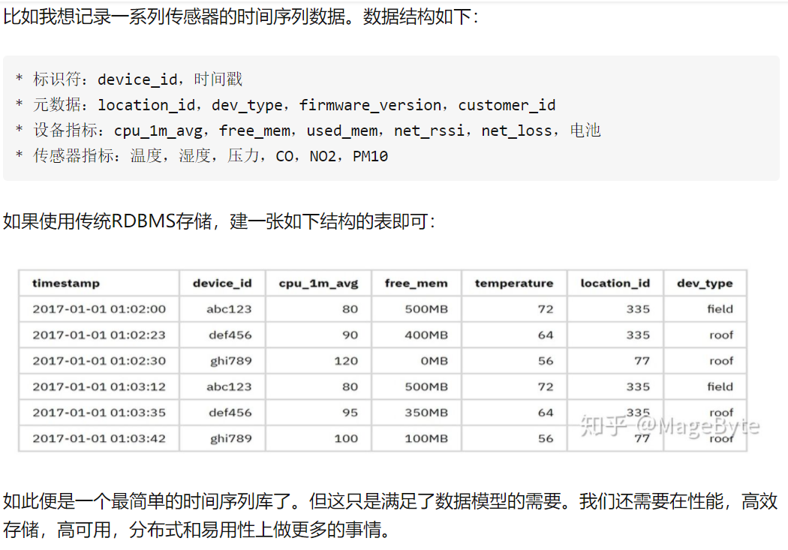

# db-ranking
> 一个神奇的网站  https://db-engines.com/en/ranking

> 时序数据ranking https://db-engines.com/en/ranking/time+series+dbms

> 排名方法  https://db-engines.com/en/ranking_definition

- DB引擎排名得分的计算方法
- DB-Engines排名是按当前流行程度排名的数据库管理系统的列表。我们通过使用以下参数来衡量系统的普及程度：

- 网站上系统提及的次数，以搜索引擎查询中结果的数量来衡量。目前，我们使用Google和Bing进行此度量。为了仅计算相关结果，我们正在与术语数据库（例如“ Oracle”和“ database”）一起搜索<system name>。

- 对系统的普遍兴趣。 对于此度量，我们使用Google趋势中的搜索频率。

- 有关系统的技术讨论频率。 我们使用与IT相关的著名问答站点Stack Overflow和DBA Stack Exchange上的相关问题数量和感兴趣的用户数量。

- 提及系统的工作机会数量。 我们使用的确有实物，只是雇用了领先的求职引擎上的报价。

- 提到系统的专业网络中的配置文件数。 我们使用国际上最受欢迎的专业网络LinkedIn。

- 社交网络中的相关性。我们计算提到该系统的Twitter推文的数量。

# 时序数据
> 带时间标签的数据也称为时间序列数据

> 具有不变性,、唯一性、时间排序性
- 举例

# 时序数据库
>时序数据库就是存放时序数据的数据库，并且需要支持时序数据的快速写入、持久化、多纬度的聚合查询等基本功能。

> Time Series DBMS are designed to efficiently collect, store and query various time series with high transaction volumes

## 数据写入的特点

> 写入平稳、持续、高并发高吞吐

- 时序数据的写入是比较平稳的，这点与应用数据不同，应用数据通常与应用的访问量成正比，而应用的访问量通常存在波峰波谷
- 时序数据的产生通常是以一个固定的时间频率产生，不会受其他因素的制约，其数据生成的速度是相对比较平稳的

> 写多读少
- 时序数据上95%-99%的操作都是写操作，是典型的写多读少的数据
- 这与其数据特性相关，例如监控数据，你的监控项可能很多，但是你真正去读的可能比较少，通常只会关心几个特定的关键指标或者在特定的场景下才会去读数据。

> 实时写入最近生成的数据，无更新
- 时序数据的写入是实时的，且每次写入都是最近生成的数据，这与其数据生成的特点相关，因为其数据生成是随着时间推进的，而新生成的数据会实时的进行写入
- 数据写入无更新，在时间这个维度上，随着时间的推进，每次数据都是新数据，不会存在旧数据的更新，不过不排除人为的对数据做订正。

## 数据查询和分析的特点
- 按时间范围读取：通常来说，你不会去关心某个特定点的数据，而是一段时间的数据。
- 最近的数据被读取的概率高
- 历史数据以粗粒度查询
- 多种精度查询
- 多维度分析

## 数据存储的特点
> 数据量大
- 拿监控数据来举例，如果我们采集的监控数据的时间间隔是1s，那一个监控项每天会产生86400个数据点
- 若有10000个监控项，则一天就会产生864000000个数据点。在物联网场景下，这个数字会更大。整个数据的规模，是TB甚至是PB级的。
> 冷热分明
- 时序数据有非常典型的冷热特征，越是历史的数据，被查询和分析的概率越低

> 具有时效性
- 时序数据具有时效性，数据通常会有一个保存周期，超过这个保存周期的数据可以认为是失效的，可以被回收
- 一方面是因为越是历史的数据，可利用的价值越低；另一方面是为了节省存储成本，低价值的数据可以被清理。
> 多精度数据存储
- 在查询的特点里提到时序数据出于存储成本和查询效率的考虑，会需要一个多精度的查询，同样也需要一个多精度数据的存储。

## 开源时间序列数据库
> 时间轴
- 1999/07/16 RRDTool First release
- 2009/12/30 Graphite 0.9.5
- 2011/12/23 OpenTSDB 1.0.0
- 2013/05/24 KairosDB 1.0.0-beta
- 2013/10/24 InfluxDB 0.0.1
- 2014/08/25 Heroic 0.3.0
- 2017/03/27 TimescaleDB 0.0.1-beta

> 简介
- RRDTool 是最早的时间序列数据库，它自带画图功能，现在大部分时间序列数据库都使用Grafana来画图。
  - 弊端：openfalcon，单series单文件。打开文件io开销大。
  - 30s打点abc now 1，生成abc_hash_30。如果改为10s，也会生成新的。比如2kw个文件。没有清理接口

- Graphite 是用 Python 写的 RRD 数据库，它的存储引擎 Whisper 也是 Python 写的， 它画图和聚合能力都强了很多，但是很难水平扩展。
- OpenTSDB 使用 HBase 解决了水平扩展的问题（10台storage-->扩容到100台）
- KairosDB 最初是基于OpenTSDB修改的，但是作者认为兼容HBase导致他们不能使用很多 Cassandra 独有的特性， 于是就抛弃了HBase仅支持Cassandra。
- 新发布的 OpenTSDB 中也加入了对 Cassandra 的支持。 故事还没完，Spotify 的人本来想使用 KairosDB，但是觉得项目发展方向不对以及性能太差，就自己撸了一个 Heroic。
- InfluxDB 早期是完全开源的，后来为了维持公司运营，闭源了集群版本。 在 Percona Live 上他们做了一个开源数据库商业模型正面临危机的演讲，里面调侃红帽的段子很不错。 并且今年的 Percona Live 还有专门的时间序列数据库单元。

## 时序数据库遇到的挑战
> 能否使用关系型数据库实现tsdb
- 很多人可能认为在传统关系型数据库上加上时间戳一列就能作为时序数据库
- 数据量少的时候确实也没问题，但少量数据是展现的纬度有限，细节少，可置信低，更加不能用来做大数据分析
- 很明显时序数据库是为了解决海量数据场景而设计的。

> 可以看到时序数据库需要解决以下几个问题

- 时序数据的写入：如何支持每秒钟上千万上亿数据点的写入。
- 时序数据的读取：又如何支持在秒级对上亿数据的分组聚合运算。
- 成本敏感：由海量数据存储带来的是成本问题。如何更低成本的存储这些数据，将成为时序数据库需要解决的重中之重。
