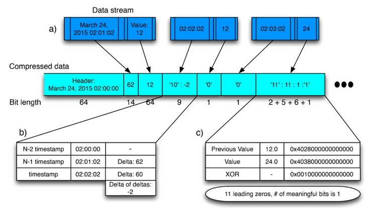
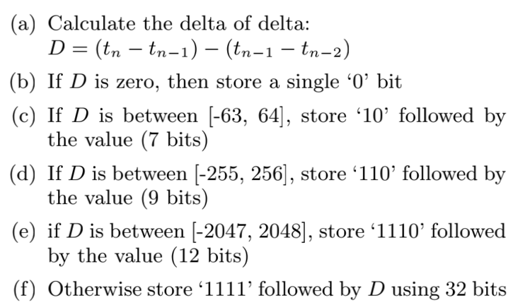
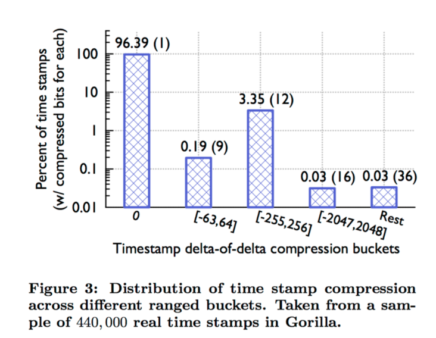
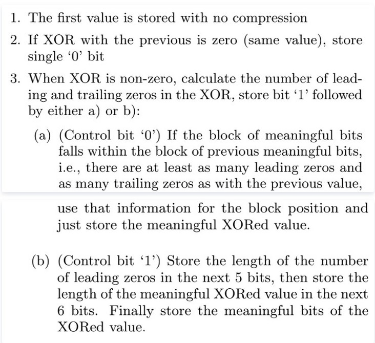
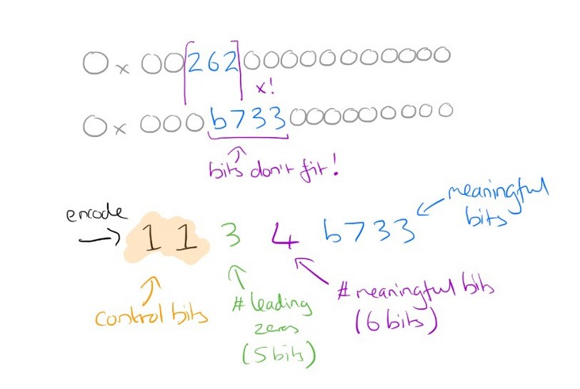

> prometheus tsdb发展历史 https://fabxc.org/tsdb/

# gorilla 简介
> Gorilla: A Fast, Scalable, In-Memory Time Series Database

> 随着监控数据量增长，对TSDB查询性能的要求越来越高，尤其是自动化运维系统，大量的查询操作让基于磁盘的TSDB系统难以满足。


- Facebook基于此需求推出了TSDB论文，设计了一个基于内存的TSDB：[Gorilla](http://www.vldb.org/pvldb/vol8/p1816-teller.pdf?spm=5176.100239.blogcont72871.18.1bfed386A0R11H&file=p1816-teller.pdf) 
- 并开源了Gorilla的原型项目[beringe](https://github.com/facebookarchive/beringei)

# 压缩算法

## 数据点压缩

- prometheus 参考facebook-gorilla dod压缩timestamp ,xor压缩value,`在两个小时的block里从16byte压缩到1.37byte，压缩比例高达11.6`
### dod 压缩timestamp
```
    Delta1       Delta2        Delta3
T1 --------> T2 --------> T3 --------> T4
```

- 原理：根据时序数据库特点，采集间隔基本稳定，所以 ts的delta基本相同，采用不等长间隔压缩，使用较少bit存储替代原来的16byte 64bite存储达到压缩的目的
- 如上图所示: March 24,2015 02:01:02 02:02:02 02:03:02 三个时间戳
```
March 24,2015 02:00:00 | 62 | '10':-2 | '0' |
bit length  64          14       9       1 
      压缩率: (64+14+9+1)/(64*4)=0.34375
```
- 假设理想情况采集稳定中间没有丢点，后面timestamp都可以用'0'来填补，压缩率会大大提升

  ```
  举例子： 00 30 00 30
         delta = 30 , dod =0
   打点异常 00 54 44 00
  ```

- 使用dod而不直接使用detal我认为还是再次压缩

- 而且D的区间更多会落在前面几个里


### xor 压缩value
- 原理:时序数据库相邻点变化不大，采用异或压缩float64的前缀和后缀0个数


- 我认为xor压缩效果取决于series曲线波动情况，越剧烈压缩效果越差，越平滑压缩效果越好

