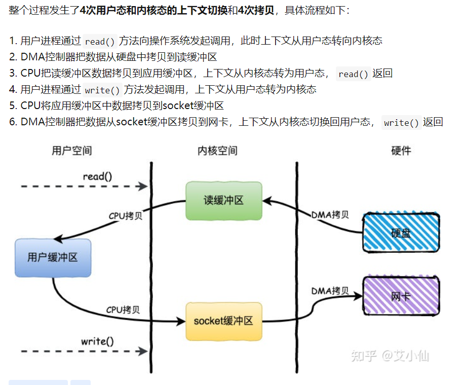
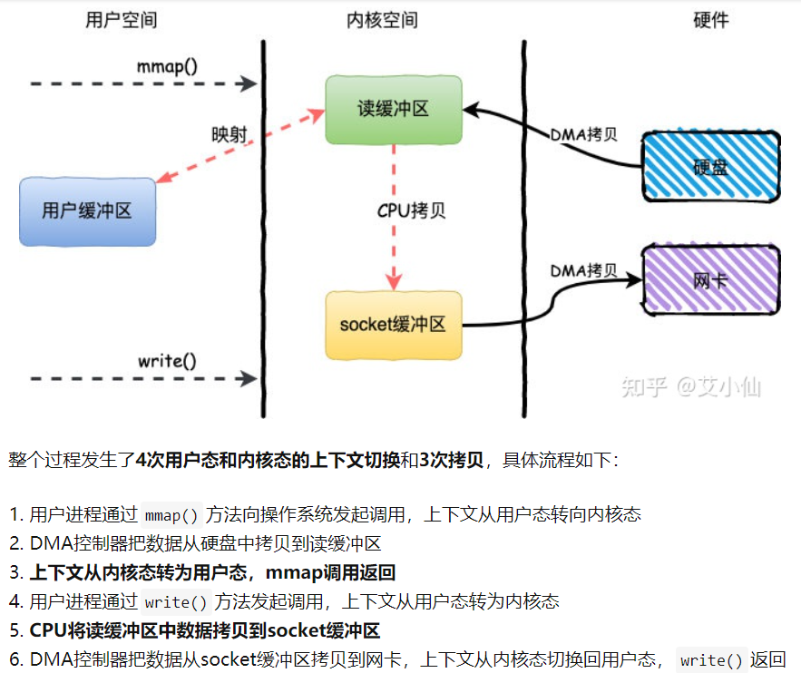
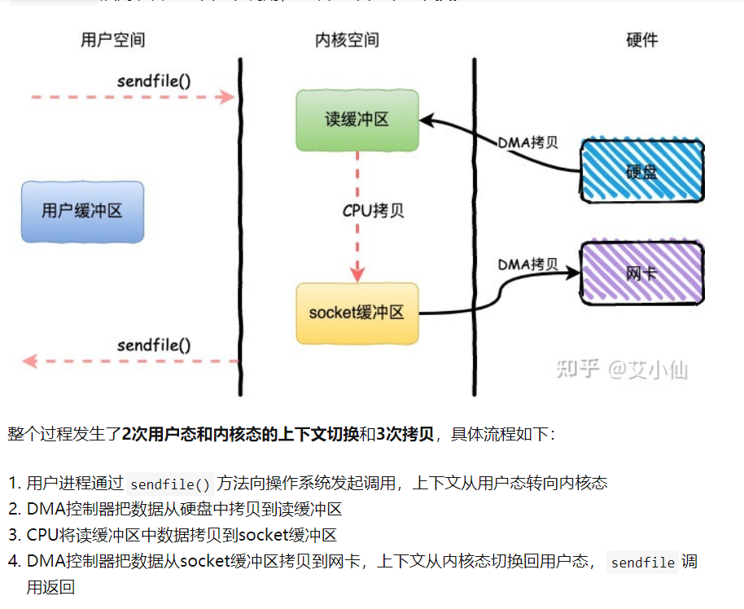
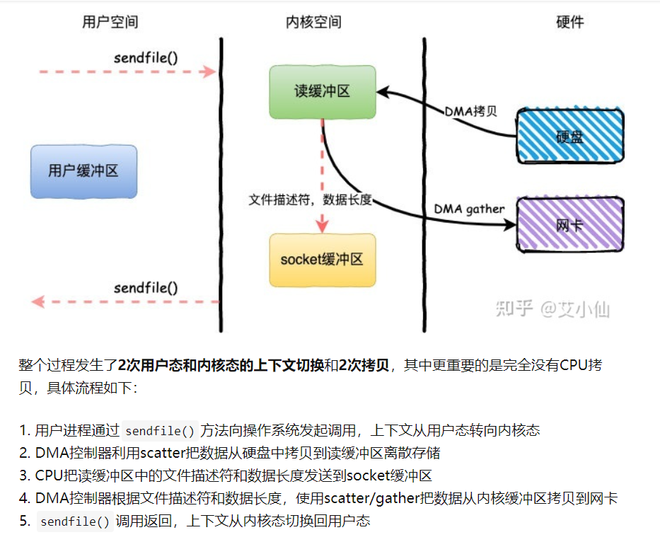

# 参考文章
- 地址 https://zhuanlan.zhihu.com/p/357820303
# mmap = 减少copy次数

## 传统IO
- 在开始谈零拷贝之前，首先要对传统的IO方式有一个概念。
- 基于传统的IO方式，底层实际上通过调用`read()`和`write()`来实现。
- 通过`read()`把数据从硬盘读取到内核缓冲区，再复制到用户缓冲区；然后再通过`write()`写入到socket缓冲区，最后写入网卡设备。

- 用户空间指的就是用户进程的运行空间，内核空间就是内核的运行空间。
- 如果进程运行在内核空间就是内核态，运行在用户空间就是用户态。
- 为了安全起见，他们之间是互相隔离的，而在用户态和内核态之间的上下文切换也是比较耗时的。
- 从上面我们可以看到，一次简单的IO过程产生了4次上下文切换，这个无疑在高并发场景下会对性能产生较大的影响。

## dma拷贝
> 那么什么又是DMA拷贝呢？

- 因为对于一个IO操作而言，都是通过CPU发出对应的指令来完成，但是相比CPU来说，IO的速度太慢了，CPU有大量的时间处于等待IO的状态。
- 因此就产生了DMA（Direct Memory Access）直接内存访问技术，本质上来说他就是一块主板上独立的芯片，通过它来进行内存和IO设备的数据传输，从而减少CPU的等待时间。
- 但是无论谁来拷贝，频繁的拷贝耗时也是对性能的影响。

## 零拷贝
- 零拷贝技术是指计算机执行操作时，CPU不需要先将数据从某处内存复制到另一个特定区域，这种技术通常用于通过网络传输文件时节省CPU周期和内存带宽。
- 那么对于零拷贝而言，并非真的是完全没有数据拷贝的过程，只不过是减少用户态和内核态的切换次数以及CPU拷贝的次数。

## mmap+write
- mmap+write简单来说就是使用mmap替换了read+write中的read操作，减少了一次CPU的拷贝。
- mmap主要实现方式是将读缓冲区的地址和用户缓冲区的地址进行映射，内核缓冲区和应用缓冲区共享，从而减少了从读缓冲区到用户缓冲区的一次CPU拷贝。
- mmap的方式节省了一次CPU拷贝，同时由于用户进程中的内存是虚拟的，只是映射到内核的读缓冲区，所以可以节省一半的内存空间，比较适合大文件的传输

## sendfile
- 相比mmap来说，sendfile同样减少了一次CPU拷贝，而且还减少了2次上下文切换。
- sendfile是Linux2.1内核版本后引入的一个系统调用函数，通过使用sendfile数据可以直接在内核空间进行传输，因此避免了用户空间和内核空间的拷贝，同时由于使用sendfile替代了read+write从而节省了一次系统调用，也就是2次上下文切换。
- sendfile方法IO数据对用户空间完全不可见，所以只能适用于完全不需要用户空间处理的情况，比如静态文件服务器。

## sendfile+DMA Scatter/Gather
- Linux2.4内核版本之后对sendfile做了进一步优化，通过引入新的硬件支持，这个方式叫做DMA Scatter/Gather 分散/收集功能。
- 它将读缓冲区中的数据描述信息--内存地址和偏移量记录到socket缓冲区，由 DMA 根据这些将数据从读缓冲区拷贝到网卡，相比之前版本减少了一次CPU拷贝的过程
- DMA gather和sendfile一样数据对用户空间不可见，而且需要硬件支持，同时输入文件描述符只能是文件，但是过程中完全没有CPU拷贝过程，极大提升了性能。

# 总结
- 由于CPU和IO速度的差异问题，产生了DMA技术，通过DMA搬运来减少CPU的等待时间。
- 传统的IOread+write方式会产生2次DMA拷贝+2次CPU拷贝，同时有4次上下文切换。
- 而通过mmap+write方式则产生2次DMA拷贝+1次CPU拷贝，4次上下文切换，通过内存映射减少了一次CPU拷贝，可以减少内存使用，适合大文件的传输。
- sendfile方式是新增的一个系统调用函数，产生2次DMA拷贝+1次CPU拷贝，但是只有2次上下文切换。因为只有一次调用，减少了上下文的切换，但是用户空间对IO数据不可见，适用于静态文件服务器。
- sendfile+DMA gather方式产生2次DMA拷贝，没有CPU拷贝，而且也只有2次上下文切换。虽然极大地提升了性能，但是需要依赖新的硬件设备支持。

