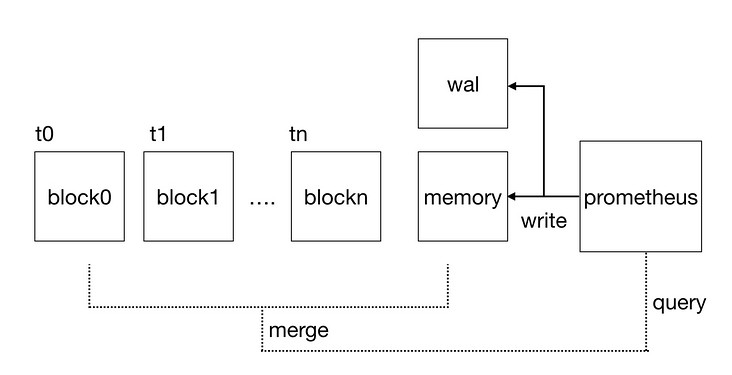
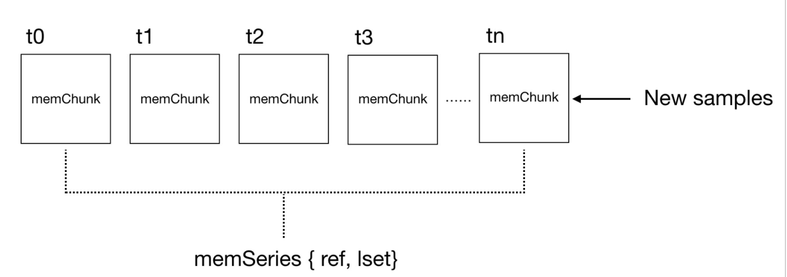
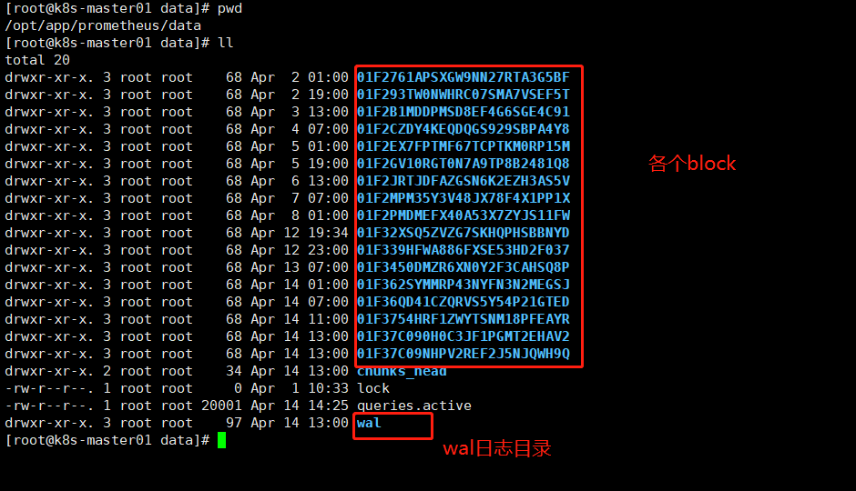
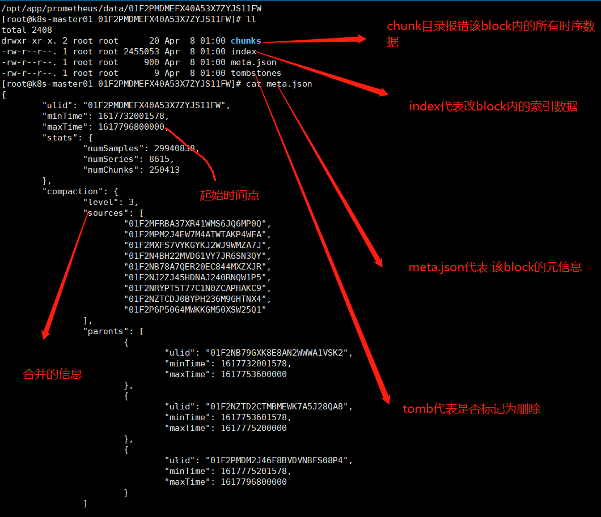
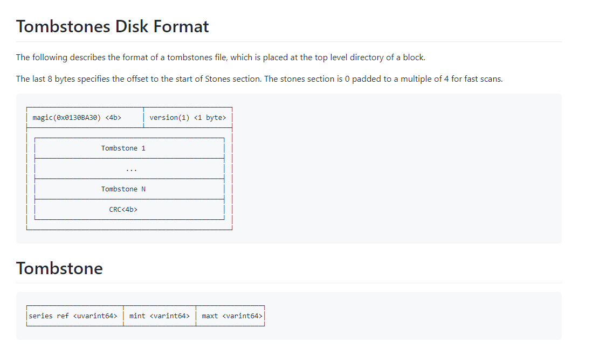
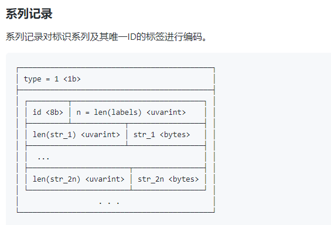
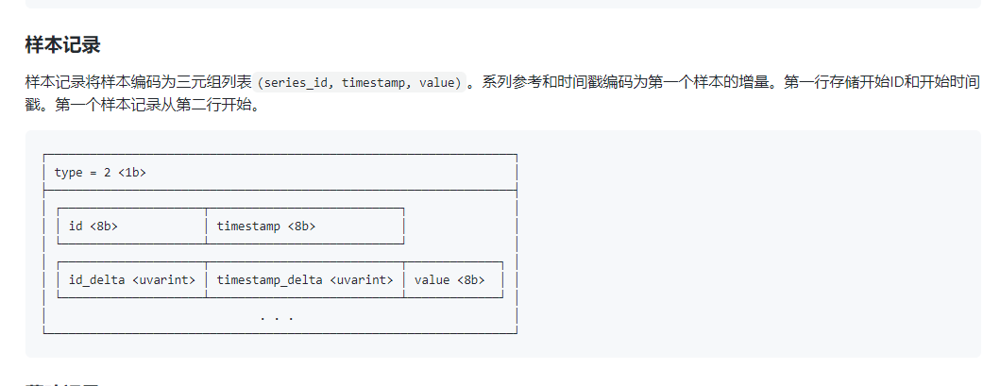

# 示意图



# 内存数据结构
- 在Prometheus的内存中使用如下所示的memSeries结构存储时间序列，一条时间序列对应一个memSeries结构：


- 可以看到，一个memSeries主要由三部分组成：

    - lset：用以识别这个series的label集合
    - ref：每接收到一个新的时间序列（即它的label集合与已有的时间序列都不同）Prometheus就会用一个唯一的整数标识它，如果有ref，我们就能轻易找到相应的series
    - memChunks：每一个memChunk是一个时间段内该时间序列所有sample的集合。如果我们想要读取[tx, ty]（t1 < tx < t2, t2 < ty < t3 ）时间范围内该时间序列的数据，只需要对[t1, t3]范围内的两个memChunk的sample数据进行裁剪即可，从而提高了查询的效率。每当采集到新的sample，Prometheus就会用Gorilla中类似的算法将它压缩至最新的memChunk中


### series内存数据结构 memSeries

```
series代表什么？
独特的序列，method=get，code=200。key-value确定的
```


```
// memSeries is the in-memory representation of a series. None of its methods
// are goroutine safe and it is the caller's responsibility to lock it.
type memSeries struct {
	sync.RWMutex

	ref           uint64
	lset          labels.Labels
	mmappedChunks []*mmappedChunk
	headChunk     *memChunk
	chunkRange    int64
	firstChunkID  int

	nextAt        int64 // Timestamp at which to cut the next chunk.
	sampleBuf     [4]sample
	pendingCommit bool // Whether there are samples waiting to be committed to this series.

	app chunkenc.Appender // Current appender for the chunk.

	memChunkPool *sync.Pool

	txs *txRing
}

```
其中最重要的三个字段
- ref 相当于这个series的uid :在getOrCreate函数中给出了明确的解释，使用递增的正整数作为ref，而没有使用hash因为hash random且不利于索引
```
func (h *Head) getOrCreate(hash uint64, lset labels.Labels) (*memSeries, bool, error) {
	// Just using `getOrSet` below would be semantically sufficient, but we'd create
	// a new series on every sample inserted via Add(), which causes allocations
	// and makes our series IDs rather random and harder to compress in postings.
	s := h.series.getByHash(hash, lset)
	if s != nil {
		return s, false, nil
	}

	// Optimistically assume that we are the first one to create the series.
	id := atomic.AddUint64(&h.lastSeriesID, 1)

	return h.getOrCreateWithID(id, hash, lset)
}
```

- lset 这个series 的label map
- headChunk 即memChunk 在这个series在这段时间内的数据集合
```
type memChunk struct {
	chunk            chunkenc.Chunk
	minTime, maxTime int64
}
```
### 哈希表
- 既然memSeries代表series ，那么如何通过一堆label最快地找到对应的`series`呢？哈希表显然是最佳的方案。基于label计算一个哈希值，维护一张哈希值与`memSeries`的映射表，如果产生哈希碰撞的话，则直接用label进行匹配。因此，Prometheus有必要在内存中维护如下所示的两张哈希表，从而无论利用`ref`还是`label`都能很快找到对应的`memSeries`

  ```
  golang中map的显著特点：线程 不安全的
  ```

  
```
{
	series map[uint64]*memSeries // ref到memSeries的映射
	hashes map[uint64][]*memSeries // labels的哈希值到memSeries的映射
}
```
### 锁的粒度
- golang中的map不是并发安全的，而Prometheus中又有大量对于`memSeries`的增删操作，如果在读写上述结构时简单地用一把大锁锁住，显然无法满足性能要求
- prometheus的解决方法就是拆分锁
```
const (
	// DefaultStripeSize is the default number of entries to allocate in the stripeSeries hash map.
	DefaultStripeSize = 1 << 14
)

// stripeSeries locks modulo ranges of IDs and hashes to reduce lock contention.
// The locks are padded to not be on the same cache line. Filling the padded space
// with the maps was profiled to be slower – likely due to the additional pointer
// dereferences.
type stripeSeries struct {
	size                    int
	series                  []map[uint64]*memSeries
	hashes                  []seriesHashmap
	locks                   []stripeLock
	seriesLifecycleCallback SeriesLifecycleCallback
}

type stripeLock struct {
	sync.RWMutex
	// Padding to avoid multiple locks being on the same cache line.
	_ [40]byte
}

```
初始化head的时候 生成16384个小哈希表，如果想根据ref找到`memSeries`只需要把`ref`对16384取模找到对应的series[x]，只需要lock[x]，从而大大降低了读写`memSeries`时对锁的抢占造成的消耗，提升读写吞吐量
```
func (s *stripeSeries) getByHash(hash uint64, lset labels.Labels) *memSeries {
	i := hash & uint64(s.size-1)

	s.locks[i].RLock()
	series := s.hashes[i].get(hash, lset)
	s.locks[i].RUnlock()

	return series
}
```
**注意看这里 取模的操作使用的是&而不是% 这是因为位运算(&)效率要比取模运算(%)高很多，主要原因是位运算直接对内存数据进行操作，不需要转成十进制，因此处理速度非常快**
```
 a % b == a & (b - 1) 前提：b 为 2^n
```

# 内存和disk之间的纽带 wal
- WAL目录中包含了多个连续编号的且大小为128M的文件，Prometheus称这样的文件为Segment，其中存放的就是对内存中series以及sample数据的备份。
- 另外还包含一个以checkpoint为前缀的子目录，由于内存中的时序数据经常会做持久化处理，WAL中的数据也将因此出现冗余
- 所以每次在对内存数据进行持久化之后，Prometheus都会对部分编号靠后的Segment进行清理。但是我们并没有办法做到恰好将已经持久化的数据从Segment中剔除，也就是说被删除的Segment中部分的数据依然可能是有用的。所以在清理Segment时，我们会将肯定无效的数据删除，剩下的数据就存放在checkpoint中。而在Prometheus重启时，应该首先加载checkpoint中的内容，再按序加载各个Segment的内容。
- 最后，series和samples以Record的形式被批量写入Segment文件中，默认当Segment超过128M时，会创建新的Segment文件。若Prometheus因为各种原因崩溃了，WAL里的各个Segment以及checkpoint里的内容就是在崩溃时刻Prometheus内存的映像。Prometheus在重启时只要加载WAL中的内容就能完全"恢复现场"。


# 磁盘数据结构

## promethues 磁盘数据结构

```
为什么要做block压实？
与rrdtsdb一样的问题
```






> Index Disk Format
- 文档地址 https://github.com/prometheus/prometheus/blob/release-2.26/tsdb/docs/format/index.md

> Chunks
- 下面介绍块文件的格式，该文件在chunks/块目录中创建。每个段文件的最大大小为512MiB。
- 文档地址 https://github.com/prometheus/prometheus/blob/release-2.26/tsdb/docs/format/chunks.md

> head chunks
- 文档地址 https://github.com/prometheus/prometheus/blob/release-2.26/tsdb/docs/format/head_chunks.md

> Tombstones
- prometheus 删除数据 `/admin/tsdb/delete_series`
- tombstones用于存储对于series的删除记录。如果删除了某个时间序列，Prometheus并不会立即对它进行清理，而是会在tombstones做一次记录，等到下一次Block压缩合并的时候统一清理。

- 文档地址 https://github.com/prometheus/prometheus/blob/release-2.26/tsdb/docs/format/tombstones.md

> wal 
- 文档地址  https://github.com/prometheus/prometheus/blob/release-2.26/tsdb/docs/format/wal.md



- 该预写日志在编号和顺序，如段工作000000，000001，000002等，在默认情况下被限制为128MB
- 段写入到32KB的页面中。仅最近段的最后一页可能是不完整的
- WAL记录是一个不透明的字节片，如果超过当前页面的剩余空间，它将被分成子记录。记录永远不会跨段边界拆分
- 如果单个记录超过了默认的段大小，则将创建一个更大的段。页面的编码很大程度上是从LevelDB / RocksDB的预写日志中借用的。

## 对block进行定时压实 compact
- 标记删除
- Compaction主要操作包括合并block、删除过期数据、重构chunk数据
- 其中合并多个block成为更大的block，可以有效减少block个数，当查询覆盖的时间范围较长时，避免需要合并很多block的查询结果。
- 为提高删除效率，删除时序数据时，会记录删除的位置，只有block所有数据都需要删除时，才将block整个目录删除，因此block合并的大小也需要进行限制，


