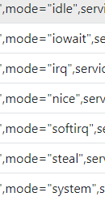
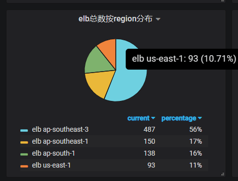
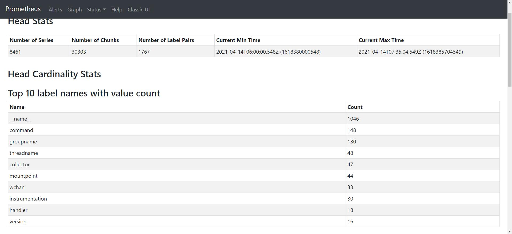

# 倒排索引简介
- 倒排索引（英文：Inverted Index），是一种索引方法，常被用于全文检索系统中的一种单词文档映射结构
- 现代搜索引擎绝大多数的索引都是基于倒排索引来进行构建的
- 这源于在实际应用当中，用户在使用搜索引擎查找信息时往往只输入信息中的某个属性关键字，如一些用户不记得歌名，会输入歌词来查找歌名；输入某个节目内容片段来查找该节目等等

```
100M大文件 索引：abc 1行 5-10
mysql -> id ->正向索引
```


### 倒排索引
**上面我们看到怎么根据一个metric的全部label 找到对应的memSeries ，但是更通用的是label模糊匹配查询 **

#### 模糊匹配
比如 node_exportor中的cpu指标 node_cpu_seconds_total 指定cpu="1"代表第二个核心，同时还有7种mode，甚至 Prometheus支持在指定label时使用正则表达式：node_cpu_seconds_total{mode=~"user|system"}

面对如此复杂的查询，必须要要引入倒排索引来解决这个问题
#### 数据结构
```
// MemPostings holds postings list for series ID per label pair. They may be written
// to out of order.
// ensureOrder() must be called once before any reads are done. This allows for quick
// unordered batch fills on startup.
type MemPostings struct {
	mtx     sync.RWMutex
	m       map[string]map[string][]uint64
	ordered bool
}
```
#### 索引过程
假设prometheus抓取到一个新的series node_cpu_seconds_total{mode="user",cpu="0",instance="1.1.1.1:9100"} 他的ref为x 
在初始化memSeries后，更新哈希表后，还需要对倒排索引进行更新
```
func (h *Head) getOrCreateWithID(id, hash uint64, lset labels.Labels) (*memSeries, bool, error) {
	s := newMemSeries(lset, id, h.chunkRange, &h.memChunkPool)

	s, created, err := h.series.getOrSet(hash, s)
	if err != nil {
		return nil, false, err
	}
	if !created {
		return s, false, nil
	}

	h.metrics.seriesCreated.Inc()
	atomic.AddUint64(&h.numSeries, 1)

	h.postings.Add(id, lset)
    ......
}
```
- 主要函数addFor 
```
MemPostings.m["__name__"]["node_cpu_seconds_total"]={..,x,..}
MemPostings.m["mode"]["user"]={..,x,..}
MemPostings.m["cpu"]["0"]={..,x,..}
MemPostings.m["instance"]["1.1.1.1:9100"]={..,x,..}
```
```
func (p *MemPostings) addFor(id uint64, l labels.Label) {
	nm, ok := p.m[l.Name]
	if !ok {
		nm = map[string][]uint64{}
		p.m[l.Name] = nm
	}
	list := append(nm[l.Value], id)
	nm[l.Value] = list

	if !p.ordered {
		return
	}
	// There is no guarantee that no higher ID was inserted before as they may
	// be generated independently before adding them to postings.
	// We repair order violations on insert. The invariant is that the first n-1
	// items in the list are already sorted.
	for i := len(list) - 1; i >= 1; i-- {
		if list[i] >= list[i-1] {
			break
		}
		list[i], list[i-1] = list[i-1], list[i]
	}
}

```
- 匹配过程如下
```
假设
MemPostings.m["__name__"]["node_cpu_seconds_total"]={1,2,3,5,7,8}
MemPostings.m["mode"]["user"]={10,2,3,4,6,8}
求 node_cpu_seconds_total{mode="user"}即是
求交集-->   {1,2,3,5,7,8} & {10,2,3,4,6,8} = {2,3,8}

一般：id --> label
倒排： label --> id数组
```
- 但是如果每个label pair包含的`series`足够多，那么对多个label pair的`series`做交集也将是非常耗时的操作。
- 那么能不能进一步优化呢？事实上，只要保持每个label pair里包含的series有序就可以了，这样就能将复杂度从指数级瞬间下降到线性级
```shell script
MemPostings.["__name__"]["http_request_total"]{1, 2, 3, 4}
MemPostings.["path"]["/"]{1, 3, 4, 5}
{1, 2, 3, 4} x {1, 3, 4, 5} -> {1, 3, 4}
```

#### 具体实现

- 核心结构MemPostings是一个双层map ，把tag=value 的记录按照tag作为第一层map的key， value作为内层map的key 内存map值为对应id set
```golang
type MemPostings struct {
   mtx     sync.RWMutex
   m       map[string]map[string][]uint64
   ordered bool
}
```
- 同时为了`反向匹配`和`统计需求`需要维护 values 和symbols
```golang
type HeadIndexReader struct {
   postings *index.MemPostings
   values   map[string]stringset
   symbols  map[string]struct{}
   symMtx   sync.RWMutex
}
```
- 将db的记录每条记录按照tag和id的对应关系构建索引
- 最内层set存储的是db 记录的主键id
- 这样就能够根据一组标签查询到主键id再去db中获取全量信息即可
- 这样查询速度是最快的
- db中所有的字段出timestamp外都可以用来构建索引，而后能所有的字段都可以被用作查询条件
举例
```python
    req_data = {
        'resource_type': 'elb',
        'use_index': True,
        'labels': [
            # 查询 group 不等于CBS，name ，正则匹配.*0dff.*，stree-app等于collecter的elb资源列表
            {'key': 'group', 'value': 'CBS', 'type': 2},
            {'key': 'name', 'value': '.*0dff.*', 'type': 3},
            {'key': 'stree-app', 'value': 'collecter', 'type': 1}]
    }
```
####  按key查询分布情况的实现


- 匹配过程和上述一致
- 再用构建一个堆就可以得到分布情况
	举例：根据kv组合查询 某一个key的分布情况
	eg:  查询 G.P.A=SGT.hawkeye.m3db 的ecs资源按cluster标签分布情况
	
```python
def query_dis():
    """

    :return:
    返回的是条件查询后按照目标label的分布情况
    dis = {
        'group': [
            {'name': 'business', 'value': 9},
            {'name': 'inf', 'value': 9},
            {'name': 'middleware', 'value': 9},
            {'name': 'bigdata', 'value': 9}
        ]
    }
    """


    req_data = {
        'resource_type': 'ecs',
        'use_index': True,
        'labels': [
            # 查询 G.P.A=SGT.hawkeye.m3db 的ecs资源按cluster标签分布情况
            {'key': 'group', 'value': 'SGT', 'type': 1},
            {'key': 'stree-project', 'value': 'hawkeye', 'type': 1},
            {'key': 'stree-app', 'value': 'm3db', 'type': 1}],
        'target_label': 'cluster'
    }
    query_uri = "{}/query/resource-distribution".format(base_url)
    res = requests.post(query_uri, json=req_data)
    print(res.json())

```

### prometheus 中基于倒排索引统计的应用

- tsdb 统计 `/api/v1/status/tsdb`
