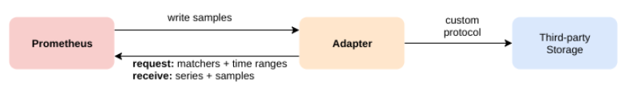

# prometheus本地存储问题
- 参考文档 https://prometheus.io/docs/prometheus/latest/storage/
> Prometheus的本地存储仅限于单个节点的可伸缩性和持久性。Prometheus并没有尝试解决Prometheus本身中的集群存储，而是提供了一组允许与远程存储系统集成的接口。

# 集成方法

> Prometheus通过以下三种方式与远程存储系统集成：

- Prometheus可以将其提取的样本以标准格式写入远程URL。
- Prometheus可以以标准格式从其他Prometheus服务器接收样本。
- Prometheus可以以标准化格式从远程URL读取（返回）样本数据。

> 读取和写入协议都使用基于HTTP的快速压缩协议缓冲区编码
- 该协议尚未被认为是稳定的API，当可以安全地假定Prometheus和远程存储之间的所有跃点都支持HTTP / 2时，该协议将来可能会更改为在HTTP / 2上使用gRPC。

## 不支持分布式promql，数据需要在查询端完成
- 请注意，在读取路径上，Prometheus仅从远端获取一组标签选择器和时间范围的原始系列数据
- PromQL对原始数据的所有评估仍然在Prometheus本身中进行
- 这意味着远程读取查询具有一定的可伸缩性限制，因为所有必需的数据都需要先加载到查询的Prometheus服务器中，然后再在该服务器中进行处理。
- 但是，暂时认为支持PromQL的完全分布式评估是不可行的。

# 现有支持的远程端点和存储
> 注意是各个存储在内部代码中适配prometheus 

> 不是prometheus适配其他存储，可见大家都在抱prometheus大腿

- Prometheus的远程写入和远程读取功能允许透明地发送和接收样本。这主要用于长期存储

> 读写都支持的存储

- AWS Timestream
- Azure Data Explorer
- Cortex
- CrateDB
- Google BigQuery
- Google Cloud Spanner
- [InfluxDB](https://docs.influxdata.com/influxdb/v1.8/supported_protocols/prometheus/)
- IRONdb
- [M3DB](https://m3db.io/docs/integrations/prometheus/)
- PostgreSQL/TimescaleDB
- QuasarDB
- Splunk
- Thanos
- TiKV

> 只支持写入的存储
- AppOptics
- Azure
- Chronix
- Elasticsearch
- Gnocchi
- Graphite
- Instana
- [Kafka](https://github.com/Telefonica/prometheus-kafka-adapter)
- New
- OpenTSDB
- SignalFx
- VictoriaMetrics
- Wavefront

> 没有只支持读而不支持写入的存储，数据进不去读没意义

