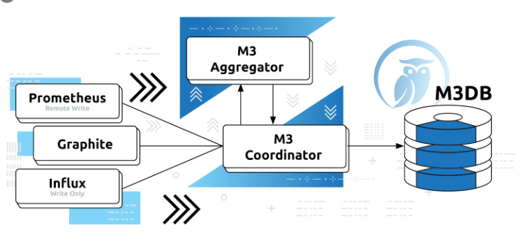
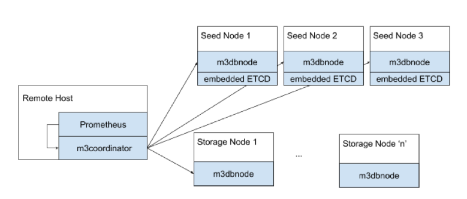

> github [https://github.com/m3db/m3](https://github.com/m3db/m3)

> 官方文档 [https://m3db.io/](https://m3db.io/)

> m3db自己的定位

> 两句话简介
- M3最初是在优步开发的，目的是提供对优步业务运营，微服务和基础架构的可视性
- 由于M3具有轻松进行水平扩展的能力，因此它为所有监视用例提供了一个集中式存储解决方案。

# 历史

- 2014年，经过数年与基于Graphite和WhisperDB的传统指标平台的对抗之后，Uber的Observability团队开始开发一个开源指标平台
- 该平台将被称为M3。该项目的目标是为团队提供一个高度可用的集中式指标平台，该平台可以轻松地与现有工具集成。

## 存储发展过程
- 存储层的第一个迭代以Cassandra和ElasticSearch为特色
- 但是，随着打车业务进入高速增长阶段，在Graphite和WhisperDB年代曾困扰团队的交火重新浮出水面
- 然后，团队决定从头开始构建M3DB，这是一个具有嵌入式反向索引的自定义时间序列数据库，这成为了平台的基础
- 在大约一年半的时间里，M3DB是在Uber上开发和推出的。

## 查询问题

- OOM和缓慢的查询已成为常见现象，这使团队无法有效地监视其服务
- 名为M3Query的新查询引擎利用了M3DB将数据存储在高度压缩的块中的事实，并在延迟应用函数时一次将数据客户端的一个数据点解压缩
- 这些优化可最大程度地减少网络，计算和内存资源
- 支持PromQL和传统Graphite语言的新查询引擎为团队提供了一种非常快速和强大的方法来深入了解其指标

## 采集问题
- 随着要摄取的指标数量的激增，很明显，在数据存储策略方面，没有一种万能的方法
- 不同的团队希望将其指标存储在不同的分辨率和保留期限内
- 例如，基础架构团队需要以非常高的分辨率（但时间不能太长）存储度量
- 相反，业务团队不需要精细的粒度，但希望将数据保留更长的时间
- 该解决方案是M3Coordinator和M3Aggregator这两个组件的组合，它们协同工作以获取指标并以高度可定制的方式聚合它们，同时提供高可用性和效率

# 架构图

# 组件说明
> M3 Coordinator 
- M3协调器是一项服务，用于协调上游系统（例如Prometheus）和M3DB之间的读写
- 它是用户可以部署以访问M3DB好处的桥梁，例如长期存储和与其他监视系统（例如Prometheus）的多DC设置

> m3db 
- M3DB是一个分布式时间序列数据库，提供可伸缩的存储和时间序列的反向索引
- 它被优化为具有成本效益的，可靠的实时和长期保留指标存储和索引

> m3query
- M3 Query是一个分布式查询引擎，用于查询存储在M3DB节点中的实时和历史数据，支持多种查询语言
- 它旨在支持低延迟的实时查询和执行时间可能更长的查询，这些数据可以聚合用于分析用例的较大数据集
- 例如，如果您将Prometheus远程写端点与M3 Coordinator一起使用，则可以使用M3 Query代替Prometheus远程读端点
- 这样，您可以获得M3 Query引擎的所有好处，例如块处理。由于M3 Query提供了与Prometheus兼容的API，因此您可以使用第三方制图和警报解决方案，例如Grafana

> m3aggregator
- M3聚合器是专用的度量标准聚合器，可在将度量标准存储在M3DB节点中之前提供基于状态的基于流的下采样。它使用存储在etcd中的动态规则。
- 它使用领导者选举和聚集窗口跟踪，利用etcd来管理此状态，以可靠的方式将一次至少一次的聚集可靠地发送给长期存储的降采样指标。这提供了具有成本效益的，可靠的下采样和指标汇总。
- M3协调器也可以执行此角色，但是M3聚合器可以分片和复制指标，而M3协调器则不是，并且需要谨慎地以高度可用的方式进行部署和运行。
- 与M3DB相似，M3 Aggregator默认情况下支持集群和复制。这意味着度量标准已正确路由到负责聚合每个度量标准的实例，并且您可以配置多个M3 Aggregator副本，以使聚合没有单点故障。