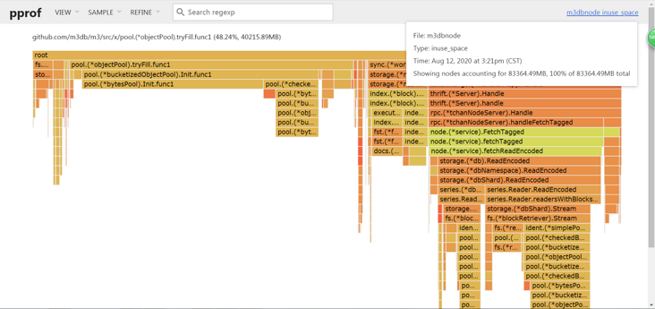
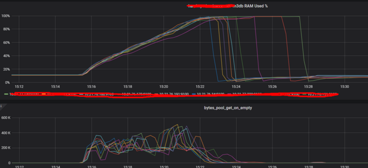
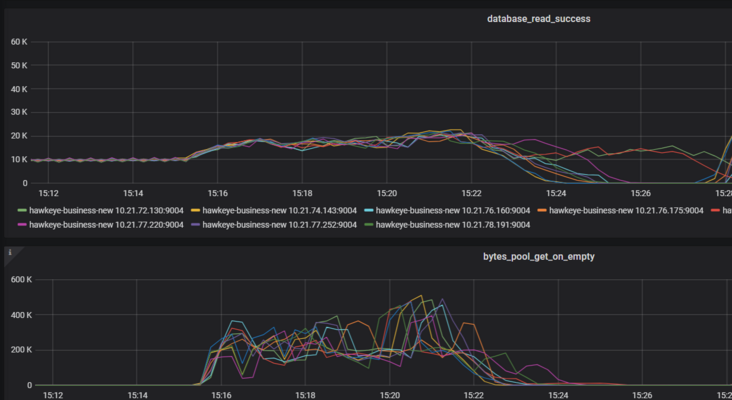
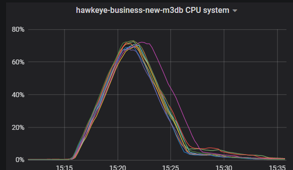
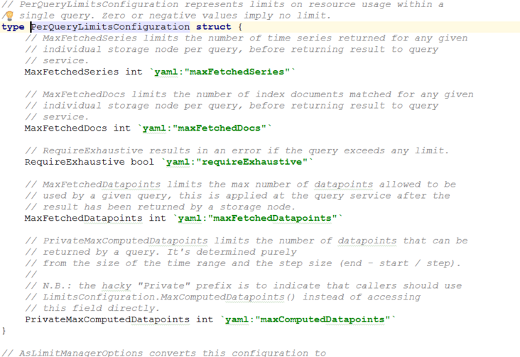

# m3dbnode oom

## 文档
https://github.com/m3db/m3/issues/2475

https://zhuanlan.zhihu.com/p/183815841
## oom时排查
- 内存火焰图: 80G内存
   
- bytes_pool_get_on_empty qps 很高
  
- db read qps增长 80%
   
- node cpu kernel 暴涨
 

**看图结论**
- m3dbnode 内存oom过程很短，很剧烈：总时间不超过7分钟
- 内存从27G增长到250G
- 节点sys态cpu暴涨：因为大量的mem_alloca sys_call
- 内存增长曲线和db_read_qps曲线和bytes_pool_get_on_empty曲线高度吻合
- 内存火焰图： 27G的rpc 40G的pool.(*objectPool).tryFill

## 查看代码，追踪火焰图中这个tryFill
### 内存分配器
**目的很简单:自己管理内存，避免频繁的mem_allocate sys_call 提升速度，空间换时间**
#### 核心结构
- **初始化时调用init 向池中注入**

```go
type objectPool struct {
	opts                ObjectPoolOptions
	values              chan interface{}
	alloc               Allocator
	size                int
	refillLowWatermark  int
	refillHighWatermark int
	filling             int32
	initialized         int32
	dice                int32
	metrics             objectPoolMetrics
}
```
```go
	for i := 0; i < cap(p.values); i++ {
		p.values <- p.alloc()
	}
```
#### 从池中获取对象时
- **池中还有剩余则直接获取否则走各自的alloc分配**
- **同时设置bytes_pool_get_on_empty**
```go
func (p *objectPool) Get() interface{} {
	if atomic.LoadInt32(&p.initialized) != 1 {
		fn := p.opts.OnPoolAccessErrorFn()
		fn(errPoolGetBeforeInitialized)
		return p.alloc()
	}

	var v interface{}
	select {
	case v = <-p.values:
	default:
		v = p.alloc()
		p.metrics.getOnEmpty.Inc(1)
	}

	p.trySetGauges()


	return v
}
```
#### 同时判断池水位，是否加油
```go
	if p.refillLowWatermark > 0 && len(p.values) <= p.refillLowWatermark {
		p.tryFill()
	}
```

#### 加油过程
- 用CompareAndSwapInt32做并发控制标志位
- 加油加到refillHighWatermark
```go
func (p *objectPool) tryFill() {
	if !atomic.CompareAndSwapInt32(&p.filling, 0, 1) {
		return
	}

	go func() {
		defer atomic.StoreInt32(&p.filling, 0)

		for len(p.values) < p.refillHighWatermark {
			select {
			case p.values <- p.alloc():
			default:
				return
			}
		}
	}()
}

```
#### 默认池参数
```
	defaultRefillLowWaterMark  = 0.3
	defaultRefillHighWaterMark = 0.6
```
## 总结思考
- 默认池低水位为什么不是0:因为 从水位判断到tryFill中间的并发请求使得最后tryFill开始时低水位可能低于0.3
- 火焰图中的tryFill消耗了40G内存不是一次性的，类比右侧thriftrpc27，属于累加内存消耗值
- 一次性的内存消耗肯定没有这么多：每次加油时内存消耗低于初始化
- 所以可以得到结论，oom是因为在当时byte_pool频繁的get消耗，然后tryFill频繁的加油导致内存分配
- 所以根本原因还是查询导致的

## 临时解决办法:限制query资源消耗保护db
- 首先要明确的几点，因为remote_read是链式的调用
- 所以限制m3db前面的组件`prometheus` `m3coordinator`是**没用的**
- 只能限制m3db中关于query的参数，但是这个方法不根治
~~**修改m3coordinator参数**~~
 

```yaml
现象：9个机器提供服务，一起oom，出现断层
处理：已经设置10w限制

100 query，30个重查询。50G内存，10cpu主要用来限制重查询

sb -> 写了一个重查询 ——> 前端提示禁止这样 --> sql 优化
```

## 上面的方法治标不治本，重要的是解决高基数/重查询的问题

