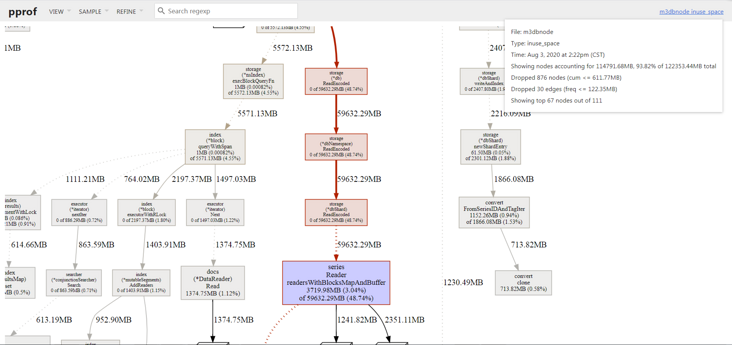
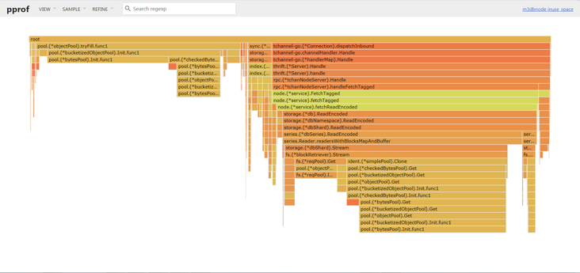

# m3db资源开销问题：无需用ssd，也没必要做raid

## 正常情况下m3db 对io要求不高
- 因为和prometheus一样设计时采用了`mmap`等技术，所以没必要采用ssd
- 和open-falcon/夜莺等采用rrd不同，rrd 单指标单文件，很耗io

```yaml
oom重启了，io打满是oom的结果，不是原因
需要加载数据
```

## cpu和内存开销
- 写峰很危险，原因很简单
    - 一条新的数据写入的时候，需要申请block，索引等一系列内存，伴随着cpu开销
    - 但是如果没有新的数据，只是不断的写入点，那么只涉及到点的append追加，则开销较小
    - 所以在突发的写峰对于tsdb来说就是危险，比如auto_scaling
    - 最理想的情况就是100w条数据，都是平稳的没有变化的持续追加点写入
    - 但是在容器中不现实，因为每次pod滚动都涉及 id等唯一值的变化
    
- 读峰也很危险，原因如下
    - m3db默认内置lru会缓存查询的block等，这个为了一个典型的场景
    - 就是一个dashboard查出来后点刷新时间，除了时间其他查询tag没变化，这种lru能应付的很好
    - 但是对于高基数的查询来说，lru的意义就不大了
    - 而且会涉及到读取放大的问题，假设1w基数需要100M内存，则100w基数需要10G内存
```yaml
spark 20 job 
```

## m3db bootstrap速度问题
- 在节点oom或其他原因导致的重启中，bootstrap速度决定了节点多久能提供服务
- bootstrap速度和`namespace 数量正相关`，和`数据量大小正相关`
- 而且会优先提供写服务，避免长时间不能写入数据造成断点
- 而且再重启时 会有大量读盘操作，基本能把io打满(*因为需要将磁盘中的部分数据缓存到内存中*)

# 聚合说明
## 不要直接在m3coordinator 中开启聚合
- 我们知道直接在m3coordinator中配置 `type: aggregated`的namespace是可以直接开启聚合的
- 但是[官方文档](https://m3db.io/docs/how_to/aggregator) 说的很清楚了 
```shell script
The M3 Coordinator also performs this role but is not cluster aware.
This means metrics will not get aggregated properly if you send metrics in round robin fashion to multiple M3 Coordinators for the same metrics ingestion source (e.g. Prometheus server).
```
- 因为数据按照轮询模式打过来到m3coordinator上，导致同一个指标的不同时刻数据可能出现在多个m3coordinator上，聚合出来的结果就是错的
- https://m3db.io/docs/how_to/m3aggregator/

## 利用m3aggregator 做downsample

- 与M3DB相似m3aggregator，默认情况下支持集群和复制。
- 这意味着度量标准已正确路由到负责聚合每个度量标准的一个或多个实例
- 并且m3aggregator可以配置多个副本，以使聚合没有单点故障。
```yaml
downsample 降采样
30s采集1个点
1个小时内，5min一个点
2天内，30min一个点

prometheus可以做降采样吗？
调整采集时间
mock  
1h scrape interval
avg min max tp50 tp90
```
- m3降采样 https://github.com/m3db/m3/wiki/Downsampling-with-aggregation-instead-of-compaction

## 降采样原理
- `m3agg`根据配置的 `resolution`计算后推给 `m3coordinator` 回写`m3db`
- 如下配置我们可以降采样的保存监控数据：**注意 下面间隔和粒度都是根据grafana查询时间算的step推算出的**
    - `default表：不聚合保存30小时`
    - `agg1表：5m为粒度保存96小时，即4天`
    - `agg2表：20m为粒度保存360小时，即15天`
    - `agg3表：60m为粒度保存360小时，即3个月`
```shell script
      - namespace: default
        type: unaggregated
        retention: 30h
      - namespace: agg1
        type: aggregated
        retention: 96h
        resolution: 5m
      - namespace: agg2
        type: aggregated
        retention: 360h
        resolution: 20m
      - namespace: agg3
        type: aggregated
        retention: 2160h
        resolution: 60m
```

## 降采样后多张表数据`merge` 
- 数据在每张表中都会存在
- 依据不同的保存精度，agg会聚合写入结果
- 多张表查询的时候，每个时间段以最精确的为准，也就是说会`merge`
- 如果在查询端少配置了几张表，那么就是缺数据

## 利用聚合打到降采样的目的
- 减少存储需求
- 对于时间久的数据，以原始点存放其实意义很小，因为查询的时候都会以较粗的精度出图，比如 15天范围内可能就是1个小时一个点了

# 对于query的limit限制 ，这些限制都治标不治本，因为要看限制在多深的地方设置的
- 举个例子：查询需要5次内存申请，只有在第4层才能判定这个query是否打到上限，那么只是省了最后一次内存申请
- 这样就演变成了：每次都在很深的地方才限制住了，资源总是在浪费
- 如果能在第一层就限制住，如布隆过滤器直接告诉不存在，那么则可以避免后面几次资源开销

## m3db limit
- 可以设置在一个回溯窗口内`lookback` 最大读取的时间序列数据的总量`maxRecentlyQueriedSeriesBlocks`
- 这个配置代表在3秒内最多允许 21w的block查询(7w来自于m3db监控图中的block数据)
- maxOutstandingReadRequests 代表并发读请求数
- maxRecentlyQueriedSeriesDiskRead可以设置读盘的限制
```yaml
db:
  limits:
    maxRecentlyQueriedSeriesBlocks:
      value: 700000
      lookback: 3s
    maxOutstandingWriteRequests: 0
    maxOutstandingReadRequests: 0
```


## 保护m3db的正确姿势，是在前面prometheus查询的时候 识别并拦截高基数查询

# m3db 读写一致性
- 在db高负载情况下，可以配置m3coordinator 读一致性为one 即`readConsistencyLevel: one`，降低后端压力
```yaml

clusters:
# Fill-out the following and un-comment before using, and
# make sure indent by two spaces is applied.
  - namespaces:
      - namespace: default
        type: unaggregated
        retention: 30h
    client:
      config:
        service:
          env: default_env
          zone: embedded
          service: m3db
          cacheDir: /var/lib/m3kv
          etcdClusters:
            - zone: embedded
              endpoints:
                - xxx1:2379
                - xxx2:2379
                - xxx3:2379
      writeConsistencyLevel: majority
      readConsistencyLevel: one

```

# etcd操作
```shell script
# 执行etcd host变量
ETCDCTL_API=3
HOST_1=xxx
HOST_2=xxx
HOST_3=xxx
ENDPOINTS=$HOST_1:2379,$HOST_2:2379,$HOST_3:2379

# 获取匹配字符串的key
etcdctl --endpoints=$ENDPOINTS get  --prefix  "" --keys-only=true 
_kv/default_env/m3db.node.namespaces
_sd.placement/default_env/m3db

# 删除agg的placement
etcdctl --endpoints=$ENDPOINTS del    /placement/namespace/m3db-cluster-name/m3aggregator

## 删除namespace
etcdctl --endpoints=$ENDPOINTS del _kv/default_env/m3db.node.namespaces
etcdctl --endpoints=$ENDPOINTS del _sd.placement/default_env/m3db
```

# m3db dump火焰图
- 注意在高负载情况下dump的速度会很慢

> 第一步：请求m3db:7201/debug/dump接口，m3db代码中内置好了生成pprof信息的zip接口
```
[root@k8s-master a]# curl -s localhost:7201/debug/dump > a.zip
```


```shell script
#!/usr/bin/env bash
input_host_file=$1
output_dir=$2
for i in `cat $1`;do
    curl -s $i:7201/debug/dump >${output_dir}/${i}_`date "+%Y_%m_%d_%H_%M_%S"`.zip &
done
    
```

> 第二步：解压zip文件，查看goroutine 执行情况
- 解压zip文件，可以得到cpu、heap、goroutine三个prof文件 和m3db的一些元信息

```shell script
[root@k8s-master a]# unzip a.zip
root@k8s-local-test-02:~/pprof$ ll
total 4060
-rw-r--r-- 1 root root    3473 Dec 31  1979 cpu.prof
-rw-r--r-- 1 root root 3953973 Dec 31  1979 goroutine.prof
-rw-r--r-- 1 root root  178938 Dec 31  1979 heap.prof
-rw-r--r-- 1 root root      40 Dec 31  1979 host.json
-rw-r--r-- 1 root root     592 Dec 31  1979 namespace.json
-rw-r--r-- 1 root root    5523 Dec 31  1979 placement-m3db.json

```


```shell script
grep goroutine goroutine.prof  | awk -F '[' '/goroutine \d*/{print "[" $2}' |sort | uniq -c | sort -k1nr | head -20

# 可以看到哪些goroutine最多
# 再根据详细的信息分析程序问题

  16800 [select]:
   9422 [chan receive, 40355 minutes]:
   1911 [select, 2 minutes]:
    631 [runnable]:
    509 [IO wait]:
     90 [chan receive, 40341 minutes]:
     76 [chan receive]:
     72 [semacquire]:
     25 [select, 291 minutes]:
     23 [sleep]:
     17 [chan receive, 7205 minutes]:
     17 [chan receive, 7402 minutes]:
     14 [select, 4 minutes]:
     12 [chan receive, 6120 minutes]:
     10 [chan receive, 5577 minutes]:
      5 [select, 165 minutes]:
      4 [chan receive, 5176 minutes]:
      4 [select, 40355 minutes]:
      3 [chan receive, 7404 minutes]:
      2 [IO wait, 40355 minutes]:

[root@k8s-master a]# cat namespace.json 

```

> 第三步： 利用火焰图分析工具分析程序内存和cpu性能
- 安装  graphviz工具
```shell script
yum -y install graphviz
```
- 安装golang
```
https://blog.csdn.net/super_xyo/article/details/128210788
```


- 根据prof文件生成svg图片,用浏览器打开svg图片即可查看

```shell script
go tool pprof -svg cpu.prof > cpu.svg
```

- 根据prof文件构建http访问查看
```shell script
go tool pprof -http=localhost:8088 cpu.prof 
[root@k8s-master a]# go tool pprof -http=192.168.116.133:8088 cpu.prof

# 举例，查看prometheus的, 浏览器查看即可
[root@k8s-master a]# go tool pprof -svg 192.168.116.130:9090/debug/pprof/profile > a.svg
[root@k8s-master a]# ll
-rw-r--r-- 1 root root    117810 Jul 11 20:11 a.svg

```
- 火焰图样例




```
m3db开销还是大
3+ 读m3coor
3+ 写m3coor
9+ m3dbnode
3 etcd


```


