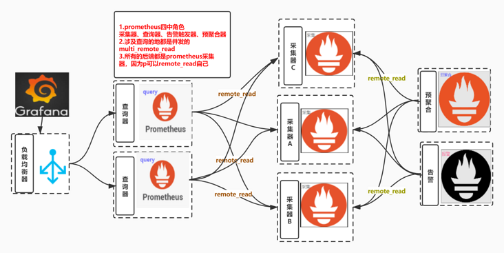

# 前言
- 我看到很多人会这样使用联邦：联邦prometheus 收集多个采集器的数据
- 实在看不下下去了，很多小白还在乱用`prometheus`的联邦
- 其实很多人是想实现prometheus数据的可用性，数据分片保存，有个统一的查询地方(小白中的联邦prometheus)
- 而且引入m3db等支持集群的tsdb可能比较重
    - 具体问题可以看我之前写的文章 [m3db资源开销，聚合降采样，查询限制等注意事项](https://zhuanlan.zhihu.com/p/359551116)
    - [m3db-node oom追踪和内存分配器代码查看](https://zhuanlan.zhihu.com/p/183815841)
- 今天写篇文章分析下联邦的问题，并给出一个基于全部是prometheus的`multi_remote_read`方案

# 架构图


# 联邦问题
- [联邦文档地址](https://prometheus.io/docs/prometheus/latest/federation/)

## 联邦使用样例

- 本质上就是采集级联
- 说白了就是 a 从 b,c,d那里再采集数据过来
- 可以搭配match指定只拉取某些指标
- 下面就是官方文档给出的样例

```yaml
scrape_configs:
  - job_name: 'federate'
    scrape_interval: 15s

    honor_labels: true
    metrics_path: '/federate'

    params:
      'match[]':
        - '{job="prometheus"}'
        - '{__name__=~"job:.*"}'

    static_configs:
      - targets:
        - 'source-prometheus-1:9090'
        - 'source-prometheus-2:9090'
        - 'source-prometheus-3:9090'
```


## 看上面的样例配置怎么感觉是采集的配置呢
- 不用怀疑就是，下面看看代码分析一下
> 从上述配置可以看到采集的 path是 `/federate`

```golang
    // web.go 的 federate Handler
	router.Get("/federate", readyf(httputil.CompressionHandler{
		Handler: http.HandlerFunc(h.federation),
	}.ServeHTTP))
```

> 分析下联邦函数 说白了就是读取本地存储数据处理

```golang

func (h *Handler) federation(w http.ResponseWriter, req *http.Request) {

	// localstorage 的query
	q, err := h.localStorage.Querier(req.Context(), mint, maxt)

	defer q.Close()
	// 最终发送的Vector 数组
	vec := make(promql.Vector, 0, 8000)

	hints := &storage.SelectHints{Start: mint, End: maxt}

	var sets []storage.SeriesSet

	set := storage.NewMergeSeriesSet(sets, storage.ChainedSeriesMerge)
    // 遍历存储中的full series
	for set.Next() {
		s := set.At()


		vec = append(vec, promql.Sample{
			Metric: s.Labels(),
			Point:  promql.Point{T: t, V: v},
		})

	for _, s := range vec {
		nameSeen := false
		globalUsed := map[string]struct{}{}
		protMetric := &dto.Metric{
			Untyped: &dto.Untyped{},
		}
        // Encode方法根据请求类型编码
				if protMetricFam != nil {
					if err := enc.Encode(protMetricFam); err != nil {
						federationErrors.Inc()
						level.Error(h.logger).Log("msg", "federation failed", "err", err)
						return
					}
				}

		}

		protMetric.TimestampMs = proto.Int64(s.T)
		protMetric.Untyped.Value = proto.Float64(s.V)

		protMetricFam.Metric = append(protMetricFam.Metric, protMetric)
	}
	// 
	if protMetricFam != nil {
		if err := enc.Encode(protMetricFam); err != nil {
			federationErrors.Inc()
			level.Error(h.logger).Log("msg", "federation failed", "err", err)
		}
	}
}

```


> 最终调用压缩函数压缩

```golang
type CompressionHandler struct {
	Handler http.Handler
}

// ServeHTTP adds compression to the original http.Handler's ServeHTTP() method.
func (c CompressionHandler) ServeHTTP(writer http.ResponseWriter, req *http.Request) {
	compWriter := newCompressedResponseWriter(writer, req)
	c.Handler.ServeHTTP(compWriter, req)
	compWriter.Close()
}

```

## 如果没有过滤那么只是一股脑把分片的数据集中到了一起，没意义

- 很多时候是因为数据量太大了，分散在多个采集器的数据是不能被一个联邦消化的

## 正确使用联邦的姿势

- 使用match加过滤，将采集数据分位两类
    - 第一类需要再聚合的数据，通过联邦收集在一起
        - 举个例子
            - 只收集中间件的数据的联邦
            - 只收集业务数据的联邦
    - 其余数据保留在采集器本地即可
- 这样可以在各个联邦上执行`预聚合`和`alert`，使得查询速度提升

## 默认prometheus是不支持降采样的
- 可以在联邦配置scrape_interval的时候设置的大一点来达到 模拟降采样的目的
- 真实的降采样需要agg算法支持的，比如5分钟的数据算平均值、最大值、最小值保留，而不是这种把采集间隔调大到5分钟的随机选点逻辑

# 正确实现统一查询的姿势是使用prometheus multi_remote_read

> 什么是remote_read 

- 简单说就是prometheus意识到自己本地存储不具备可用性，所以通过支持第三方存储来不足这点的手段
- [配置文档地址](https://prometheus.io/docs/prometheus/latest/configuration/configuration/#remote_read)

> 读写都支持的存储

- AWS Timestream
- Azure Data Explorer
- Cortex
- CrateDB
- Google BigQuery
- Google Cloud Spanner
- [InfluxDB](https://docs.influxdata.com/influxdb/v1.8/supported_protocols/prometheus/)
- IRONdb
- [M3DB](https://m3db.io/docs/integrations/prometheus/)
- PostgreSQL/TimescaleDB
- QuasarDB
- Splunk
- Thanos
- TiKV

> 但是这个和我们今天聊的问题关联在哪里?

## multi_remote_read 
> 如果我们配置了多个remote_read 接口的话即可实现 multi

```yaml
remote_read:
  - url: "http://172.20.70.205:9090/api/v1/read"
    read_recent: true
  - url: "http://172.20.70.215:9090/api/v1/read"
    read_recent: true

```

> 上述配置代表并发查询两个后端存储，并可以对查询的结果进行merge
- merge有啥用： 以为着你们的查询promql或者alert配置文件无需关心数据到底存储在哪个存储里面
- 可以直接使用全局的聚合函数

## prometheus可以remote_read prometheus自己
> 感觉这个特点很多人不知道，以为remote_read必须配置第三方存储如 m3db等

## 所以结合上述两个特点就可以用多个采集的prometheus + 多个无状态的prometheus query实现prometheus的高可用方案
- 监控数据存储在多个采集器的本地，可以是机器上的prometheus
- 也可以是k8s中的prometheus statefulset
- prometheus query remote_read 填写多个`prometheus/api/v1/read/`地址


```
1. remote_read 可以读 prometheus
2. 并发读取 + merge
```


### 数据重复怎么办
- 不用管，上面提到了query会做merge，多个数据只会保留一份
- 到正可以利用这个特点模拟副本机制：
    - 重要的采集job由两个以上的采集prometheus采集
    - 查询的时候merge数据
    - 可以避免其中一个挂掉时没数据的问题
### 那么这种方案的缺点在哪里
- 并发查询必须要等最慢的那个返回才返回，所以如果有个慢的节点会导致查询速度下降，举个例子
    - 有个美东的节点，网络基础延迟是1秒，那么所有查询无论返回多快都必须叠加1秒的延迟
    
- 应对重查询时可能会把query打挂
    - 但也正是这个特点，会很好的保护后端存储分片
    - 重查询的基数分散给多个采集器了
- 由于是无差别的并发query，也就是说所有的query都会打向所有的采集器，会导致一些采集器总是查询不存在他这里的数据
     - 那么一个关键性的问题就是，查询不存在这个prometheus的数据的资源开销到底是多少
     - 据我观察，新版本速度还是很快的说明资源开销不会在很深的地方才判断出不属于我的数据
     - m3db有布隆过滤器来防止这个问题
- 如果想精确把query打向数据它的存储分片可以参考我之前写的route方案：[开源项目 : prome-route： 使用反向代理实现prometheus分片](https://zhuanlan.zhihu.com/p/231914857)
    - 主要哦，需要特征标签支持，并且数据天然就是分开的！！

### 可以加一些探活/管理采集器的逻辑来完善这个方案


# 如何验证
> 两个prometheus只配置采集本地一个node_exporter 的job
- 这样在单一prometheus中只能查询到自己的数据

```yaml
global:
  scrape_interval:     15s # Set the scrape interval to every 15 seconds. Default is every 1 minute.
  evaluation_interval: 15s # Evaluate rules every 15 seconds. The default is every 1 minute.
  query_log_file: /opt/logs/prometheus_query_log

scrape_configs:
  - job_name: node_exporter
    honor_timestamps: true
    scrape_interval: 15s
    scrape_timeout: 10s
    static_configs:
    - targets:
      - localhost:9100

```


> 启动一个m_query服务 ,multi_remote_read 多个采集器
```yaml
global:
  scrape_interval:     15s # Set the scrape interval to every 15 seconds. Default is every 1 minute.
  evaluation_interval: 15s # Evaluate rules every 15 seconds. The default is every 1 minute.
  query_log_file: /opt/logs/prometheus_query_log

remote_read:
  - url: "http://192.168.0.106:9090/api/v1/read"
    read_recent: true
  - url: "http://192.168.0.107:9090/api/v1/read"
    read_recent: true
```

> 验证在 m_query服务上，即可查到所有数据，达到替换m3db的目的

```shell script
node_cpu_seconds_total{cpu="0", mode="system"}
```