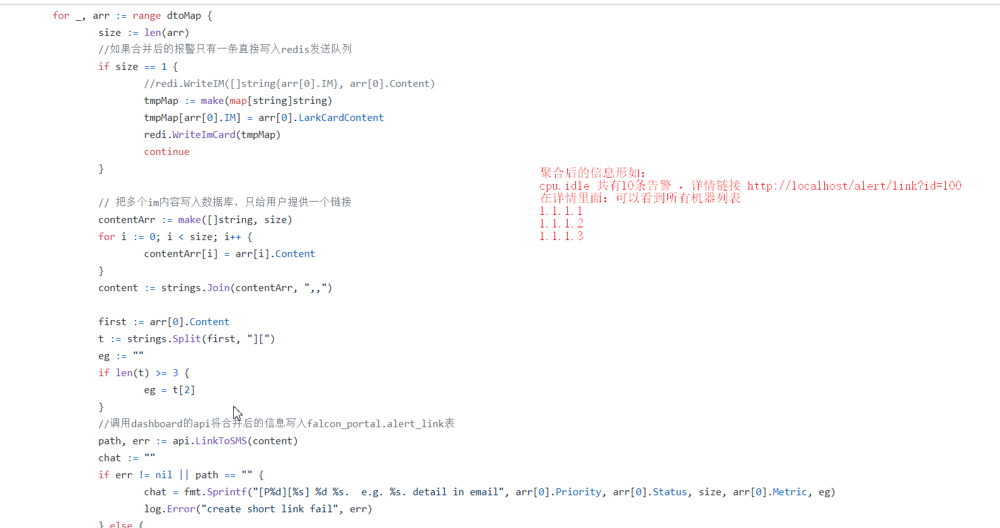

# 功能点

## 1. 发送通道
### 考察点
- 对接工作
    - 到达率
    - 高可用性
        - 多厂商对接
        - 消息队列解耦
        - l4/l7 
    - etl
        - xiaoyi --> 158000000
### 邮件
- 格式：邮件头 、subject、
- 内容的格式： html、附件

### 短信 sms
- 状态报告

### 电话 phone
- 语音模板，语音长度 不能太长，不能太短(最基本的区别信息)
- 重要报警才发语音

### 即时通信软件 im (钉钉/飞书/企业微信)
> 飞书


> 钉钉


> 企业微信


> 考察点
- 告警合并
- 能否@ oncall的人
- im 接口限速 比如 1分钟最多60条
- 快速看图 能否直接点击到对应的grafana 链接
- 带告警图片，富文本
- 个人消息和群消息
- 快速屏蔽按钮， 交互式卡片 https://developers.dingtalk.com/document/chatgroup/message-template-interaction-card-process


## 2. 回调


> 作用
- 理想的流程：set alarm --> 人为处理几次 --> 处理方案写成服务 --> 配置 回调+通道 --> 回调处理 --> 发个通知
- 和其他系统联动配合
    - 创建配件维修工单
    - 自动抓取火焰图
    - 重启服务等故障自愈
    
    ```
    6点发个总结：10个机器，20个磁盘  回调
    ```
    
    

## 3. 告警触发参数

- 触发条件
    - 连续发生 all
    - 发生次数 happen （交换机故障
    
    - 数据上报中断 nodata
        -  采集的agent失联对标 prometheus中的 `up==0告警`
        - prometheus 的absent函数 
    

    

- 是否支持与条件 (标签要一致)
    -  A and B
    - 内存剩余率< 10% and 内存可用量 <10G采集 
    -  A and B or C 
    
- 发送间隔和时间 ：执行动作
    - 在60分钟内, 最多报警1次
    - 告警发送间隔，如重复的报警 最低以5分钟发送，避免打扰正在处理故障的sre
    
- 是否发送恢复的信息

- 生效时间


- 是否支持告警升级
    - 多久触发升级
    - 升级的告警发给谁
    - 升级的告警变成什么通道
    


- 故障处理手册
  
## 4. 告警聚合

### 什么是告警聚合
> 举例1 钉钉信息聚合

- 同一个rule产生的多条告警聚合成一条发出
- 共享除了特征标签和vale之外的所有标签

> 举例2 openfalcon中将低优先告警聚合生成一个text存入 db
> 只发送一条链接信息
- https://github.com/ning1875/falcon-plus/blob/master/modules/alarm/cron/combiner.go



### 为什么进行聚合
- 告警信息爆炸
- 大group下多个实例同时触发

### 如何进行聚合
- 加大发送间隔
- 多条消息合并成一条
- inhibite 

## 5. 告警订阅

```
topic kafafa
```


## 6. 告警屏蔽