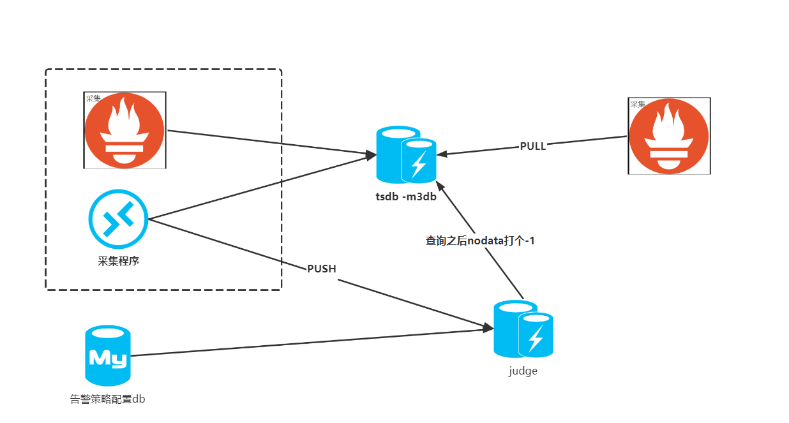

# push vs pull 两边本质区别

|  系统   | 阈值判断 | 是否支持多series告警  | 触发条件 | 组合条件 |  nodata | 
|  ----  | ----  | ---- | ---- | ---- | ---- |
| 夜莺v4 push代表	| 由judge接收点触发判断，查询本地数据 |	不支持，每个策略针对单一series<br>对应judge中内存列表<br>只能用预聚合解决 | 将happen、all、any等和聚合 avg max min等揉在一起 | 需做pull   |   需做pull   |  
| prometheus pull代表	| 由promql 查询存储 | promql直接支持<br>查询到一个就是一条，多个就是多条 | prometheus触发条件只支持 持续时间，其他的全部为聚合func | promql and支持  |   promql absent支持  |  



# 夜莺和prometheus告警流程对比分析


## prometheus告警流程分析

> 以 sum(rate(coredns_dns_requests_total[1m])) > 100 为例
- alert和record复用大部分逻辑
- prometheus根据配置文件中拿到规则 
- 解析规则查询本地存储或远端存储(带触发条件)，
- 返回一组当前点结果集，返回多少个对应多少条告警
- 根据内存中的历史数据判断告警持续时间(for 1 min)有没有到达
- 发送告警event给alertmanager
- 由alertmanager做告警的发送、静默、分组路由、关联、回调


## 夜莺告警流程分析
- monapi 定时从db同步策略，judge 根据自己的ident 拿到属于自己的策略
- transfer根据存活的judge 拿到所有策略，将策略的judge地址填好
- transfer收到 agent push的数据后，算hash拿到策略列表
    - 根据策略拿到judge地址，根据缓存拿到对应的队列，将数据塞入队列中
- judge收到策略后，根据策略中的fun做触发
- 根据策略中配置实现 发送时间、告警升级、回调等


## 告警push模式的性能提升问题
> 总结就是相比于性能损耗pull模型带来的灵活性是巨大的
- push型的告警模式无疑会带来性能提升
- 因为pull模型需要每次查询存储，虽然是当前点，但也有些损耗
- 但是
    - 现代的tsdb 有倒排索引+布隆过滤器的加持，告警查询损耗可以降到很低
    - pull模型带来的是非常灵活的触发表达式，从这点看，性能损耗可以忽略不急
    - 而且现在告警触发时都需要带上一些聚合的方法，这点push模型做不到

```
push模式适用场景：
字节 20w机器，cpu.use>80 mem.avaiable > 90

企业级：秒级告警
```


## 告警push模式可以工作在查询存储挂掉的case
> 因为push本地内存中有响应的数据，但是我觉得这是个伪优势

## 在夜莺中引入pull的问题
- 最大的动力是否是相中了promql 
- 存储和采集不支持promql
- 触发和聚合混在一起


# 代码分析


## prometheus告警代码分析
- update 加载配置文件，增量更新告警/聚合 group
- group.Eval 计算组里的规则
    - `// Eval runs a single evaluation cycle in which all rules are evaluated sequentially.`
    - `vector, err := rule.Eval(ctx, ts, g.opts.QueryFunc, g.opts.ExternalURL)`
    - 返回的是vector `type Vector []Sample` 代表享有统一时刻的一堆point
    - rule.Eval 分为规则和聚合 `alert/record`
    - 调用 EngineQueryFunc ，内部调 instance_query
        - `// EngineQueryFunc returns a new query function that executes instant queries against// the given engine.`
    - 如果没取到数据，证明没达到触发条件则，只处理历史的alert，看看持续时间到了没
    -  如果rule是 alert则走发送逻辑`	if ar, ok := rule.(*AlertingRule); ok {ar.sendAlerts(ctx, ts, g.opts.ResendDelay, g.interval, g.opts.NotifyFunc)}`    
    - alert 存在headblock中，record 写入存储中？
    


## 夜莺v4 告警代码 分析
- judge 根据自己的ident 拿到属于自己的策略 `stras := cache.StraCache.GetByNode(node)`
    - 更新本地`cache.NodataStra` 和 `cache.Strategy`
    
- monapi 定时从db同步策略`syncStras`
    - 分设备相关or设备无关
    - 根据策略的id算哈希，生成`strasMap [judge_ip_port][]*stra`
    - 全量更新 `cache.StraCache`

- transfer根据存活的judge 拿到所有策略`stras := cache.StraCache.GetAll()` ，将策略的judge地址填好
    - 根据所有策略的metrics 算哈希
    - 哈希前两位作为 map的第一层key
    - 内部map key为 哈希值，value为 策略列表
    - `straMap := make(map[string]map[string][]*models.Stra)`
    - `cache.StraMap.ReInit(straMap)`
    
- transfer收到 agent push的数据后，算hash拿到策略列表
    - 遍历策略列表 匹配tag
    - 根据策略拿到judge地址，根据缓存拿到对应的队列，将数据塞入队列中
    
- judge rpc send中 `go judge.ToJudge(cache.HistoryBigMap[pk[0:2]], pk, item, now)` 

