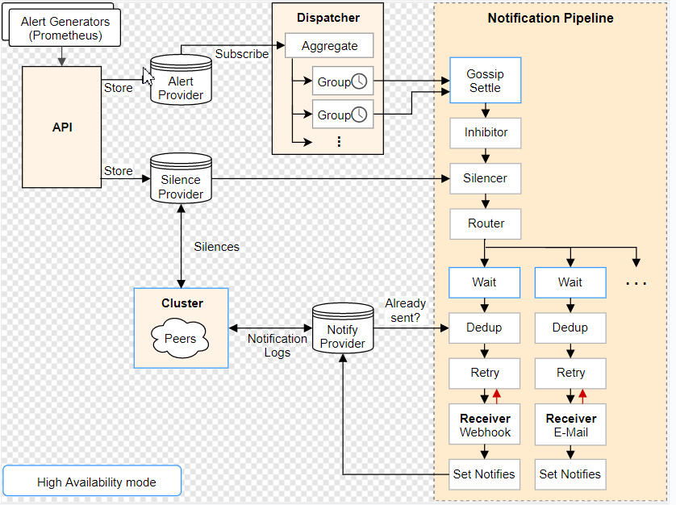

# 简介

> 项目地址
- https://prometheus.io/docs/alerting/latest/alertmanager/


> alertmanager 架构图



> 文档地址
- https://prometheus.io/docs/alerting/latest/alertmanager/
- Alertmanager处理由诸如Prometheus服务器之类的客户端应用程序发送的警报

> 核心功能点

|  英文   | 中文 | 含义  | 
|  ----  | ----  | ---- | 
| deduplicating	| 重复数据删除 |	prometheus产生同一条报警<br>发送给多个alm去重后发送  |  
| grouping	| 分组  |	告警可以分组处理，同一个组里共享等待时长等参数<br>可以做告警聚合 |  
| route	| 路由  |路由匹配树，可以理解为告警订阅 |  
| silencing 	| 静默  | 灵活的告警静默，如按tag | 
| inhibition  	| 抑制  | 如果某些其他警报已经触发，则抑制某些警报的通知 <br>如机器down，上面的进程down告警不触发| 
| HA  	| 高可用性  | gossip实现 | 

# 搭建单机版本

```shell script
#启动2个
ansible-playbook -i host_file  service_deploy.yaml  -e "tgz=alertmanager-0.21.0.linux-amd64.tar.gz" -e "app=alertmanager"

[root@prome-node01 ~]# ps -ef |grep alert
root       1953      1  1 21:43 ?        00:00:00 /opt/app/alertmanager/alertmanager --config.file=/opt/app/alertmanager/alertmanager.yml --storage.path=/opt/app/alertmanager/data/

```

> 访问ip:9093页面查看

> 配置文件讲解

```yaml
[root@prome-master01 alertmanager]# vim alertmanager.yml
[root@prome-master01 alertmanager]# pwd
/opt/app/alertmanager

```
```yaml
global:
  ＃ 如果一个告警不包括EndsAt，经过此时间后，如果尚未更新警报，则可以将警报声明为已恢复。
  ＃ 这对Prometheus的警报没有影响，因为它们始终包含EndsAt。
  resolve_timeout: 5m
  # 默认的httpconfig 如果下面webhook为空的时候用这个
  http_config: {}
  # smtp配置
  smtp_hello: localhost
  smtp_require_tls: true
  # 几个默认支持地址
  pagerduty_url: https://events.pagerduty.com/v2/enqueue
  opsgenie_api_url: https://api.opsgenie.com/
  wechat_api_url: https://qyapi.weixin.qq.com/cgi-bin/
  victorops_api_url: https://alert.victorops.com/integrations/generic/20131114/alert/
route:
  # 代表路由树的默认receiver
  # 匹配不中就走这个
  receiver: web.hook

  # 分组依据，比如按alertname分组
  group_by:
  - alertname
  # 代表新的报警最小聚合时间，第一次来的时候最短间隔
  group_wait: 10s
  # 代表同一个组里面告警聚合时间 同一个group_by 里面不同tag的聚合时间
  
  group_interval: 10s
  # 代表同一个报警(label完全相同)的最小发送间隔
  repeat_interval: 1h
# 抑制规则
# 可以有效的防止告警风暴
# 下面的含义： 当拥有相同 alertname，dev ，instance标签的多条告警触发时
# 如果severity=critical的已出发，抑制severity=warning的
inhibit_rules:
- source_match:
    severity: critical
  target_match:
    severity: warning
  equal:
  - alertname
  - dev
  - instance

# 接受者配置
receivers:
- name: web.hook
  webhook_configs:
  - send_resolved: true
    http_config: {}
    url: http://127.0.0.1:5001/alert
    max_alerts: 0

# 文本模板
templates: []

```

## 首先看下alertmanager web页面
### 测试报警
1. 使用  alert_receive.py 作为告警接受端
2. 修改配置文件中的webhook的url，重启prometheus
2. 使用 alertm_send.py 调alerm的接口发送告警
3. 查看alert_receive.py 日志和alert页面 


## 和prometheus整合

> 实验1： 与alertmanager整合
-   prometheus上配置alertmanager地址
```yaml
#  prometheus上配置alertm地址
# 为了高可用性可以配置多个 gossip组成集群的alertmanager地址
# Alertmanager configuration
alerting:
  alertmanagers:
  - static_configs:
    - targets:
      - localhost:9093
      - localhost1:9093
```

- 配置rule.yaml文件
```yaml
groups:
- name: alert_g_1
  rules:
  - alert: node_load too high
    expr:  node_memory_Active_bytes>0
    labels:
      severity: critical
      node_name: abc
    annotations:
      summary: 机器太累了

- name: alert_g_2
  rules:
  - alert: mysql_qps too high
    expr: mysql_global_status_queries >0
    labels:
      severity: warning
      node_name: abc
    annotations:
      summary: mysql太累了
```

- prometheus配置rule.yml
```yaml
# Load rules once and periodically evaluate them according to the global 'evaluation_interval'.
rule_files:
  - /opt/app/prometheus/rule.yml
```

- 重啟，查看log
```yaml
[root@prome-master01 prometheus]# systemctl restart prometheu
[root@prome-master01 prometheus]# tail -f /opt/logs/prometheus.log
```
- 查看prometheus页面的告警
```yaml
http://192.168.116.130:9090/alerts
```

- 开启003_alert_receive.py,查看日志


- 待测试
```yaml
> python flask 充当接收器

> 编辑prometheus rule file
- 编写规则文件
- 更改prometheus rule文件地址
- evaluation_interval 可以为每一个group设置trigger间隔
```


> 实验 2：配置查询日志

- 编写prometheus配置文件, 开启query_log
```yaml
global:
  scrape_interval:     15s # Set the scrape interval to every 15 seconds. Default is every 1 minute.
  evaluation_interval: 15s # Evaluate rules every 15 seconds. The default is every 1 minute.
  # scrape_timeout is set to the global default (10s).
  query_log_file: /opt/logs/prometheus_query.log
```

- touch文件并查看, 重启prometheus
```yaml
[root@prome-master01 prometheus]# systemctl restart prometheus
[root@prome-master01 alert_receive]# tail -f /opt/logs/prometheus_query.log

{"params":{"end":"2023-07-18T05:43:31.465Z","query":"mysql_global_status_queries > 0","start":"2023-07-18T05:43:31.465Z","step":0},"ruleGroup":{"file":"/opt/app/prometheus/rule.yml","name":"alert_g_2"},"stats":{"timings":{"evalTotalTime":0.000343933,"resultSortTime":0,"queryPreparationTime":0.00023768,"innerEvalTime":0.000089949,"execQueueTime":0.000086127,"execTotalTime":0.000445717}},"ts":"2023-07-18T05:43:31.466Z"}
{"params":{"end":"2023-07-18T05:43:31.628Z","query":"node_memory_Active_bytes > 0","start":"2023-07-18T05:43:31.628Z","step":0},"ruleGroup":{"file":"/opt/app/prometheus/rule.yml","name":"alert_g_1"},"stats":{"timings":{"evalTotalTime":0.000187678,"resultSortTime":0,"queryPreparationTime":0.000097481,"innerEvalTime":0.00008074,"execQueueTime":0.000018206,"execTotalTime":0.00021649}},"ts":"2023-07-18T05:43:31.639Z"}
```


