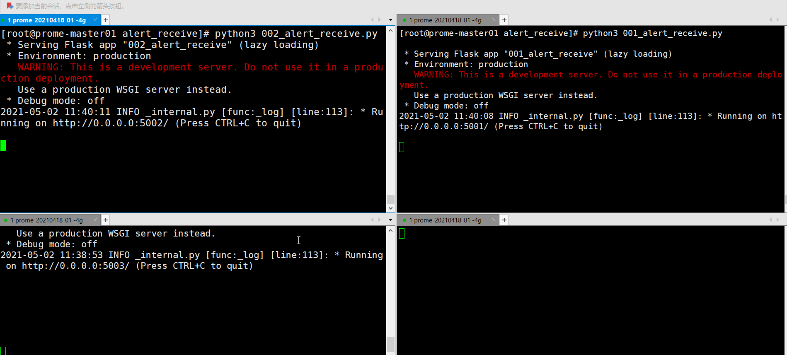
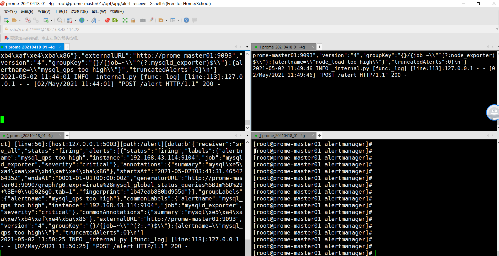

# 实验多个分组
> 效果如下
- job=node_exporter 由 sre_system处理  5001端口 
- job=mysqld_exporter  由 sre_dba处理 5002端口 
- 所有的告警 由 sre_all处理 5003端口 

> 分别启动三个flask接收器。模拟三个发送/处理通道
```yaml
# 启动3个receive，对应5001 5002 5003 端口
[root@prome-master01 alert_receive]# ll
-rw-r--r-- 1 root root 4695 Jul 18 23:01 alert_receive_5001.py
-rw-r--r-- 1 root root 4695 Jul 18 23:01 alert_receive_5002.py
-rw-r--r-- 1 root root 4695 Jul 18 23:01 alert_receive_5003.py
```


> 修改alertmanager配置文件 ， 02alertmanager.yml
```yaml
global:
  resolve_timeout: 30m

route:
  group_by: ['alertname']
  group_wait: 5s
  group_interval: 5s
  repeat_interval: 1h
  receiver: 'sre_all'
  routes:                                       #子路由，父路由的所有属性都会被子路由继承
    - match_re:                                   #此路由在警报标签上执行正则表达式匹配，以捕获与服务列表相关的警报
        job: node_exporter
      receiver: sre_system
      # 代表继续向下匹配，不然就break了
      # 只能向下匹配
      continue: true
    - match_re:
        job: mysqld_exporter
      receiver: sre_dba
      continue: true
      # 默认all路由
    - match_re:
        job: .*
      receiver: sre_all
      continue: true


receivers:
- name: 'sre_system'
  webhook_configs:
  - url: 'http://127.0.0.1:5001/alert'
- name: 'sre_dba'
  webhook_configs:
  - url: 'http://127.0.0.1:5002/alert'
- name: 'sre_all'
  webhook_configs:
  - url: 'http://127.0.0.1:5003/alert'
```


> 启动服务即可
```yaml
[root@prome-master01 alertmanager]# vim alertmanager.yml
  
[root@prome-master01 alertmanager]# rm -rf data/

[root@prome-master01 alertmanager]# systemctl restart alertmanager
[root@prome-master01 alertmanager]# systemctl status alertmanager
```


> 效果 sre_all收到所有，其余两个收到各自的



```yaml
# 解释
sre_all 收到所有的告警
sre_dba 只收到 mysql的告警
sre_system 只收到 node的告警
```
