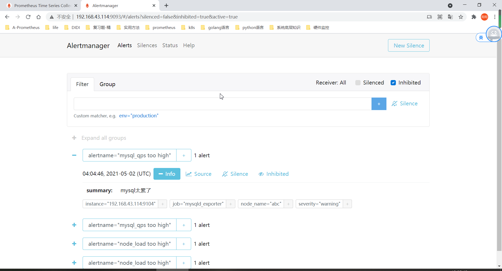
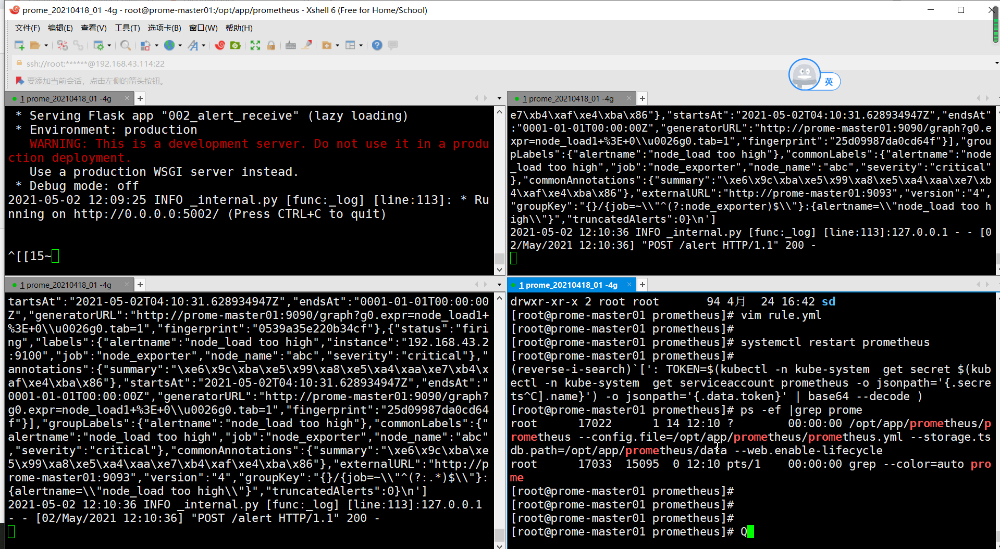

```yaml
抑制
抑制是抑制某些警报的通知的概念，如果 某些其他警报已触发。

例：正在触发警报，通知整个群集不是 到达。警报管理器可以配置为静音所有其他有关 此群集（如果该特定警报正在触发）。 这可以防止收到数百或数千个触发警报的通知 与实际问题无关。

禁止是通过警报管理器的配置文件配置的
```

> 告警中同一个机器`instance`出发的 critical告警要抑制warning的
> alertmanage.yml增加文件配置
```yaml
inhibit_rules:
  - source_match:
      severity: 'critical'
    target_match:
      severity: 'warning'
    equal: ['instance']
```
> 重启
```yaml
[root@prome-master01 alertmanager]# rm -rf data/
[root@prome-master01 alertmanager]# ll
total 51652
-rwxr-xr-x 1 3434 3434 28871879 Jun 17  2020 alertmanager
-rw-r--r-- 1 3434 3434      981 Jul 18 23:16 alertmanager.yml
-rw-r--r-- 1 root root      380 Jul 18 23:05 alertmanager.yml_bak
-rw-r--r-- 1 root root      994 Jul 18 23:08 alertmanager.yml_new
-rwxr-xr-x 1 3434 3434 23987848 Jun 17  2020 amtool
-rw-r--r-- 1 3434 3434    11357 Jun 17  2020 LICENSE
-rw-r--r-- 1 3434 3434      457 Jun 17  2020 NOTICE
[root@prome-master01 alertmanager]# vim alertmanager.yml
[root@prome-master01 alertmanager]# ll^C
[root@prome-master01 alertmanager]# systemctl restart alertmanager
[root@prome-master01 alertmanager]# systemctl status alertmanager

```


> 5002 那个mysqld接收不到了


- 抑制查看地址  http://192.168.116.130:9093/#/alerts?silenced=false&inhibited=true&active=true

