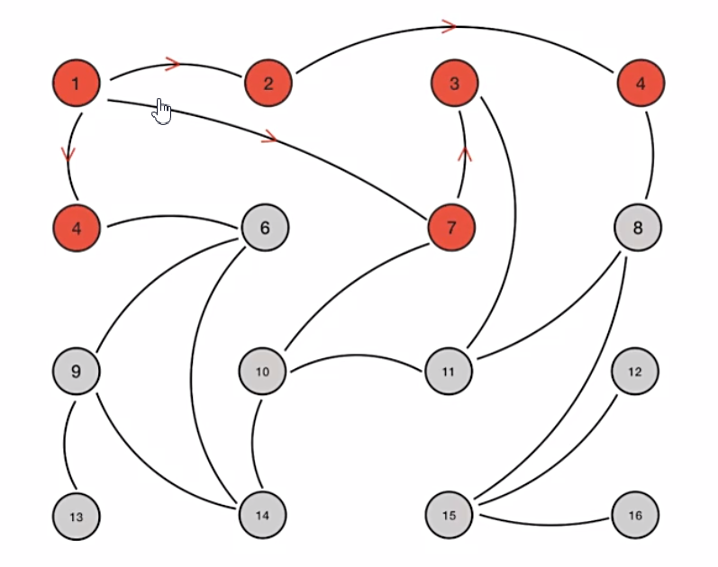
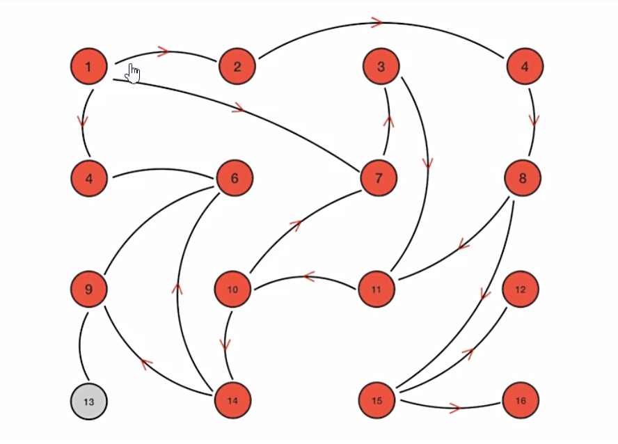

# gossip流言算法
> 作用 
- 这个协议的作用就像其名字表示的意思一样，非常容易理
- 它的方式其实在我们日常生活中也很常见，比如电脑病毒的传播，森林大火，细胞扩散等等。
- 主要用在分布式数据库系统中各个副本节点同步数据之用

# 信息同步过程演示
> 前提设定
- Gossip 是周期性的散播消息，把周期限定为 1 秒
- 被感染节点随机选择 k 个邻接节点（fan-out）散播消息，这里把 fan-out 设置为 3，每次最多往 3 个节点散播。
- 每次散播消息都选择尚未发送过的节点进行散播
- 收到消息的节点不再往发送节点散播，比如 A -> B，那么 B 进行散播的时候，不再发给 A。
- Gossip 过程是异步的，也就是说发消息的节点不会关注对方是否收到，即不等待响应；不管对方有没有收到，它都会每隔 1 秒向周围节点发消息。异步是它的优点，而消息冗余则是它的缺点。

# Gossip 的特点（优势）

1. 扩展性
    - 网络可以允许节点的任意增加和减少，新增加的节点的状态最终会与其他节点一致。
2. 容错
    - 网络中任何节点的宕机和重启都不会影响 Gossip 消息的传播，Gossip 协议具有天然的分布式系统容错特性。
3. 去中心化
    - Gossip 协议不要求任何中心节点，所有节点都可以是对等的，任何一个节点无需知道整个网络状况，只要网络是连通的，任意一个节点就可以把消息散播到全网。
4. 一致性收敛
    - Gossip 协议中的消息会以一传十、十传百一样的指数级速度在网络中快速传播，因此系统状态的不一致可以在很快的时间内收敛到一致。消息传播速度达到了 logN。
5. 简单
    - Gossip 协议的过程极其简单，实现起来几乎没有太多复杂性。
    
# Gossip 的缺陷

- 分布式网络中，没有一种完美的解决方案，Gossip 协议跟其他协议一样，也有一些不可避免的缺陷，主要是两个：

1. 消息的延迟
    - 由于 Gossip 协议中，节点只会随机向少数几个节点发送消息，消息最终是通过多个轮次的散播而到达全网的，
    - 因此使用 Gossip 协议会造成不可避免的消息延迟。不适合用在对实时性要求较高的场景下。

2. 消息冗余
    - Gossip 协议规定，节点会定期随机选择周围节点发送消息
    - 而收到消息的节点也会重复该步骤，因此就不可避免的存在消息重复发送给同一节点的情况
    - 造成了消息的冗余，同时也增加了收到消息的节点的处理压力
    - 而且，由于是定期发送，因此，即使收到了消息的节点还会反复收到重复消息，加重了消息的冗余。    
    
    
# Gossip 中的通信模式

- 在 Gossip 协议下，网络中两个节点之间有三种通信方式:

- Push: 节点 A 将数据 (key,value,version) 及对应的版本号推送给 B 节点，B 节点更新 A 中比自己新的数据
- Pull：A 仅将数据 key, version 推送给 B，B 将本地比 A 新的数据（Key, value, version）推送给 A，A 更新本地
- Push/Pull：与 Pull 类似，只是多了一步，A 再将本地比 B 新的数据推送给 B，B 则更新本地
- 如果把两个节点数据同步一次定义为一个周期，则在一个周期内，Push 需通信 1 次，Pull 需 2 次，Push/Pull 则需 3 次
- 虽然消息数增加了，但从效果上来讲，Push/Pull 最好，理论上一个周期内可以使两个节点完全一致
- 直观上，Push/Pull 的收敛速度也是最快的。