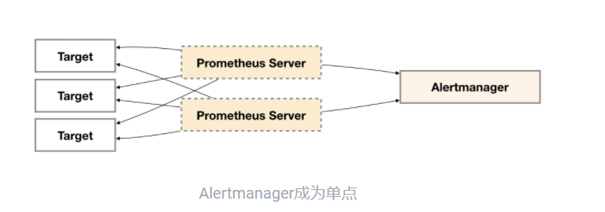
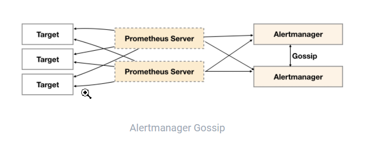
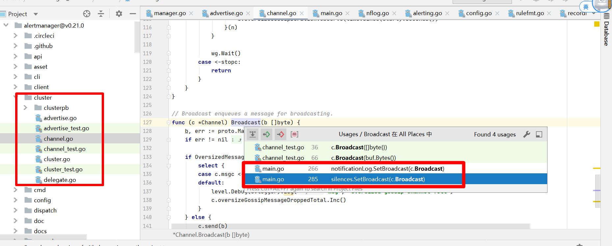

# alertmanager 单点问题
- 部署一个肯定是单点

> 尝试部署多个独立的alertmanager
> prometheus产生的报警并行发往多个alm
 
- 此方案能保证告警信息不会因为单个alm挂掉儿接收不到
- 但是会造成同一条告警信息发送多次，告警重复


> alertmanager 引入gossip协议来同步节点间的信息
 
**信息种类如下**
- 新接收到的告警信息
    - 通知发送状态同步：告警通知发送完成后，基于Push-based同步告警发送状态。Wait阶段可以确保集群状态一致
- silence静默信息
- 查看代码可以知道共有两个地方被`SetBroadcast`
    - 即动态接受数据的地方可以gossip，配置如inhibit、route则不可以

 
# 回味alertmanager 架构图


# 高可用部署
- 其余节点启动参数加上对端ip即可
```shell script
[root@prome-node01 ~]# vi /etc/systemd/system/alertmanager.service 

# 添加cluster.peer
ExecStart=/opt/app/alertmanager/alertmanager  --config.file=/opt/app/alertmanager/alertmanager.yml --storage.path=/opt/app/alertmanager/data/ --cluster.peer=192.168.116.130:9094 

[root@prome-node01 ~]# systemctl daemon-reload
[root@prome-node01 ~]# systemctl restart alertmanager


# 查看日志
[root@prome-node01 alertmanager]# tail -f /opt/logs/alertmanager.log


# 查看 131，发现silence已经同步
http://192.168.116.131:9093/#/silences
[root@prome-node01 alertmanager]# cd data/
[root@prome-node01 data]# ll
total 8
-rw-r--r-- 1 root root 519 Jul 20 01:33 nflog
-rw-r--r-- 1 root root 554 Jul 20 01:33 silences
```
> 测试gossip方法
- 在一个节点创建静默
- 在其他点页面上能看到静默的记录
```yaml
# 开启debug，重启服务
[root@prome-node01 alertmanager]# tail -f /opt/logs/alertmanager.log
ExecStart=/opt/app/alertmanager/alertmanager  --config.file=/opt/app/alertmanager/alertmanager.yml  --storage.path=/opt/app/alertmanager/data/  --cluster.peer=192.168.116.130:9094 --log.level=debug

# 查看日志
[root@prome-node01 alertmanager]# tail -f /opt/logs/alertmanager.log
Jul 20 01:39:11 prome-node01 alertmanager: level=debug ts=2023-07-20T05:39:11.615Z caller=silence.go:834 component=silences msg="Gossiping new silence" silence="silence:<id:\"a2f5ef9f-40be-4090-bc36-9571004b8446\" matchers:<name:\"k2\" pattern:\"k2\" > starts_at:<seconds:1689831551 nanos:503463401 > ends_at:<seconds:1689838742 nanos:893000000 > updated_at:<seconds:1689831551 nanos:503463401 > created_by:\"test\" comment:\"130 create\" > expires_at:<seconds:1690270742 nanos:893000000 > "

```


# 调api发送告警，测试dedupe

- 未实现，请重新实验
> step1：gossip启动两个alertm，配置保持一致

> step2：调两个alertm地址发送同一条告警
- 细节
    - 可以在第二个节点不启动接收端
    - 所以当日志中没出现 connection refused说明 第二个节点没有发送告警
    - 达到我们用gossip 去掉重复告警的目的
    - 其实是第一个节点发送告警后  gossip通知了第二个节点


- 文档地址 https://prometheus.io/docs/alerting/latest/clients/
```yaml
[
  {
    "labels": {
      "alertname": "<requiredAlertName>",
      "<labelname>": "<labelvalue>",
      ...
    },
    "annotations": {
      "<labelname>": "<labelvalue>",
    },
    "startsAt": "<rfc3339>",
    "endsAt": "<rfc3339>",
    "generatorURL": "<generator_url>"
  },
  ...
]
```

> step3: 查看接收端收到几条


 # alertmanger的config如何管理
- 使用consult管理配置
- 配置拆开了2个部分，有一部分通过gossip来同步的
！[image](./pic/alertmanager_sync.png)