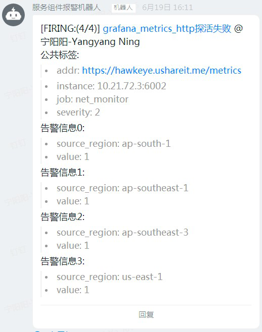
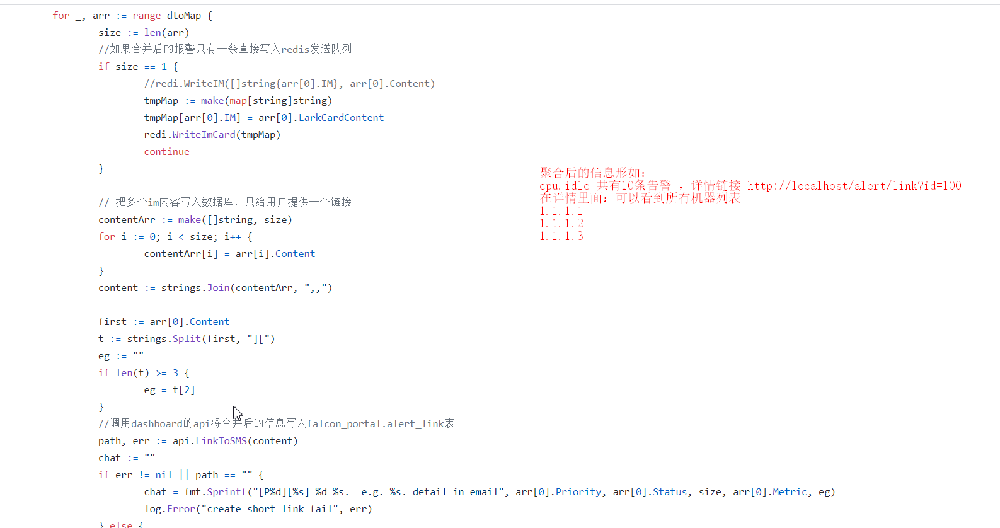

# 什么是告警聚合

- https://github.com/ning1875/xprober

> 举例1 钉钉信息聚合

- 同一个rule产生的多条告警聚合成一条发出
- 共享除了特征标签和vale之外的所有标签

> 举例2 openfalcon中将低优先告警聚合生成一个text存入 db
> 只发送一条链接信息
- https://github.com/ning1875/falcon-plus/blob/master/modules/alarm/cron/combiner.go

# 为什么进行聚合
- 告警信息爆炸
- 大group下多个实例同时触发

# 如何进行聚合
- 加大发送间隔
- 多条消息合并成一条
- inhibite 

