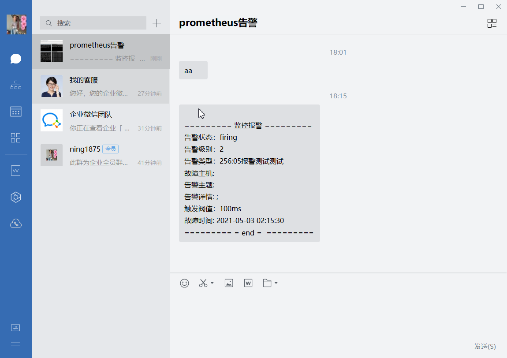
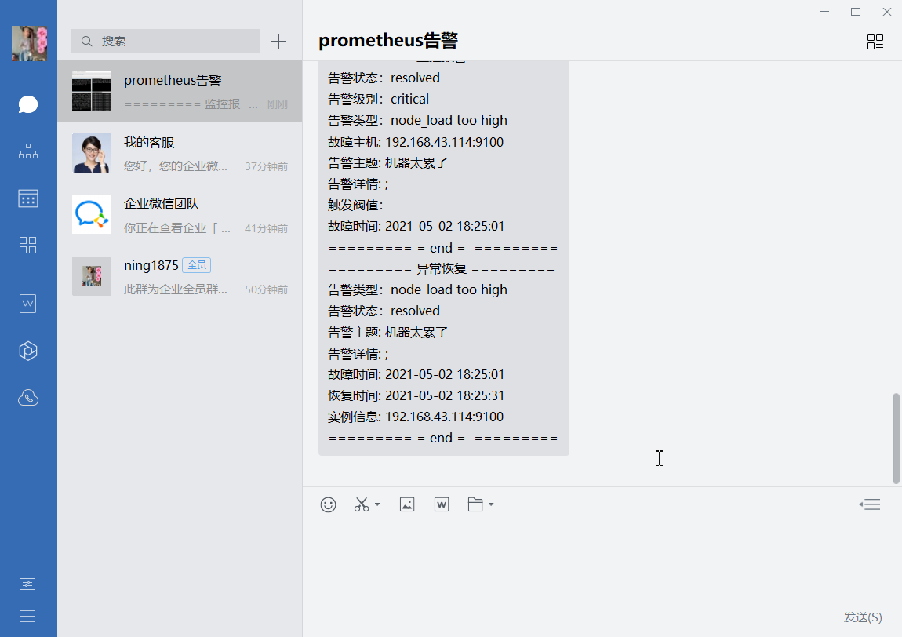

# 企业微信
- 文档地址 https://www.cnblogs.com/miaocbin/p/13706164.html

- 未能复现，猜测，wechat发送消息的url，body变换
## 步骤
> step 1：注册企业微信，拿到企业id
ww9c353d61e6068dd4

> step 2: 创建部门，部门ID获取 如果只有你自己
> 需要把你添加进部门2
ID 2

> step 3: 应用管理创建报警应用 
>告警AgentId和Secret获取
> 1000002
1Cn1qgcBB8RwAMsIOsE5EUoFJH22_sydhhdkybLHRdg
> 
> step 4: 配置微信文本模板 
> wechat.tmpl


> step 5: 将上述信息填入alertmanager配置文件
> 04.yml

> step6: 测试告警





> step7 查看日志
- 开启debug模式，查看日志
```yaml
Jul 21 13:34:26 prome-master01 alertmanager: level=debug ts=2023-07-21T05:34:26.669Z caller=dispatch.go:473 component=dispatcher aggrGroup="{}:{alertname=\"node_load too high\"}" msg=flushing alerts="[node_load too high[0d2801c][active] node_load too high[0700664][active]]"
Jul 21 13:34:27 prome-master01 alertmanager: level=debug ts=2023-07-21T05:34:27.966Z caller=dispatch.go:473 component=dispatcher aggrGroup="{}:{alertname=\"内存使用率告警\"}" msg=flushing alerts="[内存使用率告警[923cbec][active] 内存使用率告警[50f3c4e][active]]"
Jul 21 13:34:31 prome-master01 alertmanager: level=debug ts=2023-07-21T05:34:31.473Z caller=dispatch.go:473 component=dispatcher aggrGroup="{}:{alertname=\"mysql_qps too high\"}" msg=flushing alerts="[mysql_qps too high[2232e2e][active]]"
Jul 21 13:34:31 prome-master01 alertmanager: level=debug ts=2023-07-21T05:34:31.680Z caller=dispatch.go:473 component=dispatcher aggrGroup="{}:{alertname=\"node_load too high\"}" msg=flushing alerts="[node_load too high[0d2801c][active] node_load too high[0700664][active]]"
Jul 21 13:34:32 prome-master01 alertmanager: level=debug ts=2023-07-21T05:34:32.967Z caller=dispatch.go:473 component=dispatcher aggrGroup="{}:{alertname=\"内存使用率告警\"}" msg=flushing alerts="[内存使用率告警[923cbec][active] 内存使用率告警[50f3c4e][active]]"

```