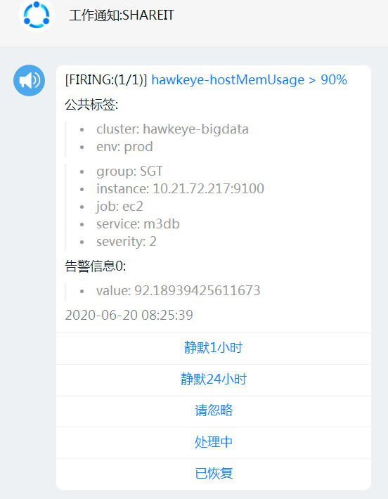
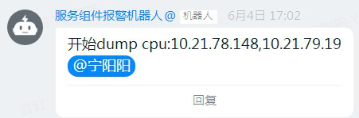

# 告警配置页面化，需要实现的功能点
> 报警表达式expr配置：名称、级别、触发expr、for时⻓、结果显示

- expr表达式：
    - 去检测一下页面上填写的promql语法是否正常
    - for时长： 后端会做时间字符串 的解析
```yaml
# prometheus rule check包
[root@prome-master01 prometheus]# pwd
/opt/app/prometheus
[root@prome-master01 prometheus]# ./promtool -h
```

    
> 报警route配置：组等待、组间隔、重复间隔、正则匹配项
- 正则匹配项：表达式 or 交互正则


> 报警接收组配置：⼈员、升级接收⼈、im群地址、邮件组、是否接收recovery

## 配置链路 
- 主要要处理 rule.yml 和 alertmanager.yml
- 前端配置调后端接口
- 后端接口写db 同步consul
- confd拉去consul配置结合template生成yml文件

## rule.yml 可以沿用day02时介绍的动态分片方案

# 告警升级如何实现
> 什么是告警升级
- 如cpu告警在5分钟还没恢复，由原来配置的以短信+im形式发给张三之外需要以im形式发给张三的领导李四
> 如何实现
- 可以配置多个group监听同一正则，负责人的wait时间设置长一点

# im 注意事项
- 所有通道中最重要的，思考下为什么？
> 快速屏蔽按钮对应action_card


```yaml
权限：通过公网交换机的流量，猜测公司核心业务的日活
方案：网络大盘，设置权限，net_sre,net_admin
```

> 告警快速链接到grafana图表
- 可以生成临时图表+multi_remote_read 的数据源
- 也可以过缓存redirect到制定的dashboard上

> 群机器+私聊机器人

> 发群消息时@ at下值班人员


> 可以生成告警曲线图片作为富文本消息发出来
- 当前值曲线
- 环比1小时曲线
- 环比1天曲线

# 对接排班系统
- 一个组多个人，按周排班，告警每天发给值班的那几个人就可以

- 360 哆啦A梦
```yaml
https://www.infoq.cn/article/NXQ2ClQCthhm6XwXkuzx/
我们开发的哆啦 A 梦，它将我们在 Web-UI 配置的监控规则存入数据库，
然后通过 Rule Engine 从 Web 后端的 Http 接口周期性地拉取 Prometheus 的报警规则，
并通过 Prometheus 的 Query API 下发到多台 Prometheus Server 进行计算。

那些触发报警的结果会由 Rule Engine 再转发给 Web 后端，Web 后端会将这些报警存在 MySQL 数据库中。
之后我们的报警网关会用一个专门的协程来每分钟扫描一次数据库，
根据规则将触发的报警以相应的形式发送给用户。
对于 360 内部来说，是支持短信、电话，以及内部的蓝信报警方式。
对于开源给外部用户的话，是通过 Web HOOK 将报警以 HTTP POST 请求的方式放送给指定的 Web Server，
这个 Web Server 需要外部用户自己来设计实现将报警发送到指定终端。

```