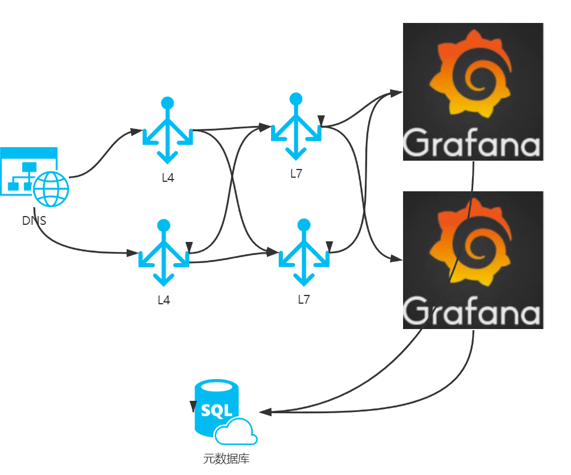

# 讲查询
## 分角色

>1）偏使用层面
- 能否展示出图
    - 挑一个前端展示的软件：
        - 调研结果 ：grafana 是时序数据展示的霸主：维护工作如下
            - 各种各样数据源DataSource接入维护：
                - 内置的|插件型的：clickhouse、druid、prometheus、夜莺、es

## 数据源类型
- 类型broswer型和server型
### browser
- browser优点：不占grafana 后端资源
- browser缺点：
    1. 鉴权问题：
    2. mysql数据源根本查不到
    3. 跨域问题 
###  server型    
- server型：虽然 要做反向代理占用一些资源
    - 多实例解决这个问题
    - 注意一点：                            

### 推动接入的ds连接地址高可用

>  2） 偏维护层面
#### 高可用
    - grafana
        - 元数据mysql的高可用
        - api型服务的ha


#### 高性能
- 识别并处理重查询
- 表结构问题：dashboard在db中单独一张表  大json
    - 修改任意一点字段导致 save全量数据
    - 查询时不好利用缓存，数据量较大
        -  mysql压力大
- search问题：
```
select * from dashboard
data表类型 mediumttext
```


> 3) 更底层源码：
#### nodata的排查
- f12看请求：need知识点
    1. 和后端交互 请求响应
    2. 怎样拿着请求的args去真实的 ds上
    3. 看代码
    
#### 速度慢怎么排查
    
    
