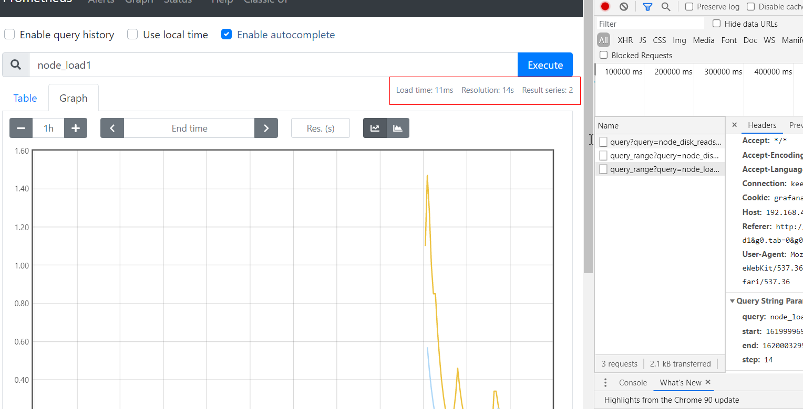
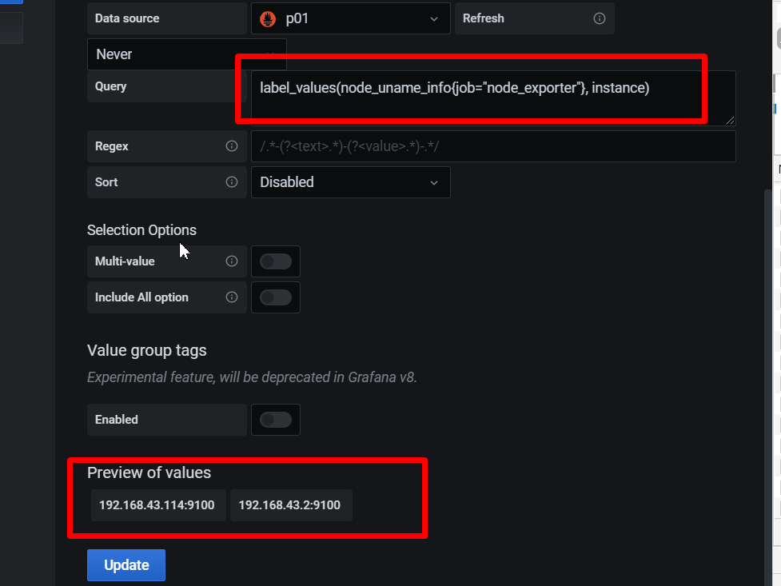
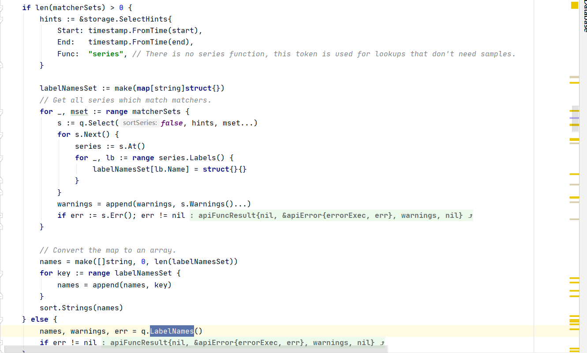
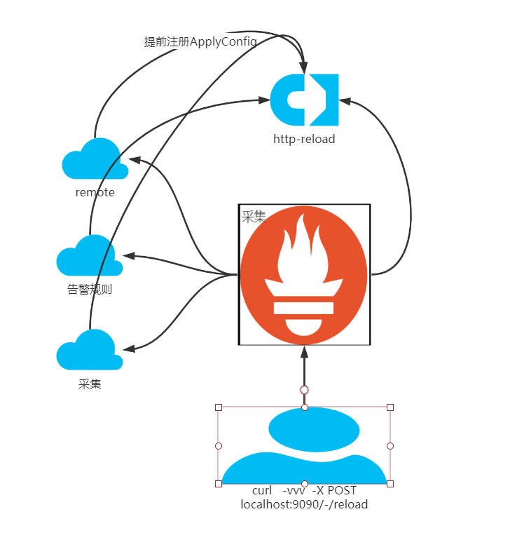

# 拿一个具体例子看
> 空的prometheus

1. 我依稀记得有个指标叫mem，然后尝试输入个m
    -  发现有包含m的metric名字供我选择 
    - 涉及prometheus的第一个接口
    - `http://192.168.0.106:9090/api/v1/label/__name__/values` 
    - 对应查询metrics 列表的接口 https://prometheus.io/docs/prometheus/latest/querying/api/#querying-label-values
    - 我用脚本查 
    - 发现和grafana不一样
    ```yaml
    
    # prometheus 
    api/v1/label/instance/values?
    
    # grafana
   # 配置模板-> variables ->label_values(node_arp_entries{job=~".*"}, instance) 查看接口
    api/datasources/proxy/1/api/v1/series?match%
    ```    
    -   看原理 D:\nyy_work\go_path\pkg\mod\github.com\prometheus\prometheus@v1.8.2-0.20210220213500-8c8de46003d1\web\api\v1\api.go
    -  在remote_read中没实现：表现就是query没法补全
2. 去点execute 查table 
    - instance_query  
    - 对应uri为 `/api/v1/query`

3. 点graph查曲线  range_query
    - 对应uri为 `/api/v1/query_range`
    - 查询⼀段时间的曲线
    - Resolution 为啥用 这个

4. grafana 上先模糊找到metric_name ,想看看有几个标签的名字
    - 破案了：发现grafana 无论 template 、补全标签名字、补全标签值都用/api/v1/series  
    - series是很重的接口，只用标签

#  主要查询接口
> instance_query
- 对应uri为 `/api/v1/query`
- 报警使⽤、预聚合、当前点查询(table)
- 可以用来调用监控数据生成报表

> range_query
- 对应uri为 `/api/v1/query_range`
- 查询⼀段时间的曲线
- 可以用来调用监控数据生成报表
- 模拟prometheus页面打印的结果

```shell script
2021-05-03 09:06:55 INFO 001_range_query.py [func:ins_query] [line:51]:[series:1/2][metric:{
    "__name__": "node_load1",
    "instance": "192.168.43.114:9100",
    "job": "node_exporter"
}]
2021-05-03 09:06:55 INFO 001_range_query.py [func:ins_query] [line:51]:[series:2/2][metric:{
    "__name__": "node_load1",
    "instance": "192.168.43.2:9100",
    "job": "node_exporter"
}]
2021-05-03 09:06:55 INFO 001_range_query.py [func:ins_query] [line:57]:Load time: 0.006407099999999999  Resolution: 30s   Result series: 2

```

> series 
- 对应uri为 `/api/v1/series`
- grafana 使⽤label_values查询变量
- grafana label_values 根据`node_uname_info{job="node_exporter"}` 查询instance变量的集合

```shell script
label_values(node_uname_info{job="node_exporter"}, instance)
```


- 对于python脚本调用结果为
```shell script
2021-05-03 09:23:44 INFO 001_series_query.py [func:label_values] [line:43]:
[prometheus_host:192.168.43.114:9090]
[expr:('node_uname_info{job="node_exporter"}',)]
[target_tag:instance]
[num:2][tag_values:{'192.168.43.2:9100', '192.168.43.114:9100'}]

```
- 再排序即可
- 注意这里是重查询的可能点之一？思考为什么？开销在哪里

> labels
- 对应uri为 `/api/v1/labels`
- 获取标签key集合
- 举例1 获取node_uname_info的标签key集合
```shell script
2021-05-03 09:43:26 INFO 001_labels_name_query.py [func:label_names] [line:40]:[series_selector:node_uname_info][label_names_num:9][they are:[
    "__name__",
    "domainname",
    "instance",
    "job",
    "machine",
    "nodename",
    "release",
    "sysname",
    "version"
]]

```
- 举例2 获取一个prometheus的所有标签key集合
```shell script
2021-05-03 09:45:32 INFO 001_labels_name_query.py [func:label_names] [line:43]:[series_selector:][label_names_num:83][they are:[
    "__name__",
    "account",
    "address",
    "alertmanager",
    "alertname",
    "alertstate",
    "branch",
    "broadcast",
```
- 原理 `D:\nyy_work\go_path\pkg\mod\github.com\prometheus\prometheus@v1.8.2-0.20210220213500-8c8de46003d1\web\api\v1\api.go`

    - 如果没有series_selector则获取指定block的标签集合
    - 这个在head block中直接在倒排索引中返回，速度最快
    - 如果有series_selector则需要遍历获取结果

> label values
- 对应uri为 `/api/v1/label/<label_name>/values`
- 获取标签label_name的 value集合
- 举例1 获取所有job的name集合
```shell script
2021-05-03 09:54:28 INFO 001_labels_value_query.py [func:label_values] [line:44]:
[series_selector:][target_label:job][label_names_num:10][they are:[
    "blackbox-http",
    "blackbox-ping",
    "blackbox-ssh",
    "mysqld_exporter",
    "node_exporter",
    "process-exporter",
    "prometheus",
    "pushgateway",
    "redis_exporter_targets",
    "shard_job"
]]
```

- 举例2：根据`node_uname_info{job="node_exporter"}` 查询instance变量的集合
```shell script
2021-05-03 09:56:11 INFO 001_labels_value_query.py [func:label_values] [line:44]:
[series_selector:node_uname_info][target_label:instance][label_names_num:2][they are:[
    "192.168.43.114:9100",
    "192.168.43.2:9100"
]]
```


> /api/v1/series 和 /api/v1/label/<label_name>/values 区别
- series使用 `Querier.Select` 然后grafana自身遍历
- 后者使用 `LableQuerier.LabelValues` 提供标签查询


# 总结 

## 1) 5大数据查询接口

```golang
D:\nyy_work\go_path\pkg\mod\github.com\prometheus\prometheus@v1.8.2-0.20210220213500-8c8de46003d1\web\api\v1\api.go
	r.Get("/query", wrap(api.query))
	r.Get("/query_range", wrap(api.queryRange))

	r.Get("/labels", wrap(api.labelNames))
	r.Get("/label/:name/values", wrap(api.labelValues))

	r.Get("/series", wrap(api.series))
```

## 2) 管理接口
curl -vvv -X POST localhost:9090/-/healthy

```golang

	if o.EnableLifecycle {
		router.Post("/-/quit", h.quit)
		router.Post("/-/reload", h.reload)

	router.Get("/debug/*subpath", serveDebug)
	router.Post("/debug/*subpath", serveDebug)

	router.Get("/-/healthy", func(w http.ResponseWriter, r *http.Request) {
		w.WriteHeader(http.StatusOK)
		fmt.Fprintf(w, "Prometheus is Healthy.\n")
	})
	router.Get("/-/ready", readyf(func(w http.ResponseWriter, r *http.Request) {
		w.WriteHeader(http.StatusOK)
		fmt.Fprintf(w, "Prometheus is Ready.\n")
	}))
```
### reload的过程


## 3) 统计接口

http://192.168.116.130:9090/api/v1/status/config

```golang
   //  拿采集targets接口
	r.Get("/targets", wrap(api.targets))
	r.Get("/targets/metadata", wrap(api.targetMetadata))
   // alertmagers
	r.Get("/alertmanagers", wrap(api.alertmanagers))


    // 拿配置文件
	r.Get("/status/config", wrap(api.serveConfig))
    //  同页面status选项
	r.Get("/status/runtimeinfo", wrap(api.serveRuntimeInfo))
	r.Get("/status/buildinfo", wrap(api.serveBuildInfo))
	r.Get("/status/flags", wrap(api.serveFlags))
	r.Get("/status/tsdb", wrap(api.serveTSDBStatus))
	r.Post("/read", api.ready(http.HandlerFunc(api.remoteRead)))
	r.Post("/write", api.ready(http.HandlerFunc(api.remoteWrite)))

	r.Get("/alerts", wrap(api.alerts))
	r.Get("/rules", wrap(api.rules))

	// Admin APIs
```