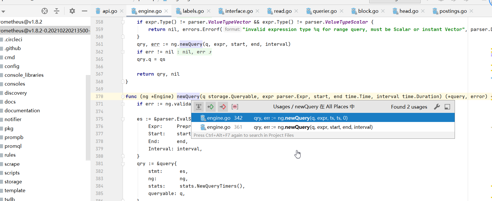
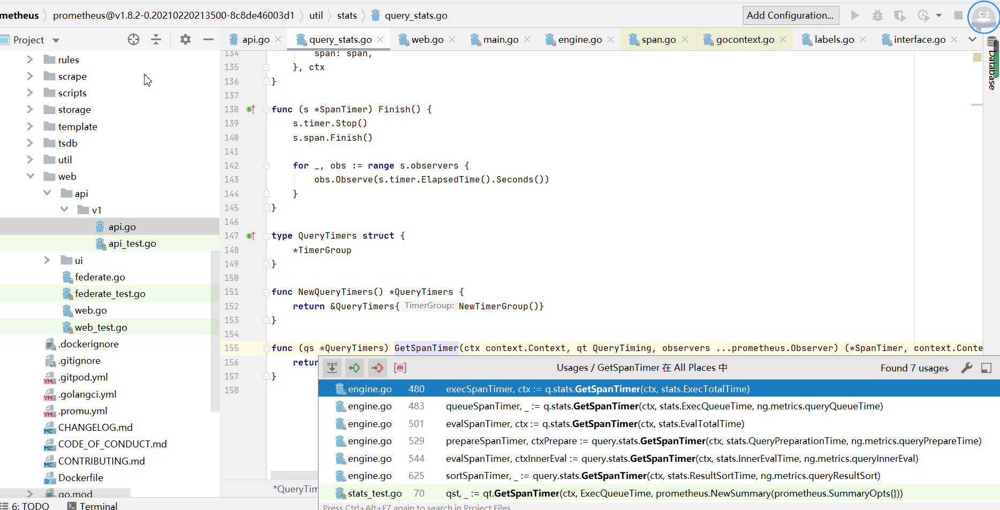
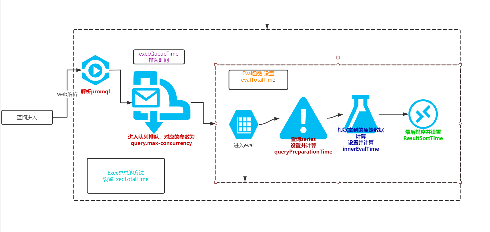

# 查询原理
- D:\nyy_work\go_path\pkg\mod\github.com\prometheus\prometheus@v1.8.2-0.20210220213500-8c8de46003d1\web\api\v1\api.go
```golang
func (api *API) queryRange(r *http.Request) (result apiFuncResult) {}
```


##  step1: 参数解析
```golang
    // 解析start
	start, err := parseTime(r.FormValue("start"))
	if err != nil {
		return invalidParamError(err, "start")
	}
    // 解析end
	end, err := parseTime(r.FormValue("end"))
	if err != nil {
		return invalidParamError(err, "end")
	}
    // 判断end是否早于start
	if end.Before(start) {
		return invalidParamError(errors.New("end timestamp must not be before start time"), "end")
	}
    // 解析 step
	step, err := parseDuration(r.FormValue("step"))
	if err != nil {
		return invalidParamError(err, "step")
	}
    
	if step <= 0 {
		return invalidParamError(errors.New("zero or negative query resolution step widths are not accepted. Try a positive integer"), "step")
	}
```

> 防止point过多
```golang
    // 这里怎么理解？
	// For safety, limit the number of returned points per timeseries.
	// This is sufficient for 60s resolution for a week or 1h resolution for a year.
	if end.Sub(start)/step > 11000 {
		err := errors.New("exceeded maximum resolution of 11,000 points per timeseries. Try decreasing the query resolution (?step=XX)")
		return apiFuncResult{nil, &apiError{errorBadData, err}, nil, nil}
	}
```

>  设置超时
```golang
	ctx := r.Context()
	if to := r.FormValue("timeout"); to != "" {
		var cancel context.CancelFunc
		timeout, err := parseDuration(to)
		if err != nil {
			return invalidParamError(err, "timeout")
		}

		ctx, cancel = context.WithTimeout(ctx, timeout)
		defer cancel()
	}

```

## step2： 根据queryEngine初始化query并解析promql
```golang
func (ng *Engine) NewRangeQuery(q storage.Queryable, qs string, start, end time.Time, interval time.Duration) (Query, error) {
	expr, err := parser.ParseExpr(qs)
	if err != nil {
		return nil, err
	}
	if expr.Type() != parser.ValueTypeVector && expr.Type() != parser.ValueTypeScalar {
		return nil, errors.Errorf("invalid expression type %q for range query, must be Scalar or instant Vector", parser.DocumentedType(expr.Type()))
	}
	qry, err := ng.newQuery(q, expr, start, end, interval)
	if err != nil {
		return nil, err
	}
	qry.q = qs

	return qry, nil
}
```
> queryEngine从何而来？

> `expr, err := parser.ParseExpr(qs)` 解析promql

> instance_query 和range_query调用同一newQuery


## step3：执行查询
```golang
// Exec implements the Query interface.
func (q *query) Exec(ctx context.Context) *Result {
	if span := opentracing.SpanFromContext(ctx); span != nil {
		span.SetTag(queryTag, q.stmt.String())
	}

	// Exec query.
	res, warnings, err := q.ng.exec(ctx, q)

	return &Result{Err: err, Value: res, Warnings: warnings}
}
```

> 使用分布式追踪 追踪查询分阶段耗时


> 核心函数 exec
```golang
func (ng *Engine) exec(ctx context.Context, q *query) (v parser.Value, ws storage.Warnings, err error) {
	// prometheus_engine_queries 计数器，表示当前query个数
    ng.metrics.currentQueries.Inc()
	defer ng.metrics.currentQueries.Dec()

	ctx, cancel := context.WithTimeout(ctx, ng.timeout)
	q.cancel = cancel
    // 收尾函数，记录日志或者jager
	defer func() {
		ng.queryLoggerLock.RLock()
		if l := ng.queryLogger; l != nil {
			params := make(map[string]interface{}, 4)
			params["query"] = q.q
			if eq, ok := q.Statement().(*parser.EvalStmt); ok {
				params["start"] = formatDate(eq.Start)
				params["end"] = formatDate(eq.End)
				// The step provided by the user is in seconds.
				params["step"] = int64(eq.Interval / (time.Second / time.Nanosecond))
			}
			f := []interface{}{"params", params}
			if err != nil {
				f = append(f, "error", err)
			}
			f = append(f, "stats", stats.NewQueryStats(q.Stats()))
			if span := opentracing.SpanFromContext(ctx); span != nil {
				if spanCtx, ok := span.Context().(jaeger.SpanContext); ok {
					f = append(f, "spanID", spanCtx.SpanID())
				}
			}
			if origin := ctx.Value(QueryOrigin{}); origin != nil {
				for k, v := range origin.(map[string]interface{}) {
					f = append(f, k, v)
				}
			}
			if err := l.Log(f...); err != nil {
				ng.metrics.queryLogFailures.Inc()
				level.Error(ng.logger).Log("msg", "can't log query", "err", err)
			}
		}
		ng.queryLoggerLock.RUnlock()
	}()
    // execTotalTime 代表exec函数执行全部耗时不算log
    // defer先进后出，这个GetSpanTimer最后执行
	execSpanTimer, ctx := q.stats.GetSpanTimer(ctx, stats.ExecTotalTime)
	defer execSpanTimer.Finish()
    
    // ExecQueueTime代表队列中等待时间
    // 命令行参数query.max-concurrency
    // 如果日志中这个耗时高，考虑队列被慢查询占满了。对应在data目录下的queries.active文件


	queueSpanTimer, _ := q.stats.GetSpanTimer(ctx, stats.ExecQueueTime, ng.metrics.queryQueueTime)
	// Log query in active log. The active log guarantees that we don't run over
	// MaxConcurrent queries.
	if ng.activeQueryTracker != nil {
		queryIndex, err := ng.activeQueryTracker.Insert(ctx, q.q)
		if err != nil {
			queueSpanTimer.Finish()
			return nil, nil, contextErr(err, "query queue")
		}
		defer ng.activeQueryTracker.Delete(queryIndex)
	}
	queueSpanTimer.Finish()

	// Cancel when execution is done or an error was raised.
	defer q.cancel()

	const env = "query execution"
    // EvalTotalTime代表execEvalStmt函数执行时间
	evalSpanTimer, ctx := q.stats.GetSpanTimer(ctx, stats.EvalTotalTime)
	defer evalSpanTimer.Finish()

	// The base context might already be canceled on the first iteration (e.g. during shutdown).
	if err := contextDone(ctx, env); err != nil {
		return nil, nil, err
	}

	switch s := q.Statement().(type) {
	case *parser.EvalStmt:
		return ng.execEvalStmt(ctx, q, s)
	case parser.TestStmt:
		return nil, nil, s(ctx)
	}

	panic(errors.Errorf("promql.Engine.exec: unhandled statement of type %T", q.Statement()))
}

```

> 核心函数 execEvalStmt
```golang
func (ng *Engine) execEvalStmt(ctx context.Context, query *query, s *parser.EvalStmt) (parser.Value, storage.Warnings, error) {
	// QueryPreparationTime代表准备存储上的querier+select series时间
    prepareSpanTimer, ctxPrepare := query.stats.GetSpanTimer(ctx, stats.QueryPreparationTime, ng.metrics.queryPrepareTime)
	mint, maxt := ng.findMinMaxTime(s)
	querier, err := query.queryable.Querier(ctxPrepare, mint, maxt)
	if err != nil {
		prepareSpanTimer.Finish()
		return nil, nil, err
	}
	defer querier.Close()
    // populateSeries调用 select返回series
	ng.populateSeries(querier, s)
	prepareSpanTimer.Finish()
    // InnerEvalTime代表从存储拿到series后在本地内存中执行 evaluator.Eval(s.Expr)的时间
    // evaluator.Eval需要判断instance_query 还是range_query
    evalSpanTimer, ctxInnerEval := query.stats.GetSpanTimer(ctx, stats.InnerEvalTime, ng.metrics.queryInnerEval)
    ...
    // ResultSortTime代表排序耗时
    sortSpanTimer, _ := query.stats.GetSpanTimer(ctx, stats.ResultSortTime, ng.metrics.queryResultSort)
	sort.Sort(mat)
	sortSpanTimer.Finish()
}
```

## 总结查询过程
- 解析参数
- 设置超时并设置opentracing
- 根据queryEngine初始化query并解析promql
- exec函数先设置 ExecTotalTime   
- exec函数进入队列排队 设置并计算 ExecQueueTime
- exec函数 设置 EvalTotalTime 并执行execEvalStmt函数
- execEvalStmt函数 准备存储上的querier+select series 设置并计算QueryPreparationTime
- execEvalStmt函数 设置InnerEvalTime，从存储拿到series后在本地内存中执行 evaluator.Eval(s.Expr)
- execEvalStmt函数设置并计算 ResultSortTime

## 示意图


### 所以这几个耗时的关系为

- EvalTotalTime=QueryPreparationTime+InnerEvalTime+ResultSortTime
    - 计算值 0.000075478+0.00024141+0.000001235=0.000318123
    - 真实值 0.000331799 > 0.000318123
    - 不一样就对了，还有中间的部分代码执行
- ExecTotalTime=ExecQueueTime+EvalTotalTime
    - 计算值 0.000331799+0.000012595=0.000344394
    - 真实值 0.000354698 > 0.000344394
```shell script
{
   # 请求基础信息
    "httpRequest":{
        "clientIP":"192.168.43.114",
        "method":"POST",
        "path":"/api/v1/query_range"
    },
    # 参数段
    "params":{
        "end":"2021-05-03T02:32:45.000Z",
        "query":"rate(node_disk_reads_completed_total{instance=~"192\\.168\\.43\\.114:9100"}[2m])",
        "start":"2021-05-03T02:17:45.000Z",
        "step":15
    },
    # 统计段
    "stats":{
        "timings":{
            "evalTotalTime":0.000331799,
            "resultSortTime":0.000001235,
            "queryPreparationTime":0.000075478,
            "innerEvalTime":0.00024141,
            "execQueueTime":0.000012595,
            "execTotalTime":0.000354698
        }
    },
    # 请求时间
    "ts":"2021-05-03T02:32:49.876Z"
}
```

## 几个耗时的问题
- 最多的重查询在于QueryPreparationTime，也就是select series阶段
- execQueueTime如果很高，不要轻易的调大query.max-concurrency，应该找出慢查并解决
    - 盲目调大队列深度会导致更严重的oom问题
    - 正常来说每个query在队列中等待时间很短
- innerEvalTime resultSortTime一般耗时不高