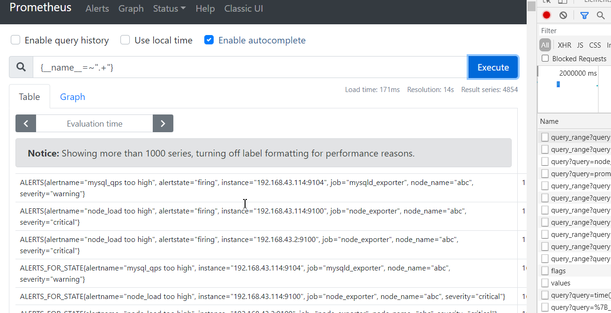

# 什么是高基数查询
- 来个 最直观的对比 
    - {__name__=~".*a.*"}
    - node_arp_entries
    - 
- 通俗的说就是返回的series或者查询到的series数量过多
- 查询表现出来返回时间较长，对应调用服务端资源较多的查询
- 数量多少算多 10w~100w
- 一般我们定义在1小时内的range_query 响应时间超过`3秒`则认为较重了

# 高基数查询举例
- `{__name__=~".+"}`

- 生产举例 这就是一个典型的heavy_query

- 可以看到去掉histogram_quantile/rate等agg方法后查询一小时的metric传输数据达到12.8MB，可见数据量之大

- 查询instance_query可以看到命中了1.8w个series

## prometheus range_query过程
请看这篇文章，写的很清楚了[详解Prometheus range query中的step参数](https://segmentfault.com/a/1190000017553625)

## prometheus 查询limit限制参数

- --storage.remote.read-sample-limit=5e7 remote_read时单一query的最大加载点数
- --storage.remote.read-concurrent-limit remote_read并发query数目
- --storage.remote.read-max-bytes-in-frame=1048576  remote_read时单一返回字节大小
- --query.max-concurrency=20 prometheus 本身并发读请求
- --query.max-samples=50000000  prometheus 单一query的最大加载点数

# heavy_query原因总结
## 资源原因
- 因为tsdb都有压缩算法对datapoint压缩，比如dod 和xor
- 那么当查询时数据必然涉及到解压放大的问题
- 比如压缩正常一个datapoint大小为16byte
- xxxxxxxxxx func GeneralPolyMethods(Name string, Q *nlist.SafeListLimited) {    Len := Q.Len()​    item := Q.PopBackBy(Len)    count := len(item)    if count == 0 {        return    }    log.Infof("[GeneralPolyMethods]RunGroupPoly_called:Name:%s,len:%d", Name, count)    var dataList []float64    var numpList []SingleEnd    var sum, avg, max, min, tp50, tp90, tp99 float64    counterType := GAUGEType    // 为了给出max、min等极值对应的endpoint    singMap := make(map[float64]string)​    for _, i := range item {        iF := i.(*cmodel.PolyRequest)        //if counterType == "" {        //  counterType = iF.Type        //}​        va := iF.Value.(float64)        endP := iF.EndPoint        t := SingleEnd{            Endpoint: endP,            Value:    va,        }        numpList = append(numpList, t)        if singMap[va] == "" {            singMap[va] = endP        }        sum += va        dataList = append(dataList, va)    }    realCount := len(dataList)    if realCount == 0 {        return    }    var pushSetp int64    pushSetp = PolyTimeStep​    if realCount == 1 {        sum = dataList[0]        avg = dataList[0]        max = dataList[0]        min = dataList[0]        tp50 = dataList[0]        tp90 = dataList[0]        tp99 = dataList[0]    } else {        sort.Float64s(dataList)​        max = dataList[realCount-1]        min = dataList[0]        avg = sum / float64(realCount)        tp50 = dataList[int(float64(realCount)*0.5)]        tp90 = dataList[int(float64(realCount)*0.95)]        tp99 = dataList[int(float64(realCount)*0.99)]​    }    // 本地map 做循环技术用    localDataMap := make(map[string]float64)    promeDataMap := make(map[string]float64)    localDataMap["sum"] = sum    localDataMap["avg"] = avg    localDataMap["max"] = max    localDataMap["min"] = min    localDataMap["tp50"] = tp50    localDataMap["tp90"] = tp90    localDataMap["tp99"] = tp99​    names := strings.Split(Name, SEP)​    polyType := names[0]    polyName := names[1]    metric := names[2]    endp := polyType + "_poly_" + polyName    log.Infof("poly_res:endp sum, avg, max, min, tp50, tp90, tp99", endp, sum, avg, max, min, tp50, tp90, tp99)    endNew := strings.Replace(endp, ".", "_", -1)​    tagPre := "method="    //log.Infof("sum,avg,max,min,tp50,", sum, avg, max, min)    sender.Push(endNew, metric, tagPre+"sum", sum, counterType, int64(pushSetp))    sender.Push(endNew, metric, tagPre+"avg", avg, counterType, int64(pushSetp))    sender.Push(endNew, metric, tagPre+"max", max, counterType, int64(pushSetp))    sender.Push(endNew, metric, tagPre+"min", min, counterType, int64(pushSetp))    sender.Push(endNew, metric, tagPre+"tp50", tp50, counterType, int64(pushSetp))    sender.Push(endNew, metric, tagPre+"tp90", tp90, counterType, int64(pushSetp))    sender.Push(endNew, metric, tagPre+"tp99", tp99, counterType, int64(pushSetp))​    /*        根据内存中的值计算 rate 和delta    */    for k, v := range localDataMap {        promeDataMap[k] = v        rate := 0.0        delta := 0.0        uniqueResultKey := endNew + metric + tagPre + k​        if lastPoint, loaded := PolyHistoryDataMap.Load(uniqueResultKey); loaded {            log.Debugf("[localDataMap_lastPoint] key,this_value,last_value,%+v,%+v,%+v", k, v, lastPoint)            lastP := lastPoint.(float64)            delta = v - lastP            if lastP == 0.0 {                rate = 0.0            } else {                //rate = delta / lastP * 100.0                rate = delta / lastP            }​        }        // 本次计算完毕，更新cache中的值        PolyHistoryDataMap.Store(uniqueResultKey, v)        log.Debugf("[localDataMap] key,this_value,rate delta ,%+v,%+v,%+v,%+v", k, v, rate, delta)        sender.Push(endNew, metric+"_rate", tagPre+k, rate, counterType, int64(pushSetp))        sender.Push(endNew, metric+"_delta", tagPre+k, delta, counterType, int64(pushSetp))        promeDataMap[k+"_rate"] = rate        promeDataMap[k+"_delta"] = delta​    }    // push to prome    if g.Config().Prome.Enabled {        PushToProme(metric, polyName, promeDataMap)    }    // push到kafka    if kafka.KafkaAsyncProducer != nil {        maxEnd := singMap[max]        minEnd := singMap[min]        tp50End := singMap[tp50]        tp90End := singMap[tp90]        tp99End := singMap[tp99]        AsyncPushKafka(polyType, polyName, maxEnd, metric, "max", max)        AsyncPushKafka(polyType, polyName, minEnd, metric, "min", min)        AsyncPushKafka(polyType, polyName, tp50End, metric, "tp50", tp50)        AsyncPushKafka(polyType, polyName, tp90End, metric, "tp90", tp90)        AsyncPushKafka(polyType, polyName, tp99End, metric, "tp99", tp99)    }    RpcCallNumpApi(metric, polyName, numpList)    ////outlier check    //outlierStr := outlierCheck(dataList, singMap)    //outPoint := outlier.GrpOutlier{    //  GrpName:   polyName,    //  PolyType:  polyType,    //  Counter:   metric,    //  Timestamp: time.Now().Unix(),    //  Value:     outlierStr,    //}    //saveOutlier2DB(&outPoint)}golang

- 当然除了上面说的queryPreparation过程外，查询时还涉及sort和eval等也需要耗时

