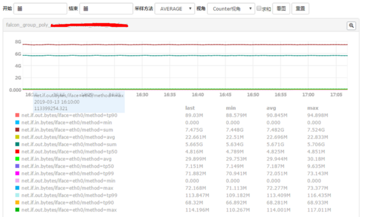
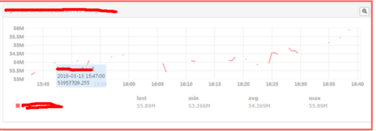
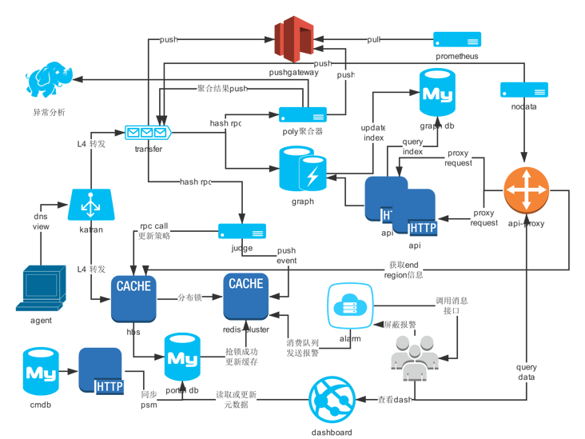
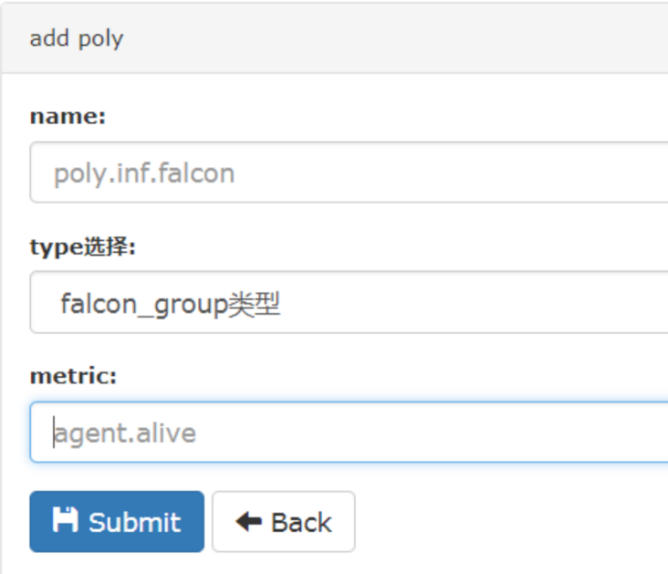
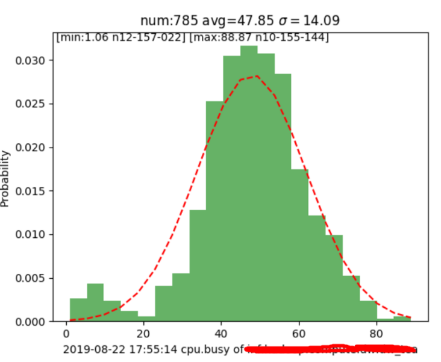

# 效果图


# 项目地址
[polymetric代码](https://github.com/ning1875/falcon-plus/tree/master/modules/polymetric)

[go - 开源项目：polymetric：监控聚合器系列之: open-falcon新聚合器polymetric - 监控系统和运维开发 - SegmentFault 思否](https://segmentfault.com/a/1190000023092934?sort=newest)

# 聚合在监控中的作用

* 简单来说:需要将分散的大量监控数据按照一定的维度(idc/service)及一定的算法(avg/sum/max/min/quantile分位)得到一个结果值
* 比如: 想知道服务a下面的100台机器的平均
* 又比如: 想知道查询接口b的99分位延迟值

# open-falcon原版聚合器
## aggregator 介绍: 
* aggregator聚合器就是从falcon_portal.cluster表中取出用户在页面上配置的表达式,然后解析后，通过api拿到对应机器组的所有机器，通过api查询graph数据算出一个值重新打回transfer作为一个新的点。
* 具体介绍可以看我的文章: [open-falcon 聚合器aggregator代码解析](https://segmentfault.com/a/1190000023092317)
## aggregator 问题:

### endpoint多的聚合断点问题


造成断点的原因有两个：
* 原来的接口在机器量超过1k时就效率就会很慢 2w+endpoint需要8s,看了代码是用orm进行了多次查询而且附带了很多别的信息,这里我只需要group_id对应endpoint_list所以我写了一个新的接口用一条raw_sql进行查询 [HostnamesByID](https://github.com/open-falcon/falcon-plus/blob/master/modules/aggregator/sdk/sdk.go#L28)   
* 数据查询 依赖graph/lastpoint这个api 查询最近一个点的数据，如果endpoint多的时候batch_query会超时,返回结果成功率也比较低
### 聚合器单点问题
这个是由于其代码架构导致的，如果单点聚合器挂了会导致数据断点


### 架构说明

* 聚合策略按照 group_name + metric_name保存在db中，hbs从db中刷入redis集群中

* transfer新增定时从redis集群更新poly策略到本地map，目的是将push过来的endpoint直接按照poly策略push到polymetric [transfer同步redis中的poly策略](https://github.com/ning1875/falcon-plus/blob/master/modules/transfer/cron/sync_poly.go)
* transfer 根据配置文件中的poly实例生成一致性哈希环，根据聚合策略哈希将要聚合的数据push到对应的polymetric实例上面[transfer rpc对于poly的处理](https://github.com/ning1875/falcon-plus/blob/master/modules/transfer/receiver/rpc/rpc_transfer.go#L166)(agent rpc中对于polymetric的处理)
* 这里还要注意一点:需要将counter型的数据转化为gauge型所以需要在map中hold点
* 到这里polymetric实例就能源源不断的收到应该交给它聚合的数据，并将数据推入链表[polymetric rpc接收transfer数据](https://github.com/ning1875/falcon-plus/blob/master/modules/polymetric/rpc/polymetric.go#L64)
* polymetric启动worker处理数据 ,链表中popall数据,排序后得到slice然后就可以轻松得出: max/min/sum/avg 和各个分位值
* 同时max min还需要知道是哪个endpoint提供的所以将数据推送到kafka，写入es由kibana展示
* 同时将数据经由pushgateway打入promethues做topk/同环比展示[push 到promethues](https://github.com/ning1875/falcon-plus/blob/master/modules/polymetric/cron/prome.go)

* 异常分析: 将数据推送到异常分析组件做正态分布展示


* [数据处理主函数](https://github.com/ning1875/falcon-plus/blob/master/modules/polymetric/cron/poly_worker.go#L293)
```golang
func GeneralPolyMethods(Name string, Q *nlist.SafeListLimited) {
	Len := Q.Len()

	item := Q.PopBackBy(Len)
	count := len(item)
	if count == 0 {
		return
	}
	log.Infof("[GeneralPolyMethods]RunGroupPoly_called:Name:%s,len:%d", Name, count)
	var dataList []float64
	var numpList []SingleEnd
	var sum, avg, max, min, tp50, tp90, tp99 float64
	counterType := GAUGEType
	// 为了给出max、min等极值对应的endpoint
	singMap := make(map[float64]string)

	for _, i := range item {
		iF := i.(*cmodel.PolyRequest)
		//if counterType == "" {
		//	counterType = iF.Type
		//}

		va := iF.Value.(float64)
		endP := iF.EndPoint
		t := SingleEnd{
			Endpoint: endP,
			Value:    va,
		}
		numpList = append(numpList, t)
		if singMap[va] == "" {
			singMap[va] = endP
		}
		sum += va
		dataList = append(dataList, va)
	}
	realCount := len(dataList)
	if realCount == 0 {
		return
	}
	var pushSetp int64
	pushSetp = PolyTimeStep

	if realCount == 1 {
		sum = dataList[0]
		avg = dataList[0]
		max = dataList[0]
		min = dataList[0]
		tp50 = dataList[0]
		tp90 = dataList[0]
		tp99 = dataList[0]
	} else {
		sort.Float64s(dataList)

		max = dataList[realCount-1]
		min = dataList[0]
		avg = sum / float64(realCount)
		tp50 = dataList[int(float64(realCount)*0.5)]
		tp90 = dataList[int(float64(realCount)*0.95)]
		tp99 = dataList[int(float64(realCount)*0.99)]

	}
	// 本地map 做循环技术用
	localDataMap := make(map[string]float64)
	promeDataMap := make(map[string]float64)
	localDataMap["sum"] = sum
	localDataMap["avg"] = avg
	localDataMap["max"] = max
	localDataMap["min"] = min
	localDataMap["tp50"] = tp50
	localDataMap["tp90"] = tp90
	localDataMap["tp99"] = tp99

	names := strings.Split(Name, SEP)

	polyType := names[0]
	polyName := names[1]
	metric := names[2]
	endp := polyType + "_poly_" + polyName
	log.Infof("poly_res:endp sum, avg, max, min, tp50, tp90, tp99", endp, sum, avg, max, min, tp50, tp90, tp99)
	endNew := strings.Replace(endp, ".", "_", -1)

	tagPre := "method="
	//log.Infof("sum,avg,max,min,tp50,", sum, avg, max, min)
	sender.Push(endNew, metric, tagPre+"sum", sum, counterType, int64(pushSetp))
	sender.Push(endNew, metric, tagPre+"avg", avg, counterType, int64(pushSetp))
	sender.Push(endNew, metric, tagPre+"max", max, counterType, int64(pushSetp))
	sender.Push(endNew, metric, tagPre+"min", min, counterType, int64(pushSetp))
	sender.Push(endNew, metric, tagPre+"tp50", tp50, counterType, int64(pushSetp))
	sender.Push(endNew, metric, tagPre+"tp90", tp90, counterType, int64(pushSetp))
	sender.Push(endNew, metric, tagPre+"tp99", tp99, counterType, int64(pushSetp))

	/*
		根据内存中的值计算 rate 和delta
	*/
	for k, v := range localDataMap {
		promeDataMap[k] = v
		rate := 0.0
		delta := 0.0
		uniqueResultKey := endNew + metric + tagPre + k

		if lastPoint, loaded := PolyHistoryDataMap.Load(uniqueResultKey); loaded {
			log.Debugf("[localDataMap_lastPoint] key,this_value,last_value,%+v,%+v,%+v", k, v, lastPoint)
			lastP := lastPoint.(float64)
			delta = v - lastP
			if lastP == 0.0 {
				rate = 0.0
			} else {
				//rate = delta / lastP * 100.0
				rate = delta / lastP
			}

		}
		// 本次计算完毕，更新cache中的值
		PolyHistoryDataMap.Store(uniqueResultKey, v)
		log.Debugf("[localDataMap] key,this_value,rate delta ,%+v,%+v,%+v,%+v", k, v, rate, delta)
		sender.Push(endNew, metric+"_rate", tagPre+k, rate, counterType, int64(pushSetp))
		sender.Push(endNew, metric+"_delta", tagPre+k, delta, counterType, int64(pushSetp))
		promeDataMap[k+"_rate"] = rate
		promeDataMap[k+"_delta"] = delta

	}
	// push to prome
	if g.Config().Prome.Enabled {
		PushToProme(metric, polyName, promeDataMap)
	}
	// push到kafka
	if kafka.KafkaAsyncProducer != nil {
		maxEnd := singMap[max]
		minEnd := singMap[min]
		tp50End := singMap[tp50]
		tp90End := singMap[tp90]
		tp99End := singMap[tp99]
		AsyncPushKafka(polyType, polyName, maxEnd, metric, "max", max)
		AsyncPushKafka(polyType, polyName, minEnd, metric, "min", min)
		AsyncPushKafka(polyType, polyName, tp50End, metric, "tp50", tp50)
		AsyncPushKafka(polyType, polyName, tp90End, metric, "tp90", tp90)
		AsyncPushKafka(polyType, polyName, tp99End, metric, "tp99", tp99)
	}
	RpcCallNumpApi(metric, polyName, numpList)
	////outlier check
	//outlierStr := outlierCheck(dataList, singMap)
	//outPoint := outlier.GrpOutlier{
	//	GrpName:   polyName,
	//	PolyType:  polyType,
	//	Counter:   metric,
	//	Timestamp: time.Now().Unix(),
	//	Value:     outlierStr,
	//}
	//saveOutlier2DB(&outPoint)
}
```