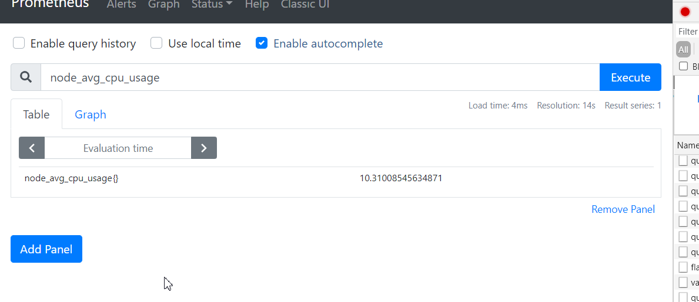

## prometheus原生不支持downsample
- 还有个原因是prometheus原生不支持downsample，所以无论grafana上面的step随时间如何变化，涉及到到查询都是将指定的block解压再按step切割
- 所以查询时间跨度大对应消耗的cpu和内存就会报增，同时原始点的存储也浪费了，因为grafana的step会随时间跨度变大变大
## 实时查询/聚合 VS 预查询/聚合
prometheus的query都是实时查询的/聚合
**实时查询的优点很明显**
- 查询/聚合条件随意组合，比如 rate后再sum然后再叠加一个histogram_quantile

**实时查询的缺点也很明显**
- 那就是慢，或者说资源消耗大
**实时查询的优缺点反过来就是预查询/聚合的**
一个预聚合的例子请看我写的falcon组件 [监控聚合器系列之: open-falcon新聚合器polymetric](https://segmentfault.com/a/1190000023092934)
- 所有的聚合方法提前定义好，并定时被计算出结果
- 查询时不涉及任何的聚合，直接查询结果
- 比如实时聚合需要每次加载10万个series，预聚合则只需要查询几个结果集
**那么问题来了prometheus有没有预查询/聚合呢**

答案是有的
## prometheus的预查询/聚合
[prometheus record](https://prometheus.io/docs/prometheus/latest/configuration/recording_rules/)

Recording rules allow you to precompute frequently needed or computationally expensive expressions and save their result as a new set of time series. Querying the precomputed result will then often be much faster than executing the original expression every time it is needed. This is especially useful for dashboards, which need to query the same expression repeatedly every time they refresh.

### 原理分析
record配置样例
```yaml
groups:
- name: my_record
  interval: 30s
  rules:
  - record: hke:heavy_expr:0211d8a2fcdefee8e626c86ba3916281
    expr: sum(delta(kafka_topic_partition_current_offset{instance=~'1.1.1.1:9308', topic=~".+"}[5m])/5) by (topic)

```
- 查看代码我们知道，prometheus把record记录当做和alert一样处理
- 进行instance_query查询当前点，如果是alert则走报警的流程
- 如果是record，那么将查询到的结果做tsdb的add `app.Add(s.Metric, s.T, s.V)`，新的metric_name使用配置中设置的，同时保留原有结果的label
- E:\go_path\src\github.com\prometheus\prometheus\rules\manager.go
```golang
// Eval runs a single evaluation cycle in which all rules are evaluated sequentially.  
func (g *Group) Eval(ctx context.Context, ts time.Time) {  
   for i, rule := range g.rules {  
      select {  
      case <-g.done:  
         return  
 default:  
      }  
  
      func(i int, rule Rule) {  
         sp, ctx := opentracing.StartSpanFromContext(ctx, "rule")  
         sp.SetTag("name", rule.Name())  
         defer func(t time.Time) {  
            sp.Finish()  
  
            since := time.Since(t)  
            g.metrics.evalDuration.Observe(since.Seconds())  
            rule.SetEvaluationDuration(since)  
            rule.SetEvaluationTimestamp(t)  
         }(time.Now())  
  
         g.metrics.evalTotal.WithLabelValues(groupKey(g.File(), g.Name())).Inc()  
  
         vector, err := rule.Eval(ctx, ts, g.opts.QueryFunc, g.opts.ExternalURL)  
         if err != nil {  
            // Canceled queries are intentional termination of queries. This normally  
 // happens on shutdown and thus we skip logging of any errors here. if _, ok := err.(promql.ErrQueryCanceled); !ok {  
               level.Warn(g.logger).Log("msg", "Evaluating rule failed", "rule", rule, "err", err)  
            }  
            g.metrics.evalFailures.WithLabelValues(groupKey(g.File(), g.Name())).Inc()  
            return  
 }  
  
         if ar, ok := rule.(*AlertingRule); ok {  
            ar.sendAlerts(ctx, ts, g.opts.ResendDelay, g.interval, g.opts.NotifyFunc)  
         }  
         var (  
            numOutOfOrder = 0  
 numDuplicates = 0  
 )  
  
         app := g.opts.Appendable.Appender()  
         seriesReturned := make(map[string]labels.Labels, len(g.seriesInPreviousEval[i]))  
         defer func() {  
            if err := app.Commit(); err != nil {  
               level.Warn(g.logger).Log("msg", "Rule sample appending failed", "err", err)  
               return  
 }  
            g.seriesInPreviousEval[i] = seriesReturned  
         }()  
         for _, s := range vector {  
            if _, err := app.Add(s.Metric, s.T, s.V); err != nil {  
               switch errors.Cause(err) {  
               case storage.ErrOutOfOrderSample:  
                  numOutOfOrder++  
                  level.Debug(g.logger).Log("msg", "Rule evaluation result discarded", "err", err, "sample", s)  
               case storage.ErrDuplicateSampleForTimestamp:  
                  numDuplicates++  
                  level.Debug(g.logger).Log("msg", "Rule evaluation result discarded", "err", err, "sample", s)  
               default:  
                  level.Warn(g.logger).Log("msg", "Rule evaluation result discarded", "err", err, "sample", s)  
               }  
            } else {  
               seriesReturned[s.Metric.String()] = s.Metric  
            }  
         }
```

# 配置一个预聚合
- 机器的平均cpu利用率
```shell script
avg(1 - avg(rate(node_cpu_seconds_total{job=~"node_exporter",mode="idle"}[2m])) by (instance)) * 100
```

- 编写record.yml
```shell script
cat <<EOF > /opt/app/prometheus/record.yml
groups:
  - name: example
    rules:
    - record: node_avg_cpu_usage
      expr: avg(1 - avg(rate(node_cpu_seconds_total{job=~"node_exporter",mode="idle"}[2m])) by (instance)) * 100
EOF

```
- check下语法
```shell script
[root@prome-master01 prometheus]# ./promtool check rules record.yml 
Checking record.yml
  SUCCESS: 1 rules found

```

- 修改主配置文件加入record

- prometheus查看 ： http://192.168.116.130:9090/rules

- 查询数据


再配置一个：

```
node_memory_MemTotal_bytes  - node_memory_MemAvailable_bytes
node_mem_used

存在标签，且一致
legend 配置 {{job}}:{{instance}}

if instance == 10w, 需要查询10w次， 预聚合只需要查询一次


标签怎么来的？
- 代码里面取出然后再塞进去的
avg by (instance) (node_mem_used)
avg by (job,instance) (node_mem_used)
```


# 灵魂拷问

- 预聚合不能解决什么问题？
    - 如果instance_query本身就是高基数？
