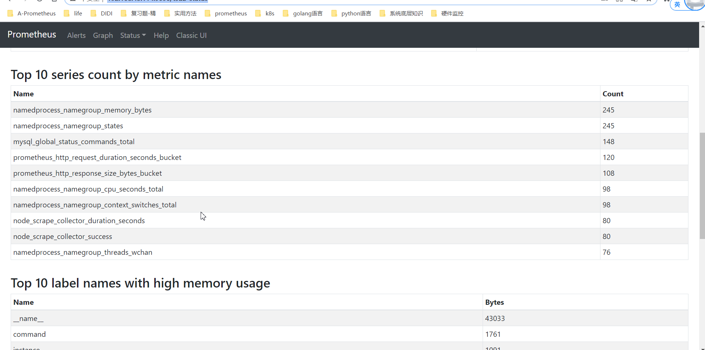

# 方法一 tsdb的统计接口
- http://192.168.43.114:9090/tsdb-status

- 接口地址 `/api/v1/status/tsdb`
- 是基于内存中的倒排索引 算最大堆取 top10
- 10个最多的metric_name排序
```shell script
seriesCountByMetricName: [{name: "namedprocess_namegroup_memory_bytes", value: 245},…]
0: {name: "namedprocess_namegroup_memory_bytes", value: 245}
1: {name: "namedprocess_namegroup_states", value: 245}
2: {name: "mysql_global_status_commands_total", value: 148}
3: {name: "namedprocess_namegroup_context_switches_total", value: 98}
4: {name: "namedprocess_namegroup_cpu_seconds_total", value: 98}
5: {name: "node_scrape_collector_success", value: 80}
6: {name: "node_scrape_collector_duration_seconds", value: 80}
7: {name: "namedprocess_namegroup_threads_wchan", value: 73}
8: {name: "namedprocess_namegroup_thread_cpu_seconds_total", value: 66}
9: {name: "namedprocess_namegroup_thread_io_bytes_total", value: 66}
```
- 思考采集器如果不是prometheus怎么办？
    - 比如m3db没有提供高基数查询的接口


- 源码解析
```golang
// Stats calculates the cardinality statistics from postings.
func (p *MemPostings) Stats(label string) *PostingsStats {
	const maxNumOfRecords = 10
	var size uint64

	p.mtx.RLock()

	metrics := &maxHeap{}
	labels := &maxHeap{}
	labelValueLength := &maxHeap{}
	labelValuePairs := &maxHeap{}
	numLabelPairs := 0

	metrics.init(maxNumOfRecords)
	labels.init(maxNumOfRecords)
	labelValueLength.init(maxNumOfRecords)
	labelValuePairs.init(maxNumOfRecords)

	for n, e := range p.m {
		if n == "" {
			continue
		}
		labels.push(Stat{Name: n, Count: uint64(len(e))})
		numLabelPairs += len(e)
		size = 0
		for name, values := range e {
			if n == label {
				metrics.push(Stat{Name: name, Count: uint64(len(values))})
			}
			labelValuePairs.push(Stat{Name: n + "=" + name, Count: uint64(len(values))})
			size += uint64(len(name))
		}
		labelValueLength.push(Stat{Name: n, Count: size})
	}

	p.mtx.RUnlock()

	return &PostingsStats{
		CardinalityMetricsStats: metrics.get(),
		CardinalityLabelStats:   labels.get(),
		LabelValueStats:         labelValueLength.get(),
		LabelValuePairsStats:    labelValuePairs.get(),
		NumLabelPairs:           numLabelPairs,
	}
}
```

# 方法二 query_log 
- 可以根据log中的queryPreparationTime来定位
# 方法三 通过count统计
```shell script
topk(5,count({__name__=~".+"}) by(__name__) > 100 )
```
- scrape_samples_scraped 可以说明job的instance维度sample数量，也能够定位
