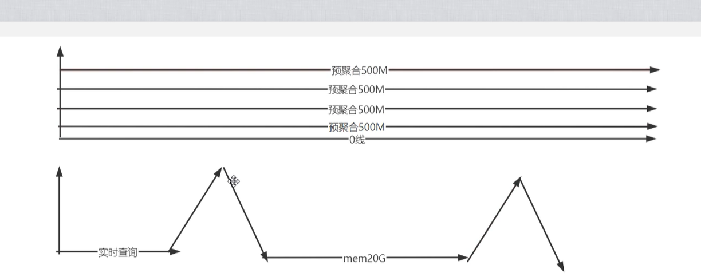

# 封禁
- 假设 abc_def这个metric是高基数，那么可以在query前做封禁
- 匹配expr有abc_def 则返回400
- 不合理的一定要拒绝掉


高基数查询

```
{__name__=~".*a.*"} 
```


解决法之一


- 拒绝该语句

- 给出更建议的语句 `count({__name__=~".*a.*"} )`

  


# 预聚合
- 这个只能应对range_query的case，本身instance_query在预聚合时也要查询数据
- 能很好的提速，但是需要考虑range_query查询的频率

```
重查询，a一个点耗1G，结果值1个点耗1M，range_query查10个点
预先查询，可以重用资源, 查询多次
```


