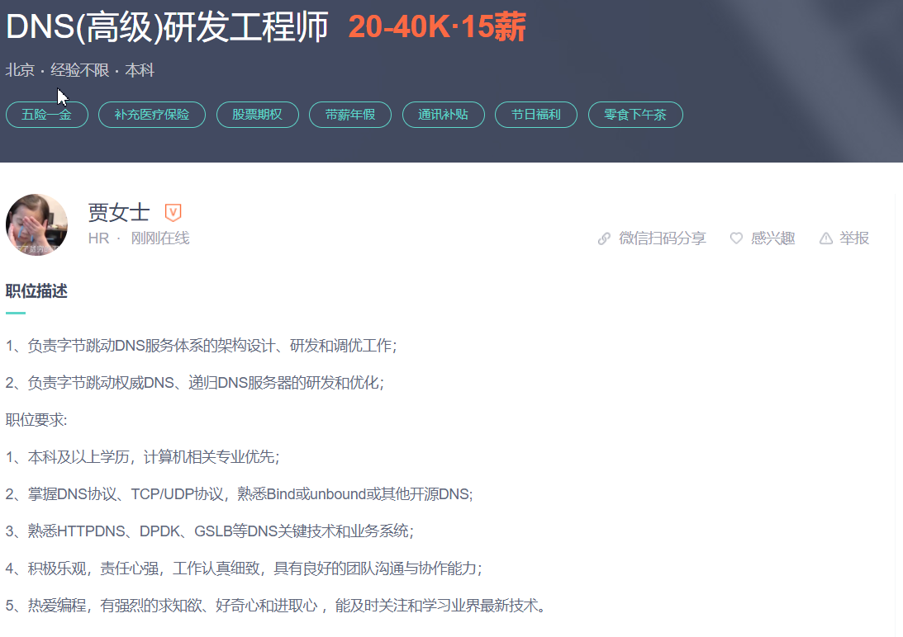
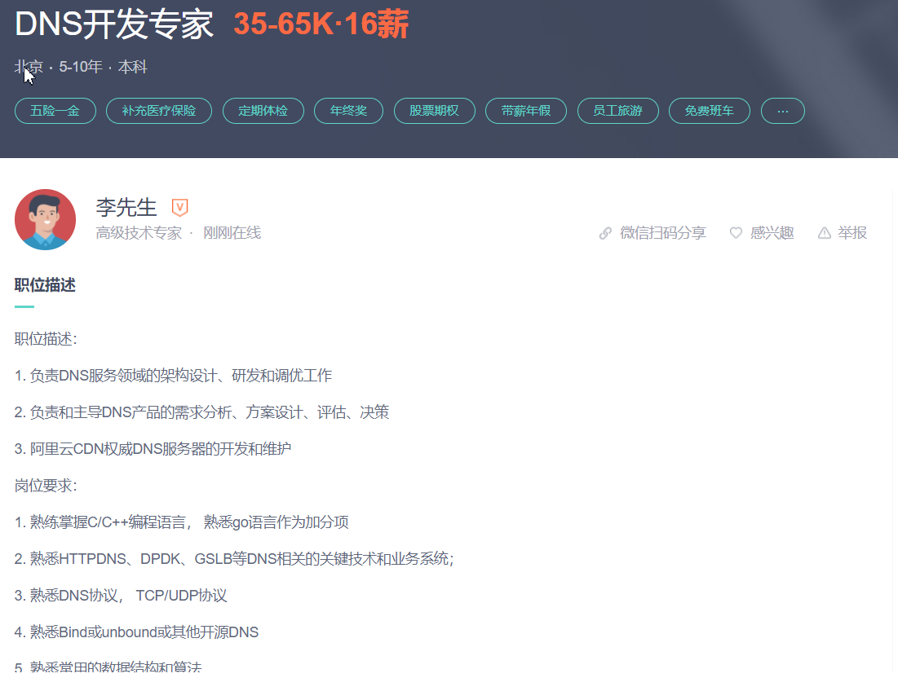
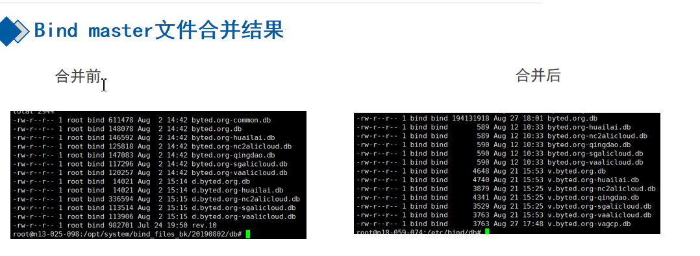
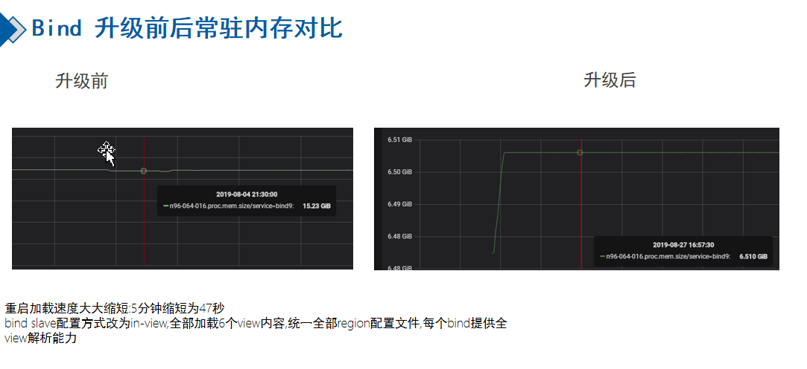
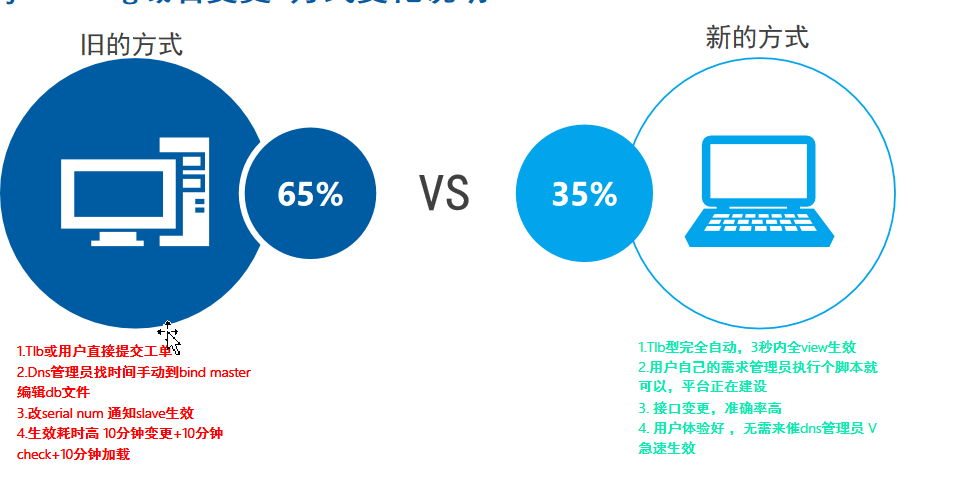
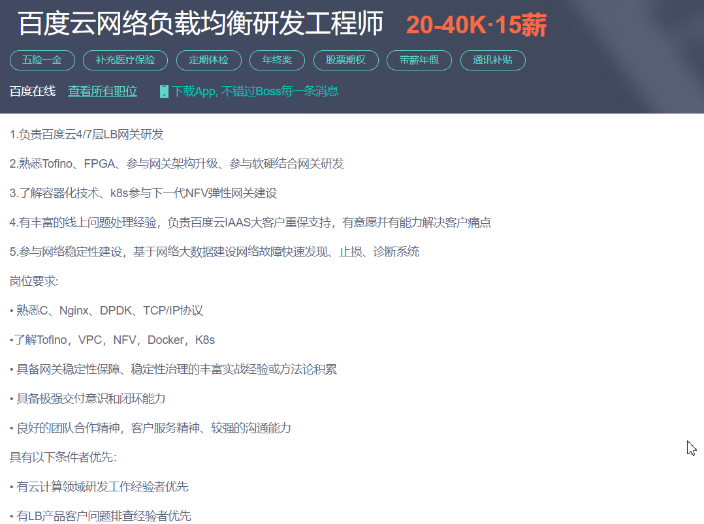
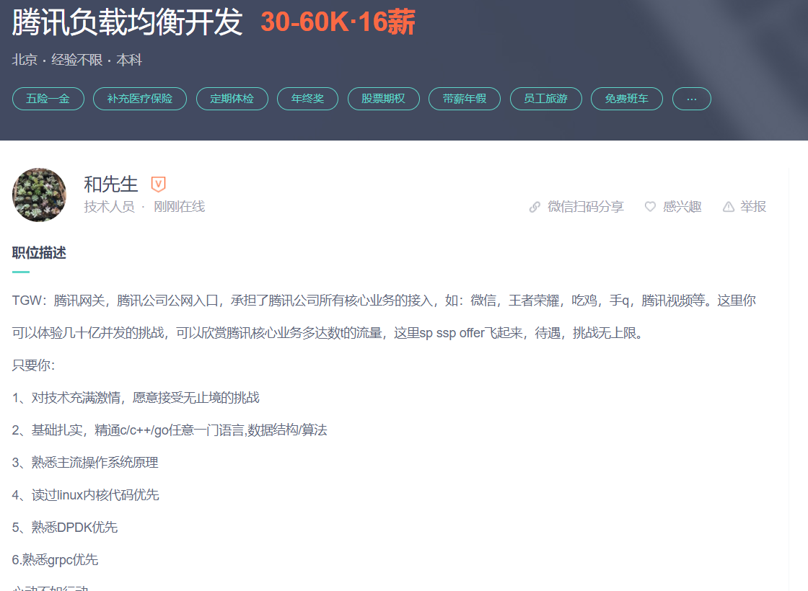
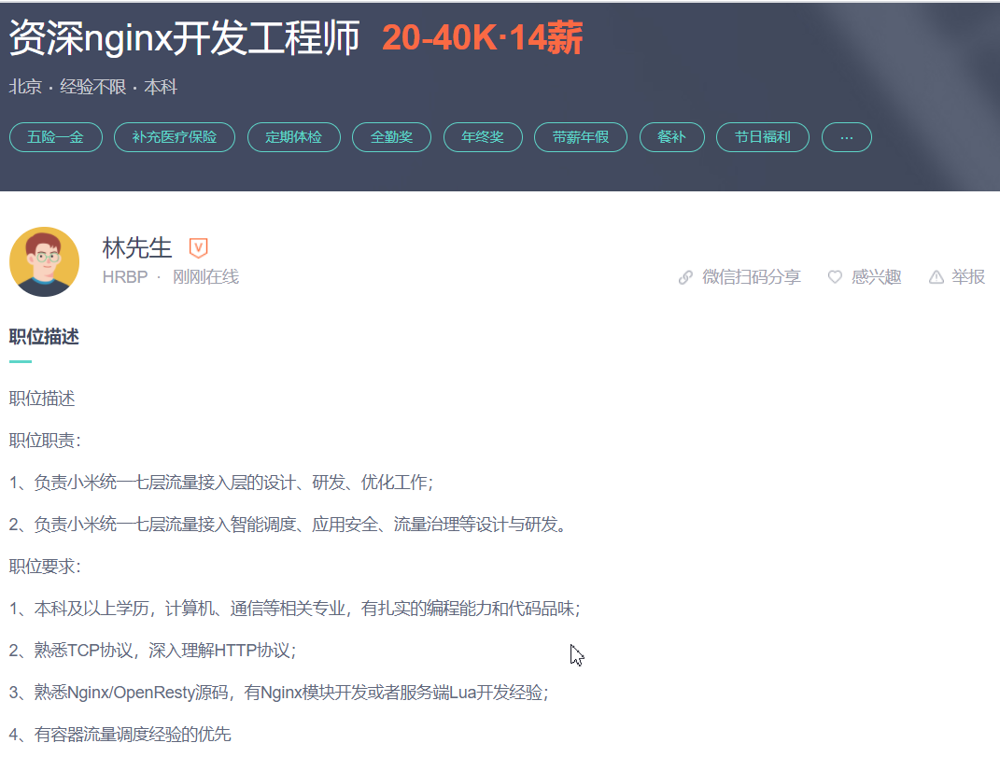
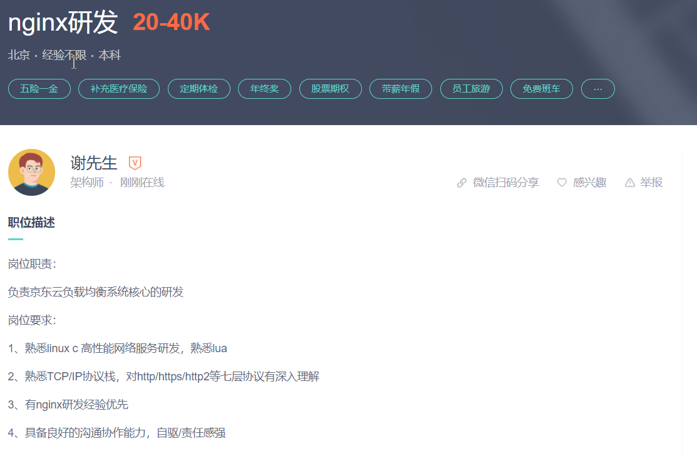

# 按大的方向划分
## 系统底层
> 流量接入层dns/lvs/nginx
### dns工程师
> 岗位实例 

> 技能点 
- 掌握DNS协议、TCP/UDP协议，熟悉Bind或unbound或其他开源DNS;
- 熟悉HTTPDNS、DPDK、GSLB等DNS关键技术和业务系统

#### 潜在工作内容
- bind优化

- bind降低资源消耗

- 域名变更自动化

### lvs工程师
> 岗位实例 

> 技能点 
- 读过linux内核代码优先
- 熟悉DPDK优先
- 熟悉Tofino、FPGA、参与网关架构升级、参与软硬结合网关研发

#### 潜在工作内容
- 优化现有的负载均衡器

### nginx工程师
> 岗位实例 

> 技能点
- 熟悉linux c 高性能网络服务研发，熟悉lua
- 熟悉TCP/IP协议栈，对http/https/http2等七层协议有深入理解
- 有nginx研发经验优先

