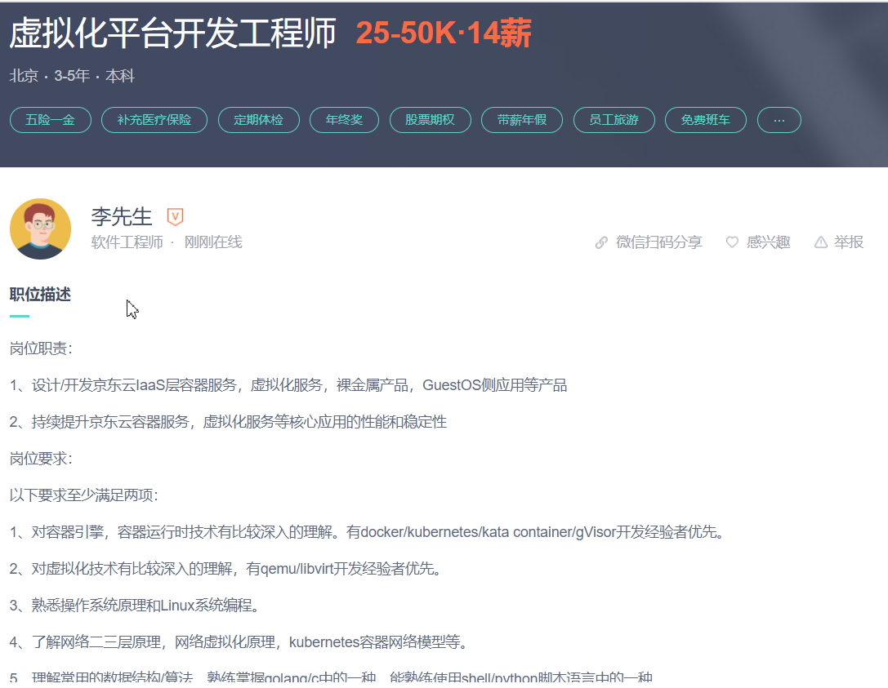
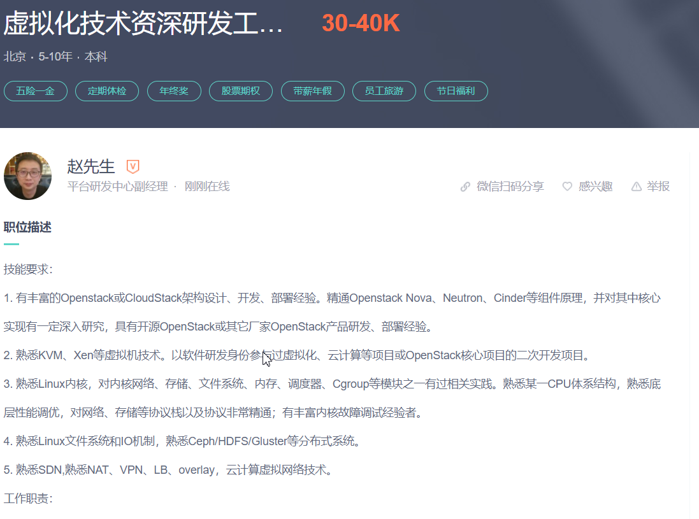
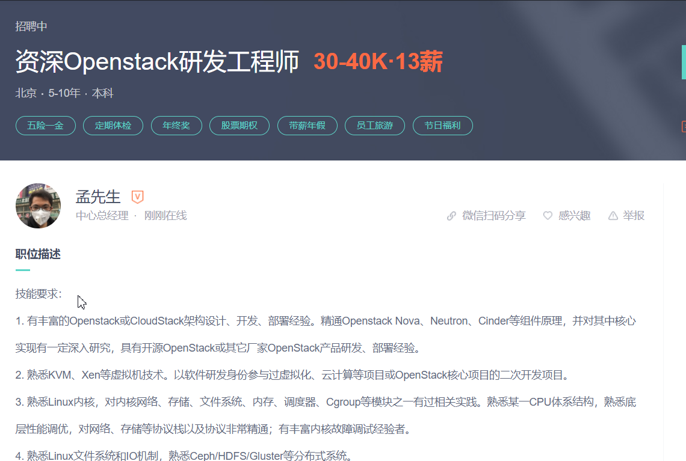

# 按大的方向划分
## 虚拟化 iaas层

### 虚拟化/openstack工程师
> 岗位实例 

> 技能点 
-  有丰富的Openstack或CloudStack架构设计、开发、部署经验。精通Openstack Nova、Neutron、Cinder等组件原理
- 并对其中核心实现有一定深入研究，具有开源OpenStack或其它厂家OpenStack产品研发、部署经验。
#### 潜在工作内容
- openstack私有云开发

