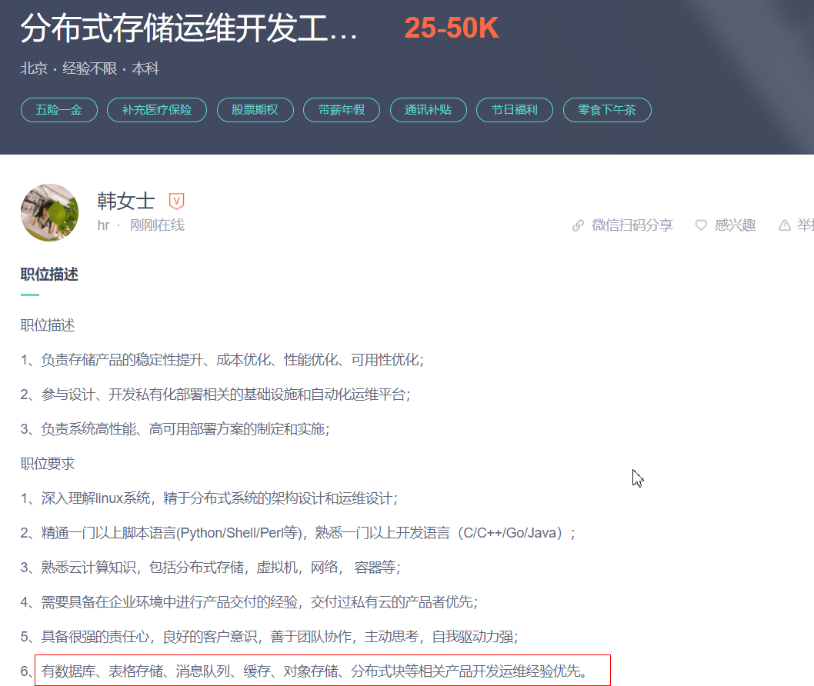
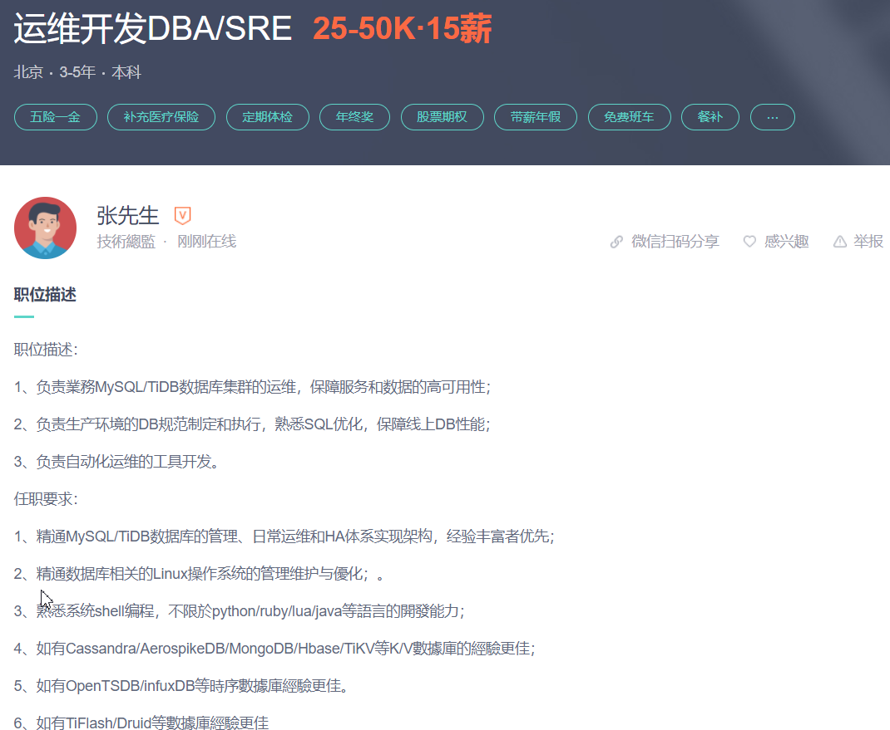
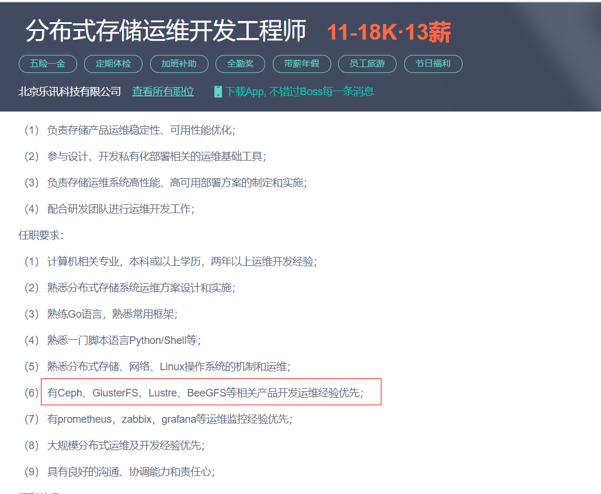

# 按大的方向划分
## 存储层/中间件

### 存储运维开发工程师
> 岗位实例 

> 技能点 
- 有Ceph、GlusterFS、Lustre、BeeGFS等相关产品开发运维经验优先；
- 如有Cassandra/AerospikeDB/MongoDB/Hbase/TiKV等K/V數據庫的經驗更佳；
- 有数据库、表格存储、消息队列、缓存、对象存储、分布式块等相关产品开发运维经验优先。
#### 潜在工作内容
- 负责存储产品的稳定性提升、成本优化、性能优化、可用性优化；
- 负责業務MySQL/TiDB数据库集群的运维，保障服务和数据的高可用性；
- 负责系统高性能、高可用部署方案的制定和实施；
- 参与设计、开发私有化部署相关的基础设施和自动化运维平台；

