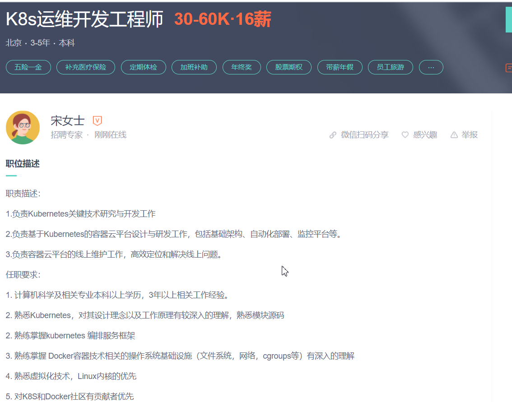
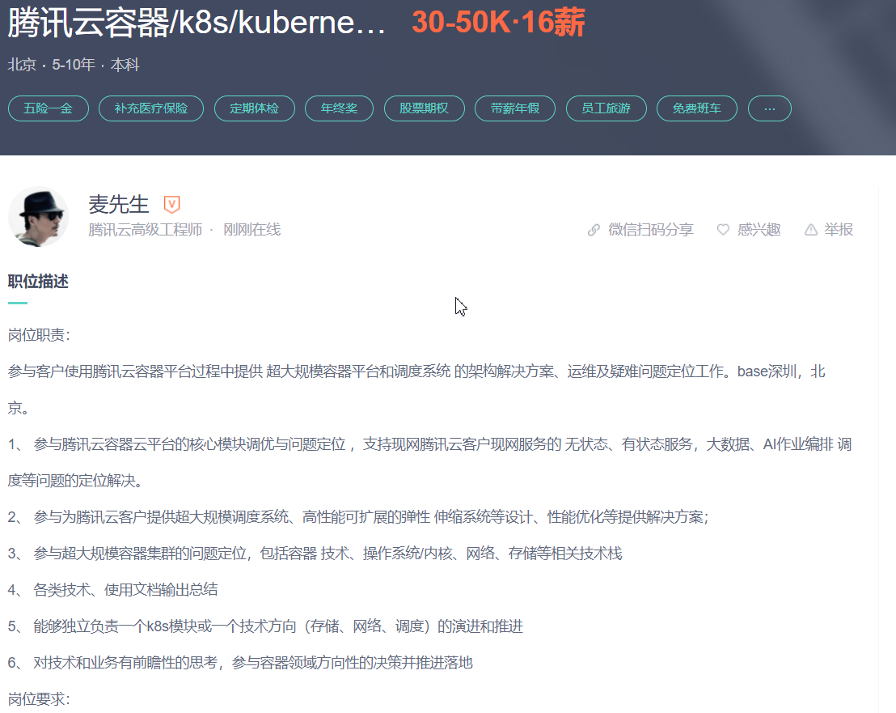
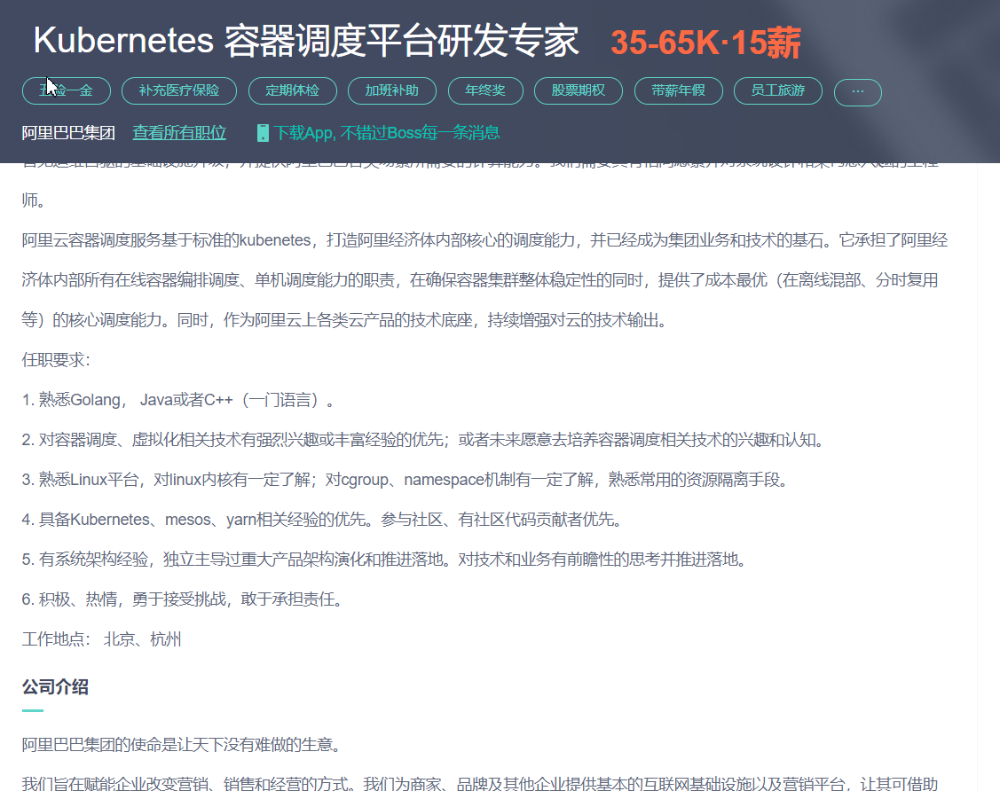

# 按大的方向划分
## k8s云平台

### k8s运维开发工程师
> 岗位实例 

> 技能点 
- 熟悉Golang语言开发，有独立解决各种系统问题的能力，对Golang语言有深刻的理解者优先考虑
- 有Kubernetes/Docker项目经验的同学优先， 熟悉源码和原理者加分；
- 有Docker/Kubernetes/lstio二次开发，扩展幵发者、社区经验者优先；
#### 潜在工作内容
- 能够独立负责一个k8s模块或一个技术方向（存储、网络、调度）的演进和推进
- 阿里云容器调度服务基于标准的kubenetes，打造阿里经济体内部核心的调度能力
- 负责基于Kubernetes的容器云平台设计与研发工作，包括基础架构、自动化部署、监控平台等。

