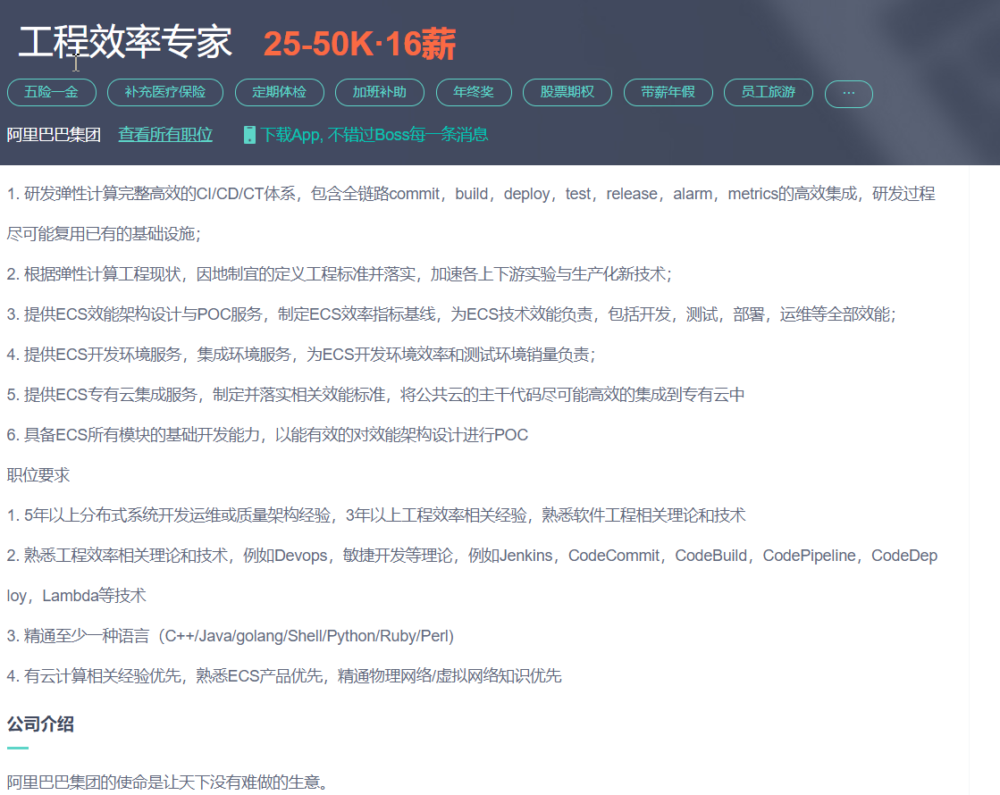
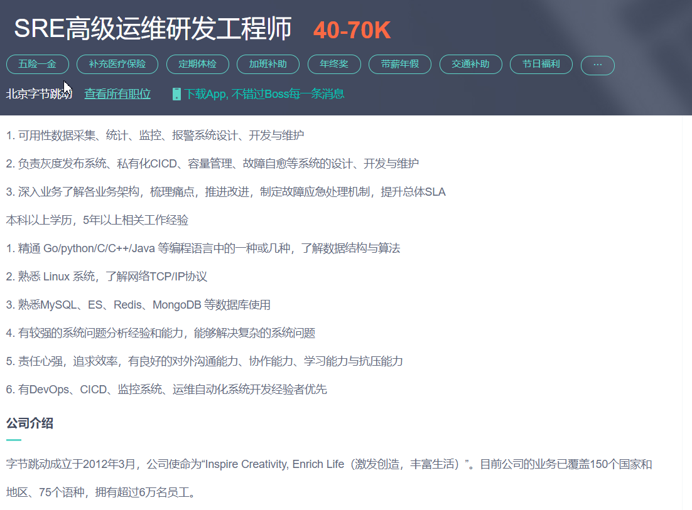
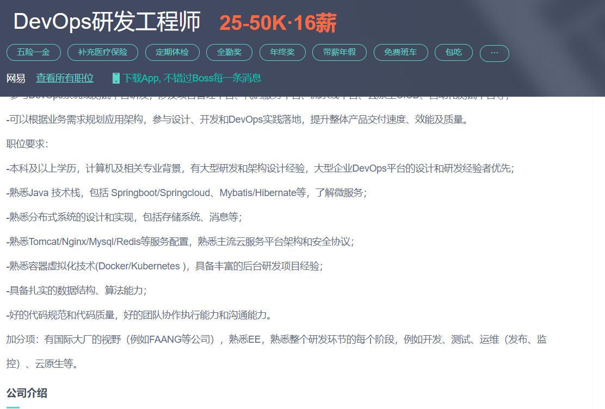

# 按大的方向划分
## cicd

### cicd运维开发工程师
> 岗位实例 

> 技能点 
- 2. 熟悉工程效率相关理论和技术，例如Devops，敏捷开发等理论，例如Jenkins，CodeCommit，CodeBuild，CodePipeline，CodeDeploy，Lambda等技术
#### 潜在工作内容
- 1. 研发弹性计算完整高效的CI/CD/CT体系，包含全链路commit，build，deploy，test，release，alarm，metrics的高效集成，研发过程尽可能复用已有的基础设施；

