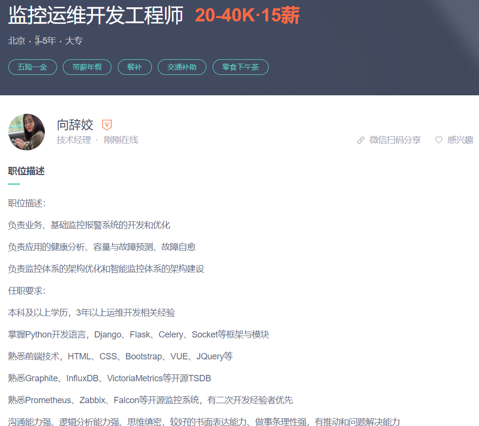
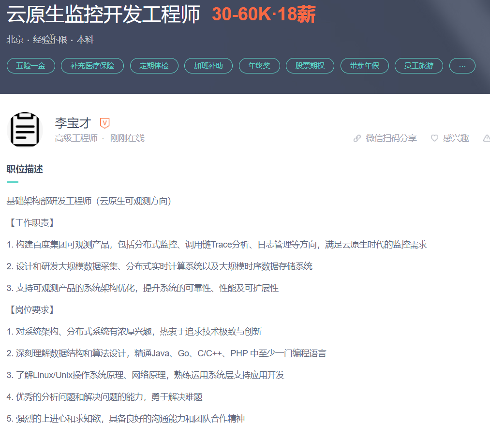

# 按大的方向划分
## 功能平台-监控

### 监控运维开发工程师
> 岗位实例 

> 技能点 
- 有Skywalking、Jaeger、CAT、Zipkin、Opentracing等组件经验的优先
- 有Prometheus、ELK、InfluxDB、Open-Falcon、Zabbix等监控组件使用和开发经验的优先
#### 潜在工作内容
1. 构建可观测产品，包括分布式监控、调用链Trace分析、日志管理等方向，满足云原生时代的监控需求
2. 设计和研发大规模数据采集、分布式实时计算系统以及大规模时序数据存储系统
3. 支持可观测产品的系统架构优化，提升系统的可靠性、性能及可扩展性

