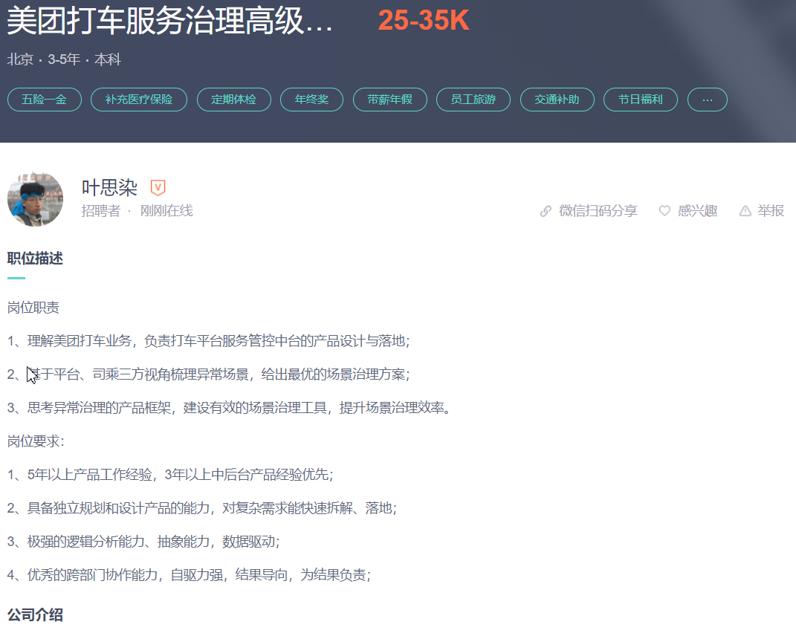
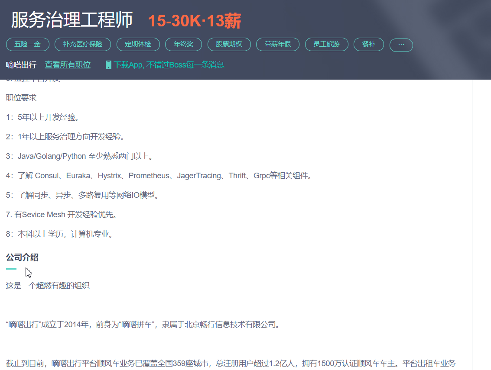

# 按大的方向划分
## 功能平台-服务治理

### 服务治理运维开发工程师
> 岗位实例 

> 技能点 
- 了解 Consul、Euraka、Hystrix、Prometheus、JagerTracing、Thrift、Grpc等相关组件。
- 有Sevice Mesh 开发经验优先。
#### 潜在工作内容
1. 理解美团打车业务，负责打车平台服务管控中台的产品设计与落地；
2. 基于平台、司乘三方视角梳理异常场景，给出最优的场景治理方案；
3. 思考异常治理的产品框架，建设有效的场景治理工具，提升场景治理效率。

