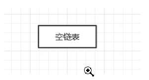
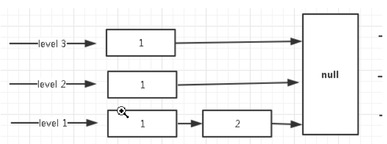
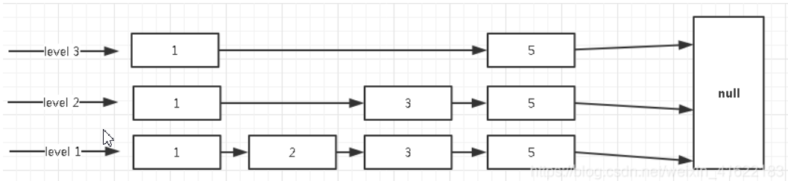
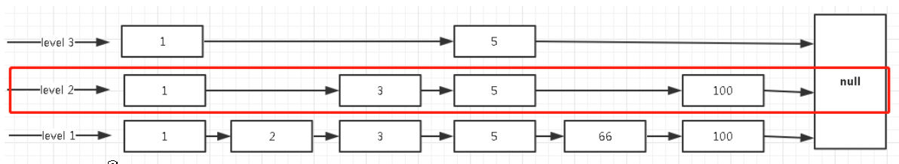

# Redis性能如此高的原因，我总结了如下几点：

- 纯内存操作
- 单线程
- 高效的数据结构
- 合理的数据编码
- 其他方面的优化

# 在 Redis 中，常用的 5 种数据结构和应用场景如下：

- String：缓存、计数器、分布式锁等。
- List：链表、队列、微博关注人时间轴列表等。
- Hash：用户信息、Hash 表等。
- Set：去重、赞、踩、共同好友等。
- Zset：访问量排行榜、点击量排行榜等。

# SDS
> Redis 是用 C 语言开发完成的，但在 Redis 字符串中，并没有使用 C 语言中的字符串，而是用一种称为 SDS（Simple Dynamic String）的结构体来保存字符串。

- SDS 的结构如上图：
    - len：用于记录 buf 中已使用空间的长度。
    - free：buf 中空闲空间的长度。
    - buf[]：存储实际内容。
- 例如：执行命令 set key value，key 和 value 都是一个 SDS 类型的结构存储在内存中。

## SDS 与 C 字符串的区别
1. 常数时间内获得字符串长度
    - C 字符串本身不记录长度信息，每次获取长度信息都需要遍历整个字符串，复杂度为 O(n)；C 字符串遍历时遇到 '\0' 时结束。
    - SDS 中 len 字段保存着字符串的长度，所以总能在常数时间内获取字符串长度，复杂度是 O(1)。
2. 避免缓冲区溢出
    - 假设在内存中有两个紧挨着的两个字符串，s1=“xxxxx”和 s2=“yyyyy”。
    - 由于在内存上紧紧相连，当我们对 s1 进行扩充的时候，将 s1=“xxxxxzzzzz”后，由于没有进行相应的内存重新分配，导致 s1 把 s2 覆盖掉，导致 s2 被莫名其妙的修改。
    - 但 SDS 的 API 对 zfc 修改时首先会检查空间是否足够，若不充足则会分配新空间，避免了缓冲区溢出问题。
3. 减少字符串修改时带来的内存重新分配的次数
    - 在 C 中，当我们频繁的对一个字符串进行修改（append 或 trim）操作的时候，需要频繁的进行内存重新分配的操作，十分影响性能。
    - 如果不小心忘记，有可能会导致内存溢出或内存泄漏，对于 Redis 来说，本身就会很频繁的修改字符串，所以使用 C 字符串并不合适
    - 而 SDS 实现了空间预分配和惰性空间释放两种优化策略：
        - 空间预分配：当 SDS 的 API 对一个 SDS 修改后，并且对 SDS 空间扩充时，程序不仅会为 SDS 分配所需要的必须空间，还会分配额外的未使用空间。
        - 惰性空间释放：当对 SDS 进行缩短操作时，程序并不会回收多余的内存空间，而是使用 free 字段将这些字节数量记录下来不释放，后面如果需要 append 操作，则直接使用 free 中未使用的空间，减少了内存的分配。

4. 二进制安全
    - 在 Redis 中不仅可以存储 String 类型的数据，也可能存储一些二进制数据。
    - 二进制数据并不是规则的字符串格式，其中会包含一些特殊的字符如 '\0'，在 C 中遇到 '\0' 则表示字符串的结束，但在 SDS 中，标志字符串结束的是 len 属性        
    
# 字典
- Redis 本身就是 KV 服务器，除了 Redis 本身数据库之外，字典也是哈希键的底层实现。

- 重要的两个字段是 dictht 和 trehashidx，这两个字段与 rehash 有关，下面重点介绍 rehash。

## rehash

- 学过 Java 的朋友都应该知道 HashMap 是如何 rehash 的，在此处我就不过多赘述，下面介绍 Redis 中 Rehash 的过程。

- 由上段代码，我们可知 dict 中存储了一个 dictht 的数组，长度为 2，表明这个数据结构中实际存储着两个哈希表 ht[0] 和 ht[1]，为什么要存储两张 hash 表呢？

- 当然是为了 Rehash，Rehash 的过程如下：

    - 为 ht[1] 分配空间。如果是扩容操作，ht[1] 的大小为第一个大于等于 ht[0].used*2 的 2^n；如果是缩容操作，ht[1] 的大小为第一个大于等于 ht[0].used 的 2^n。
    - 将 ht[0] 中的键值 Rehash 到 ht[1] 中。
    - 当 ht[0] 全部迁移到 ht[1] 中后，释放 ht[0]，将 ht[1] 置为 ht[0]，并为 ht[1] 创建一张新表，为下次 Rehash 做准备。

## 渐进式 Rehash
- 由于 Redis 的 Rehash 操作是将 ht[0] 中的键值全部迁移到 ht[1]，如果数据量小，则迁移过程很快。但如果数据量很大，一个 Hash 表中存储了几万甚至几百万几千万的键值时，迁移过程很慢并会影响到其他用户的使用。

- 为了避免 Rehash 对服务器性能造成影响，Redis 采用了一种渐进式 Rehash 的策略，分多次、渐进的将 ht[0] 中的数据迁移到 ht[1] 中。

- 前一过程如下：

    - 为 ht[1] 分配空间，让字典同时拥有 ht[0] 和 ht[1] 两个哈希表。
    - 字典中维护一个 rehashidx，并将它置为 0，表示 Rehash 开始。
    - 在 Rehash 期间，每次对字典操作时，程序还顺便将 ht[0] 在 rehashidx 索引上的所有键值对 rehash 到 ht[1] 中，当 Rehash 完成后，将 rehashidx 属性+1。当全部 rehash 完成后，将 rehashidx 置为 -1，表示 rehash 完成。
    - 注意，由于维护了两张 Hash 表，所以在 Rehash 的过程中内存会增长。另外，在 Rehash 过程中，字典会同时使用 ht[0] 和 ht[1]。
    - 所以在删除、查找、更新时会在两张表中操作，在查询时会现在第一张表中查询，如果第一张表中没有，则会在第二张表中查询。但新增时一律会在 ht[1] 中进行，确保 ht[0] 中的数据只会减少不会增加。
    
# 跳表
- 跳跃表是一种有序的数据结构
- 它通过在每个节点中维持多个指向其他的节点指针，从而达到快速访问队尾目的
- 跳跃表的效率可以和平衡树想媲美了
- 最关键是它的实现相对于平衡树来说，代码的实现上简单很多。

## 跳表的插入

- 首先我们需要插入几个数据。链表开始时是空的。

- 当我们插入 level = 3，key = 1 时，结果如下：

- 当继续插入 level = 1，key = 2 时，结果如下

- 当继续插入 level = 2，key = 3 时，结果如下

- 当继续插入 level = 3，key = 5 时，结果如下

- 当继续插入 level = 1，key = 66 时，结果如下

- 当继续插入 level = 2，key = 100 时，结果如下

- 上述便是跳跃表插入原理，关键点就是层级–使用抛硬币的方式，感觉还真是挺随机的。
- 每个层级最末端节点指向都是为 null，表示该层级到达末尾，可以往下一级跳。

## 跳跃表的查询
- 现在我们要找键为 66 的节点的值。那跳跃表是如何进行查询的呢？

- 跳跃表的查询是从顶层往下找，那么会先从第顶层开始找，方式就是循环比较，如过顶层节点的下一个节点为空说明到达末尾，会跳到第二层，继续遍历，直到找到对应节点。

- 如下图所示红色框内，我们带着键 66 和 1 比较，发现 66 大于 1。继续找顶层的下一个节点，发现 66 也是大于五的，继续遍历。由于下一节点为空，则会跳到 level 2。

- 上层没有找到 66，这时跳到 level 2 进行遍历，但是这里有一个点需要注意，遍历链表不是又重新遍历。而是从 5 这个节点继续往下找下一个节点。如下，我们遍历了 level 3 后，记录下当前处在 5 这个节点，那接下来遍历是 5 往后走，发现 100 大于目标 66，所以还是继续下沉。

- 当到 level 1 时，发现 5 的下一个节点恰恰好是 66 ，就将结果直接返回。

## 跳跃表删除
- 跳跃表的删除和查找类似，都是一级一级找到相对应的节点，然后将 next 对象指向下下个节点，完全和链表类似。
- 现在我们来删除 66 这个节点，查找 66 节点和上述类似。

- 接下来是断掉 5 节点 next 的 66 节点，然后将它指向 100 节点。

- 如上就是跳跃表的删除操作了，和我们平时接触的链表是一致的。当然，跳跃表的修改，也是和删除查找类似，只不过是将值修改罢了，就不继续介绍了。
